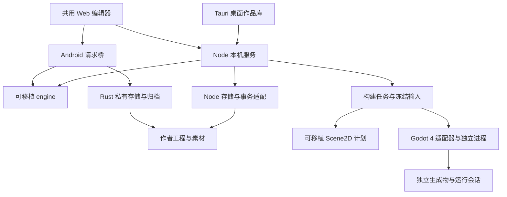

# 系统架构：当前实现

本文说明当前源码的模块职责、数据权威和调用链路。源码与安装包的交付范围见 [当前状态](STATUS.md)，后续范围与验收见 [演进路线](ROADMAP.md)，完整目标模型见 [下一代架构书](NEXT_ARCHITECTURE.zh-CN.md)。这里不把目标设计解释为已实现接口。

Viento 正从通用文档设计工具演进为设计优先的 IDE。当前 GUI 使用 Web/Tauri，可移植引擎负责文档语义和变更规划，Node 或 Rust 宿主执行文件、进程与归档操作。原生方向是 Nuislang、ns-nova 和 yalivia runtime，Viento 将成为 ns-nova 的官方 GUI 编辑器；自身 GUI 的迁移与工程执行后端分开推进。现有 Godot 4 后端承担原生体系早期的受限场景执行，也可作为未来副引擎保留。原生运行、ns-nova GUI 和 Bevy 尚未接入。

## 模块与依赖方向

| 模块 | 当前职责 | 边界 |
| --- | --- | --- |
| `web/` | 文档阅读、源码／分段／字段草稿、世界与对象、素材／导出、构建面板和中英日界面 | 通过宿主接口操作工程；不直接启动执行器或选择磁盘输出路径 |
| `engine/` | 解析与布局、项目模型、保真字段修改、文档存储流程、World 投影／查询／命令规划、资源依赖选择、Scene2D 计划 | 不依赖 Node、HTTP、Tauri 或具体游戏引擎；不执行文件和进程操作 |
| `scripts/adapters/` | Node 文档读写、World 快照／命令执行、冻结构建输入、构建与运行编排 | 落实路径、修订号、锁、资源字节和生成物校验 |
| `scripts/backends/` | Godot 4 工程生成、工具识别、诊断和运行事件协议 | 引擎节点路径与脚本只属于生成物，不改变作者对象身份 |
| `scripts/lib/`、`scripts/ops/` | HTTP 服务、项目／模板、索引、素材、导出、事务恢复、构建任务和启动编排 | 把宿主操作交给相应适配器，不把领域规则放进路由 |
| `desktop/`、`src-tauri/src/desktop_host.rs` | 桌面作品库、内置 Node、窗口／会话和进程生命周期、原生保存与归档 | 编辑 WebView 不直接获得文件系统或 Shell 权限 |
| `mobile/`、移动端 Rust 模块 | Android 作品库、WebView 请求桥、私有存储、即时索引、草稿恢复和完整迁移 | 不启动 Node／HTTP；支持范围单独声明 |
| `schemas/` | 作品清单、登记和实验性语义契约的验证定义 | 软件、作品格式、命令／事务协议分别版本化 |

`engine/` 是共享语义实现，不是未来 ns-nova 的替身。其文档存储流程通过注入的 `storage` 调用宿主，命令规划返回待写内容和提案；真正持久化在宿主完成。旧的解析入口保留兼容转发，YAML 依赖随应用离线提供。接口细节见 [引擎说明](../engine/README.md)。



图中的 Web 编辑器按宿主选择传输。Android 在 WebView 内适配请求，直接调用 Tauri 原生命令；构建分支目前只接入 Linux 本机编辑服务。

## 数据权威与生命周期

新建 v3 工程用 `workspace.json` 声明类型与布局，默认保存 `documents/`、`templates/`、`metadata/`、`assets/`。旧 v1／v2 工程继续走兼容读取与原有保存规则，不因应用升级自动改名或重排正文。

| 数据 | 权威来源与保留规则 |
| --- | --- |
| 文档内容 | 原文是标题、字段、叙事和场景声明的权威来源；布局、索引和 World 属性是解析投影 |
| 身份、关系与素材登记 | `metadata/` 保存稳定 UUID、逻辑路径、类型、归属／引用和资源用途绑定；名称和路径不充当身份 |
| 类型和起始模板 | 创建工程时复制完整定义与模板，实例此后自行维护；模板不会自动重写旧正文 |
| 素材字节 | 由登记中的逻辑存储定位；正文使用相对逻辑路径或 `asset:<UUID>`，本机外置位置留在 `.viento/local.json` |
| 派生索引 | 受管理工程的标准化文件和索引位于 `.viento/cache/`；Android 索引即时生成，均不作为作品权威内容 |
| 恢复状态 | `.viento/world-transactions/` 等意图和恢复记录参与一致性保障，不能当作普通缓存清理；活动事务阻止不一致的读取或导出 |
| 构建输出 | 写到作者工程和实际素材目录之外，默认使用应用构建缓存；保存输入摘要、生成物、工具版本和会话记录 |
| 本机偏好与草稿 | 与工程分开；Android 恢复草稿不等于作品备份，也不会自动进入完整迁移包 |

角色背景仍由角色正文或有明确 `part-of` 归属的附属文档承载；共享故事可以多归属。不能为对象化另建一份与原文竞争的可写属性库。

物理默认布局在 `scripts/lib/workspace-layout.json`，起始模板目录在 `scripts/lib/project-templates.json`。桌面和移动端创建工程时选择模板包，复制类型／模板并记录版本与摘要；缺少原始包不妨碍打开已创建工程。这些仍是文档实例模板，尚无可执行工程类型插件或模板包升级框架。格式与迁移见 [通用项目](GENERIC_PROJECTS.md)、[工作流](PROJECT_WORKFLOW.md) 和 [作品布局](WORKSPACE_LAYOUT.md)。

## 文档编辑与宿主存储

桌面作品库启动内置 Node 和 `scripts/desktop-server.mjs`，服务绑定本机随机端口，以每次启动的会话 Cookie、Host 和 Origin 校验隔离编辑器。浏览器编辑入口由 `scripts/ops/site.mjs` 启动；独立浏览服务不开放正文写入、项目配置写入和构建操作。

```text
工程清单 + 正文 + 登记
  → 标准化与静态索引 → 阅读器和列表

源码／分段／字段草稿
  → 文档接口 → engine/document-store.mjs
  → node-document-storage.mjs 或 Android Rust 存储
  → 修订检查、原子写入与登记 → 刷新视图
```

可编辑目录来自已验证的工程定义。桌面静态索引入口 `data/index.json` 与实时文档接口 `/api/index` 是不同读取路径；两者共享原文及登记约束。正文保存与索引刷新分开：保存成功后即使刷新失败，也保留保存结果并允许重试。版本冲突保留草稿，字段修改只替换可证明对应的原文范围。

Android 的 `mobile/platform.mjs` 复用引擎并通过 `mobile_storage` 传入作品 UUID 与逻辑源路径；Rust 核对 SHA-256 修订号、目录边界和共享锁，执行原子替换。创建文档另有持久化创建意图；恢复不覆盖已有的不同内容。媒体访问、World 命令与 Godot 构建没有因此自动获得移动端实现。

桌面关闭会检查未保存草稿，返回作品库可保留编辑窗口；Android 则按作品在 WebView 本机存储维护恢复草稿，两种保证不同。完整平台限制见 [桌面宿主](../desktop/README.md) 和 [Android 宿主](../mobile/README.md)。

## World 查询、语义命令与事务

`scripts/adapters/node-world-projection.mjs` 读取正文和登记，交给 `engine/world-projection.mjs` 生成 World／Object／Resource 观察快照。GUI、`GET /api/world` 和 `scripts/world.mjs` 共用查询实现。投影保留原文修订号与属性范围，只存在于内存；资源的 `present-unverified` 状态表示发现文件，不表示字节已验证。

```text
GUI / HTTP / CLI 语义请求
  → 可移植命令校验和原文变更规划
  → 预览提案，或 Node 执行器在共享锁内重新校验
  → 原子单文件写入，或持久意图 / 数据发布 / 提交决定
  → 回执与新投影
```

| 已实现动作 | 持久化范围 |
| --- | --- |
| `property.set` | 一个现有文档中的一个字段，保真写回原文 |
| `changeset.apply` | 多个现有对象的属性批量修改；当前每个对象一个字段，使用可恢复事务 |
| `object.create` | 一个新正文与其登记共同发布／恢复 |
| `projection.update` | 原位修改投影标题／配置、追加新图片绑定；version 7 意图守护正文与登记两个既有文件，保留来源／模板和额外元数据 |
| `projection.create` | 新建 OC 投影配置与来源／图片登记；子模板快照完整嵌入正文，version 6 意图仍限两个新文件 |
| `scene.update` | 原位修改场景、保留继承／覆盖语义，追加必要依赖；version 8 意图守护正文与登记两个既有文件 |
| `scene.create` | 复用已有工程类型，新建 Scene2D 正文及派生角色／图片依赖；version 5 意图仍限两个新文件 |
| `relation.add` | 保真追加一个引用或共享归属关系，重新校验端点和关系图 |
| `resource.bind` | 向既有登记追加素材用途绑定；允许保留离线资源身份，实际构建另验资源字节 |
| `world.recover` | 按已持久化的提交决定完成恢复，外部内容冲突时保留现场 |

Node 语义命令与旧文档保存共享登记锁。多记录发布先保存意图和前后镜像，以提交标记决定恢复到完整旧版或新版；读者在活动事务期间拒绝取得混合状态。World、旧编辑、资源包及 Node／Rust 完整导出遵守相应屏障。语义批次还不是任意混合命令事务，资源文件内容和 Build 不属于这些作者事务。

请求中的 `actorRef` 只是操作标签；HTTP 鉴权仍由宿主负责。语义命令描述不等于已接入远程 AI、Lese 或协作权限系统。使用、协议及恢复边界见 [World 投影](WORLD_PROJECTION.md)、[批量事务](WORLD_TRANSACTIONS.md)、[对象创建](WORLD_OBJECT_CREATE.md)、[关系](WORLD_RELATIONS.md) 与 [资源绑定](WORLD_RESOURCES.md)。

## 构建与运行

当前实现是一条明确的 Scene2D 链路：场景 JSON 引用已登记角色 UUID 和图片，支持方向键输入与 `idle`／`moving` 状态。它不会从故事正文推断程序，也不执行任意 Nuis 或 Godot 脚本。

```text
已保存的场景、对象和登记
  → node-build-snapshot：读取屏障、修订复查、图片字节与摘要
  → engine/build-plan：显式场景语义与后端能力校验
  → Godot 适配器：生成工程、导入资源、检查脚本
  → build.json + snapshot.json + source-map.json + 生成项目
  → 校验冻结产物并创建独立运行副本
  → Godot 独立进程 → 状态事件、诊断、session.json
```

场景预览从相同冻结快照读取可移植计划，`scene-preview-service.mjs` 提供有限期的图片字节，`app-scene-preview.js` 和 Canvas 视图消费有效字段。预览与构建任务使用独立生命周期，不启动引擎、不写作者数据；浏览器仅渲染静态保存状态，运行语义仍由后端执行。

`web/modules/app-scene-create.js` 共用创建／编辑场景表单，按字段维护投影继承与显式覆盖。`engine/world-scene-create.mjs` 和 `world-scene-update.mjs` 复用 Scene2D 规划器；宿主分别执行第 5 版创建和第 8 版更新事务，既有原文／字段编辑器继续可用。

`object-projection-template.mjs` 提供无解析器依赖的 OC 子模板继承、快照锁与配置规则，供浏览器直接导入；`object-projection.mjs` 负责正文识别及依赖验证；`world-object-projection.mjs` 规划创建，`app-object-projection.js` 提供表单。World 汇总同一 OC 的不同投影；场景可按投影运行映射继承配置，Build 保留投影 UUID 和原 OC 的来源身份。引擎适配器消费已解析值，不读取内置模板目录。见 [投影契约](OBJECT_PROJECTIONS.md)。

`web/modules/app-project-build.js` 提供 Linux 本机编辑器面板；`scripts/lib/project-build-service.mjs` 管理跨 HTTP 请求的任务、进度、取消和本次服务登记的产物 ID；CLI 调用同一 Node 构建／运行适配器。面板关闭后任务继续，重新打开可以观察。计划检查返回快照身份，面板构建以该身份拒绝过期输入；未保存草稿不会被静默加入构建。

宿主通过 `VIENTO_GODOT_BIN` 选择工具。`/api/project-build` 限制回环连接与本机 Host／Origin，POST 沿用写鉴权；浏览器不能指定任意二进制、环境或磁盘输出目录。远程绑定的编辑服务、只读浏览服务与 Android 不提供执行能力。

构建记录固定输入、适配器与真实工具的版本／摘要，运行前重验生成文件，并从冻结产物创建隔离副本。运行节点与作者 UUID 的映射只保存在生成记录中，运行值不会自动改写原文。进程输出有界，取消、超时、SIGINT／SIGTERM 和桌面 owner 关闭会回收引擎；运行工作副本与引擎缓存随后清理。强制杀死宿主或断电后的会话恢复仍未实现。

产物是**需要 Godot 执行的生成工程**，并非独立发行程序。无头测试只验逻辑，正常窗口预览验图形路径；内嵌运行视口、原生 GPU 计算、Live Build、Nuis／yalivia 与 Bevy 接入仍是后续工作。参数、使用和验证入口见 [构建与运行](PROJECT_BUILD.md)。

## 资源复用、分享与完整迁移

三条链路共用稳定身份，但输出契约不同：

| 链路 | 数据范围与实现 |
| --- | --- |
| 文档分享 | 选定文档及附属内容 → 通用布局 → HTML／Markdown 和所需素材 → ZIP |
| 选择式资源包 | `engine/resource-package.mjs` 计算依赖闭包；Node 校验内容、预览冲突，以独立持久导入事务追加内容 |
| 完整项目迁移 | 清单、模板、正文、登记及素材全部收集；Node 和 Rust 实现对齐同一项目包格式，Android 复用 Rust 并增加系统传输适配 |

单个图片、音频、视频还可按原始字节导出。完整项目包不携带 `.viento/local.json` 的本机绑定或派生缓存；外置素材收集实际字节。导出核验摘要、身份、关系与源变化，活动事务先恢复或阻止导出；恢复先暂存校验再发布，拒绝覆盖既有异内容工程。

构建输出不混入作者工程备份。生成物的独立发行、保留和迁移另有契约需求，不能用完整作品迁移能力代替已打包游戏的承诺。详见 [导出](EXPORT.md) 和 [资源包](RESOURCE_PACKAGES.md)。

## 验证与架构演进

当前平台覆盖和源码交付由 [STATUS](STATUS.md) 汇总，复现命令及设备边界见 [TESTING](TESTING.md)。历史 `test-results/`、发布记录和 [功能链路网络](FUNCTION_NETWORK.md) 保留执行时的环境与证据，不由本文更新旧统计。

新增能力沿现有边界做可运行纵切：先说明作者数据、命令、宿主权限及输出归属，再用真实执行器验收。后续原生异构计算通过独立计算／渲染适配开放；设备句柄、队列和显存状态留在运行会话，通用文档与事务内核保持可移植。下一步范围见 [ROADMAP](ROADMAP.md)，长期决策见 [ADR 0008](adr/0008-native-nuis-and-bootstrap-runtime.md)。
