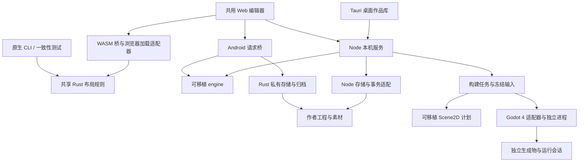
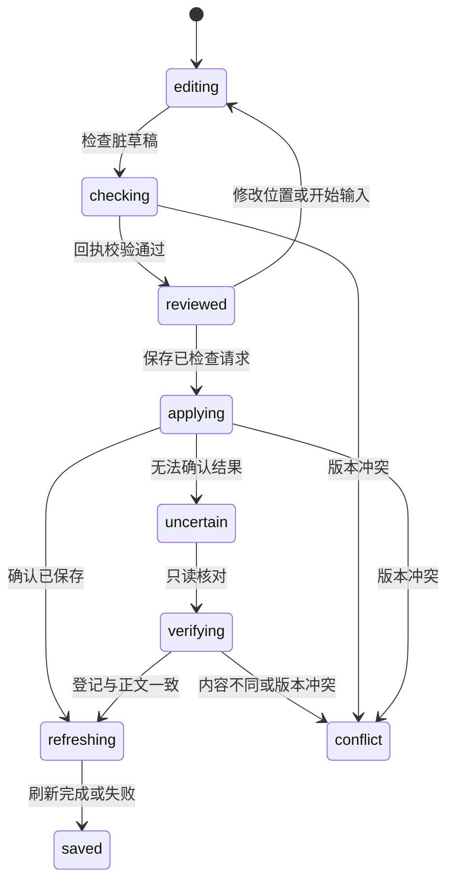

# 系统架构：当前实现

本文说明当前源码的模块职责、数据权威和调用链路。源码与安装包的交付范围见 [当前状态](STATUS.md)，后续范围与验收见 [演进路线](ROADMAP.md)，完整目标模型见 [下一代架构书](NEXT_ARCHITECTURE.zh-CN.md)。这里不把目标设计解释为已实现接口。跨区域功能、具体实现、评分理由和证据由 [当前功能图谱](FUNCTION_ATLAS.md) 统一索引；[离线交互版](function-atlas.html) 可按架构、语言、交付状态与工作流切片。

Viento 正从通用文档设计工具演进为设计优先的 IDE。当前 GUI 使用 Web/Tauri，可移植引擎负责文档语义和变更规划，Node 或 Rust 宿主执行文件、进程与归档操作。原生方向是 Nuislang、ns-nova 和 yalivia runtime，Viento 将成为 ns-nova 的官方 GUI 编辑器；自身 GUI 的迁移与工程执行后端分开推进。现有 Godot 4 后端承担原生体系早期的受限场景执行，也可作为未来副引擎保留。近期场景与行为开发优先利用 Godot GDScript 和 Rust，不依赖 Nuislang 的研发进度；原生运行、ns-nova GUI 和 Bevy 尚未接入。

## 模块与依赖方向

| 模块 | 当前职责 | 边界 |
| --- | --- | --- |
| `web/` | 文档阅读、源码／分段／字段草稿、世界与对象、素材／导出、场景预览与布局编辑、构建面板和中英日界面 | 通过宿主接口操作工程；不直接启动执行器或选择磁盘输出路径 |
| `engine/` | 解析与布局、项目模型、保真字段修改、文档存储流程、World 投影／查询／命令规划、资源依赖选择、Scene2D 来源模型、计划与布局草稿的作者原文适配 | 不依赖 Node、HTTP、Tauri 或具体游戏引擎；不执行文件和进程操作 |
| `scripts/adapters/` | Node 文档读写、World 快照／命令执行、冻结构建输入、构建与运行编排 | 落实路径、修订号、锁、资源字节和生成物校验 |
| `crates/viento-studio-core/` | 独立 Rust 布局规则、位置草稿、100 步撤销／重做及保存工作流；原生库／CLI 和 WASM 共用 | 不依赖 DOM、Tauri 或 Godot，不读写作品；当前编辑器使用 WASM 同步调用 |
| `scripts/backends/` | Godot 4 工程生成、工具识别、诊断和运行事件协议 | 引擎节点路径与脚本只属于生成物，不改变作者对象身份 |
| `scripts/lib/`、`scripts/ops/` | HTTP 服务、项目／模板、索引、素材、导出、事务恢复、构建任务和启动编排 | 把宿主操作交给相应适配器，不把领域规则放进路由 |
| `desktop/`、`src-tauri/src/desktop_host.rs` | 桌面作品库、内置 Node、窗口／会话和进程生命周期、原生保存与归档 | 编辑 WebView 不直接获得文件系统或 Shell 权限 |
| `mobile/`、移动端 Rust 模块 | Android 作品库、WebView 请求桥、私有存储、即时索引、草稿恢复和完整迁移 | 不启动 Node／HTTP；支持范围单独声明 |
| `schemas/` | 作品清单、登记和实验性语义契约的验证定义 | 软件、作品格式、命令／事务协议分别版本化 |

`engine/` 是共享语义实现，不是未来 ns-nova 的替身。其文档存储流程通过注入的 `storage` 调用宿主，命令规划返回待写内容和提案；真正持久化在宿主完成。旧的解析入口保留兼容转发，YAML 依赖随应用离线提供。接口细节见 [引擎说明](../engine/README.md)。



图中的 Rust 分支只承接布局规则；原生 CLI 是验证入口，当前编辑器实际调用 WASM，未增加原生 GUI 通信链。Web 编辑器按宿主选择传输。Android 在 WebView 内适配请求，直接调用 Tauri 原生命令；构建分支目前只接入 Linux 本机编辑服务。

## 数据权威与生命周期

新建 v3 工程用 `workspace.json` 声明类型与布局，默认保存 `documents/`、`templates/`、`metadata/`、`assets/`。旧 v1／v2 工程继续走兼容读取与原有保存规则，不因应用升级自动改名或重排正文。

| 数据 | 权威来源与保留规则 |
| --- | --- |
| 文档内容 | 原文是标题、字段、叙事和场景声明的权威来源；布局、索引和 World 属性是解析投影 |
| 身份、关系与素材登记 | `metadata/` 保存稳定 UUID、逻辑路径、类型、归属／引用和资源用途绑定；名称和路径不充当身份 |
| 类型和起始模板 | 创建工程时复制完整定义与模板，实例此后自行维护；模板不会自动重写旧正文 |
| 素材字节 | 由登记中的逻辑存储定位；正文使用相对逻辑路径或 `asset:<UUID>`，本机外置位置留在 `.viento/local.json` |
| 派生索引 | 受管理工程的标准化文件和索引位于 `.viento/cache/`；Android 索引即时生成，均不作为作品权威内容 |
| 恢复状态 | `.viento/world-transactions/` 等意图和恢复记录参与一致性保障，不能当作普通缓存清理；活动事务阻止不一致的读取或导出 |
| 构建输出 | 写到作者工程和实际素材目录之外，默认使用应用构建缓存；保存输入摘要、生成物、工具版本和会话记录 |
| 本机偏好与草稿 | 与工程分开；Android 恢复草稿不等于作品备份，也不会自动进入完整迁移包 |

角色背景仍由角色正文或有明确 `part-of` 归属的附属文档承载；共享故事可以多归属。不能为对象化另建一份与原文竞争的可写属性库。

物理默认布局在 `scripts/lib/workspace-layout.json`，起始模板目录在 `scripts/lib/project-templates.json`。桌面和移动端创建工程时选择模板包，复制类型／模板并记录版本与摘要；缺少原始包不妨碍打开已创建工程。这些仍是文档实例模板，尚无可执行工程类型插件或模板包升级框架。格式与迁移见 [通用项目](GENERIC_PROJECTS.md)、[工作流](PROJECT_WORKFLOW.md) 和 [作品布局](WORKSPACE_LAYOUT.md)。

## 文档编辑与宿主存储

桌面作品库启动内置 Node 和 `scripts/desktop-server.mjs`，服务绑定本机随机端口，以每次启动的会话 Cookie、Host 和 Origin 校验隔离编辑器。浏览器编辑入口由 `scripts/ops/site.mjs` 启动；独立浏览服务不开放正文写入、项目配置写入和构建操作。

```text
工程清单 + 正文 + 登记
  → 标准化与静态索引 → 阅读器和列表

源码／分段／字段草稿
  → 文档接口 → engine/document-store.mjs
  → node-document-storage.mjs 或 Android Rust 存储
  → 修订检查、原子写入与登记 → 刷新视图
```

可编辑目录来自已验证的工程定义。桌面静态索引入口 `data/index.json` 与实时文档接口 `/api/index` 是不同读取路径；两者共享原文及登记约束。正文保存与索引刷新分开：保存成功后即使刷新失败，也保留保存结果并允许重试。版本冲突保留草稿，字段修改只替换可证明对应的原文范围。

Android 的 `mobile/platform.mjs` 复用引擎并通过 `mobile_storage` 传入作品 UUID 与逻辑源路径；Rust 核对 SHA-256 修订号、目录边界和共享锁，执行原子替换。创建文档另有持久化创建意图；恢复不覆盖已有的不同内容。媒体访问、World 命令与 Godot 构建没有因此自动获得移动端实现。

桌面关闭会检查未保存草稿，返回作品库可保留编辑窗口；Android 则按作品在 WebView 本机存储维护恢复草稿，两种保证不同。完整平台限制见 [桌面宿主](../desktop/README.md) 和 [Android 宿主](../mobile/README.md)。

## World 查询、语义命令与事务

`scripts/adapters/node-world-projection.mjs` 读取正文和登记，交给 `engine/world-projection.mjs` 生成 World／Object／Resource 观察快照。GUI、`GET /api/world` 和 `scripts/world.mjs` 共用查询实现。投影保留原文修订号与属性范围，只存在于内存；资源的 `present-unverified` 状态表示发现文件，不表示字节已验证。

```text
GUI / HTTP / CLI 语义请求
  → 可移植命令校验和原文变更规划
  → 预览提案，或 Node 执行器在共享锁内重新校验
  → 原子单文件写入，或持久意图 / 数据发布 / 提交决定
  → 回执与新投影
```

| 已实现动作 | 持久化范围 |
| --- | --- |
| `property.set` | 一个现有文档中的一个字段，保真写回原文 |
| `changeset.apply` | 多个现有对象的属性批量修改；当前每个对象一个字段，使用可恢复事务 |
| `object.create` | 一个新正文与其登记共同发布／恢复 |
| `projection.update` | 原位修改投影标题／配置、追加新图片绑定；version 7 意图守护正文与登记两个既有文件，保留来源／模板和额外元数据 |
| `projection.create` | 新建 OC 投影配置与来源／图片登记；子模板快照完整嵌入正文，version 6 意图仍限两个新文件 |
| `scene.update` | 原位修改场景、保留继承／覆盖语义，追加必要依赖；version 8 意图守护正文与登记两个既有文件 |
| `scene.create` | 复用已有工程类型，新建 Scene2D 正文及派生角色／图片依赖；version 5 意图仍限两个新文件 |
| `relation.add` | 保真追加一个引用或共享归属关系，重新校验端点和关系图 |
| `resource.bind` | 向既有登记追加素材用途绑定；允许保留离线资源身份，实际构建另验资源字节 |
| `world.recover` | 按已持久化的提交决定完成恢复，外部内容冲突时保留现场 |

Node 语义命令与旧文档保存共享登记锁。多记录发布先保存意图和前后镜像，以提交标记决定恢复到完整旧版或新版；读者在活动事务期间拒绝取得混合状态。World、旧编辑、资源包及 Node／Rust 完整导出遵守相应屏障。语义批次还不是任意混合命令事务，资源文件内容和 Build 不属于这些作者事务。

请求中的 `actorRef` 只是操作标签；HTTP 鉴权仍由宿主负责。语义命令描述不等于已接入远程 AI、Lese 或协作权限系统。使用、协议及恢复边界见 [World 投影](WORLD_PROJECTION.md)、[批量事务](WORLD_TRANSACTIONS.md)、[对象创建](WORLD_OBJECT_CREATE.md)、[关系](WORLD_RELATIONS.md) 与 [资源绑定](WORLD_RESOURCES.md)。

## 构建与运行

当前实现是一条明确的 Scene2D 链路：场景 JSON 引用已登记角色 UUID 和图片，支持方向键输入与 `idle`／`moving` 状态。它不会从故事正文推断程序，也不执行任意 Nuis 或 Godot 脚本。

```text
已保存的场景、对象和登记
  → node-build-snapshot：读取屏障、修订复查、图片字节与摘要
  → engine/json-source：严格 JSON 值与原文范围
  → engine/scene-model：场景语义、投影继承、依赖与来源
  → engine/build-plan：按来源发射 v1／v2 计划及后端能力校验
  → Godot 适配器：生成工程、导入资源、检查脚本
  → build.json + snapshot.json + source-map.json + 生成项目
  → 校验冻结产物并创建独立运行副本
  → Godot 独立进程 → 状态事件、诊断、session.json
```

场景预览从相同冻结快照读取可移植计划，`scene-preview-service.mjs` 提供有限期的图片字节，`app-scene-preview.js` 和 Canvas 视图消费有效字段。预览与构建任务使用独立生命周期，读取和查看无需启动引擎或写入作者数据。捕获结果在冻结 `snapshot` 外另外携带 `sceneEditing`、`sourceLocations` 和 v3 的 `sceneStructure`：前者提供场景原文及 World／对象／正文修订，后者为场景、对象定义、场景声明与有效字段提供来源。`sceneStructure` 只携带组织分组与实例归属，`scene-structure.mjs` 严格验证后供视图使用，不进入计划或快照容器。预览服务复制这些编辑信息，本身不承担保存。

原文草稿预览使用独立入口 `captureSceneDraftPreview`。`engine/scene-draft-preview.mjs` 限定 128 KiB UTF-8、注册场景路径和原始正文基线，在克隆的只读观察中替换单份原文并重新派生 World 投影；登记记录、关系和资源绑定不变。Node 冻结层核对同一读取屏障、图片摘要和前后修订，草稿成功／失败均复查基线。返回独立域的预览摘要及 `draft` 来源信息，不产生可执行构建快照或 `sceneEditing`；`captureBuildSnapshot` 始终读取磁盘保存版本。

界面从主编辑器的原文保真序列化器取得草稿及基线。候选模型与图片完成后才替换上一有效结果，解析失败保留旧画面并标明来源；同场景返回编辑器再打开可继续草稿模式，切场景／切保存模式／销毁清理缓存。请求和精确来源定位核对场景、编辑会话、草稿令牌和内容摘要，异步旧响应不能覆盖新编辑。草稿定位只选择当前编辑器的原文本，不重读文件；保存来源继续使用原读取流程。预览服务本身保持只读；当前文本草稿的布局回写通过另一个本地接口接入，不提升预览结果的 World 保存权限。

```text
当前单场景源码草稿 + 有效草稿预览
  → Rust sceneSource.inspect：严格 JSON、稳定身份／坐标／分组检查
  → scene-source-layout：核验路径／基线／原文 SHA-256、模型与分组侧带
  → scene-layout 的共用几何会话 → Rust LayoutDraft：位置、100 批次历史
  → Rust sceneSource.patch → propose：仅变化坐标的精确数值 token 补丁
  → 主编辑器：复核 sceneId／会话／源码模式／完整原文，再应用到内存
  → 普通文档保存：沿用原版本与冲突检查
```

`engine/scene-source-layout.mjs` 不接收或制造 `sceneEditing`、World 修订或事务命令。源码的严格 JSON 检查与坐标数值补丁已迁入 Rust 的无状态 `sceneSource.inspect`／`sceneSource.patch`；JS 负责解码、预览元数据匹配、摘要和编辑会话归属。`createSceneSourceLayoutDraft` 在注入的摘要函数返回后绑定已分离的输入；`patchSceneSourcePositions` 调用 Rust，仅替换变化的数值 token，不从有效角色重建作者声明。Rust 内部按 UTF-8 字节范围修改原文，范围不持久化，也不取代导航使用的 UTF-16 来源映射。原文前后均限 128 KiB UTF-8，JSON 预算沿用 64 层和 100000 个值节点；检查 v1／v2／v3 的 1–128 个角色身份与位置、v3 的 0–128 个组和 16 层组织关系。字面孤立代理字符、解码重复键、身份歧义和不一致的分组侧带被拒绝，合法未改 token 的原写法保留。`prepareSceneSourceLayoutApply` 重新计算补丁并核对完整候选正文与来源摘要；宿主在异步返回后再次复核当前编辑会话、路径、场景身份、原文及编辑会话持有的保存基线，才替换内存中的源码。应用过程不读磁盘；外部文件变化不阻止本地补丁，之后的预览基线校验及普通保存的原版本条件分别拒绝过期预览和覆盖写入。

本地布局和保存版布局共用 `createSceneGeometryDraft` 及既有 Rust 协议；本地会话不暴露 `command`、`beginSave` 或保存阶段接口。UI 的本地操作归属独立于 World 写入忙碌状态，取消不碰主编辑器草稿。成功应用保留主编辑器的旧保存版本并重新比较 dirty；未保存修改重新预览草稿，恰好回到原基线则显示保存态，不触发 `scene.update`、索引重建或构建。它限定当前已登记场景的源码模式，没有跨文本／表单／布局的统一撤销栈或多文件提交。

后端的 `engine/json-source.mjs` 继续以 `JSON.parse` 决定语法和值，复用 `yaml` CST 取得范围；不会用 YAML 值替代 JSON 语义。本轮只移除了源码布局对它的依赖，浏览器工作台模块图不再为坐标补丁加载 YAML，本机服务撤去专门的 YAML 包目录静态入口。通用解析及后端场景／事务仍使用原解析路径，移动端通用引擎仍保留既有 `/vendor/yaml/`，并未删除 YAML 格式支持。范围为原文含 BOM 的 UTF-16 半开区间，附 JSON Pointer、是否精确以及正文 SHA-256 修订。索引限制为 8 Mi UTF-16 单元、64 层和 100000 个值节点，Node 读取另有字节限制；索引只保留在私有 WeakMap。解码后重复键在运行规划中拒绝，避免构建与保真保存解释不同；仅 v1 旧事务登记恢复保留 JSON 最后键语义，不提供歧义范围。v1 新索引预算或范围构建失败仍可使用旧 JSON 语法门槛恢复，宿主既有大小屏障继续生效；v2／v3 从首次接入即严格拒绝重复键和超预算索引，包括恢复。两种恢复模式均不解析当前投影正文。

`engine/scene-model.mjs` 解析场景字段、投影有效值和资源依赖，输出与声明对应的 `viento-scene-model` v1／v2／v3。`scene2DModelToPlan` 保留 v1／v2 计划，作者 v3 也发射 plan v2 并剔除组织分组字段；已有 v1／v2 DTO 保持原样；来源范围独立于冻结计划，因此既有有效 v1 快照和生成文件保持一致。声明位置属于场景修订，继承字段属于投影修订；宽高分别映射配置项，合成尺寸只有近似容器位置。缺失字段也只返回最近容器提示。

场景预览的字段按钮将完整位置传给主编辑器。编辑器先读取当前正文并核对摘要，再把原文 UTF-16 偏移转换为 textarea 的 LF 偏移并选中精确值；正文变化、近似范围或无法定位时显示说明。已有未保存草稿及光标保留，过期异步读取不能改动后来打开的文档。普通文档链接继续可用，这条链路不写作者文件。

保存版 `createSceneLayoutDraft` 核对原声明与解析角色的身份、顺序和中心位置，再通过 `engine/scene-layout.mjs` 的共用几何会话创建 Rust 位置草稿。v2／v3 使用 `instanceId` 选择实例，保留作者 `objectId` 作为定义引用；适配器将实例 UUID 传入 Rust 协议名为 `objectId` 的不透明几何键。这组几何／历史操作仍只解释不透明键；另设的 `sceneSource.*` 才检查受限的 Scene2D 源码结构，不读取登记关系或修改旧操作的协议。`setPositions` 在 Rust 内完成整个批次的校验、原子更新及最多 100 批次的撤销／重做；JS 接收当前位置和状态快照。拖动、方向键微调和对齐各形成一个可整体撤销的批次。候选声明仍从原文解析结果复制，只替换已有角色的 `position`，保留继承、局部覆盖、明确去图和可选字段省略。

`engine/scene-layout.mjs` 的几何入口通过 `studio-core.mjs` 调用 Rust/WASM 核心，原有 JS 几何算法已移除。Rust 为所选对象计算共同位移；吸附以实际抓取对象的中心为锚点，坐标上限限制整组位移，保持相对间距。`alignSceneSelection` 使用已解析的有效尺寸形成选择集整体外接矩形，按其侧边或中心计算六向对齐，非法结果整批拒绝。`app-scene-preview-canvas.js` 复用这些几何规则，拖动中的位置只用于临时绘制，结束时提交一次位置批次；Esc、捕获丢失或模型／选择变化取消临时移动。视图平移与缩放独立于作者坐标。

多选仅在布局编辑器启用，已保存场景的预览保持原有单对象检查。布局的选择集与主选对象保留在页面内存，支持组合键、列表复选框以及全选／清除，不进入作者声明、归档或构建输入。X／Y 输入只在单选时显示，多选通过整体移动与对齐修改位置。批次草稿保留输入的 Scene2D v1／v2／v3 声明版本；保存版使用同一 `scene.update`，原文草稿版只提出坐标补丁；v2 选择与撤销分别作用于独立实例。v3 的组织分组保留在声明中；分组选择先展开为后代实例 UUID，Rust 仍只接收实例几何键。workspace 格式不变。

保存版 `web/modules/app-scene-layout.js` 流程管理拖拽、坐标输入、历史操作入口和明确的检查／保存步骤，撤销与保存阶段由 Rust 草稿提供，界面保留审阅正文和异步请求归属。检查调用 `scene.update` 的预览模式并展示实际候选原文，保存沿用同一修订基线与第 8 版事务；有效位置修改或开始输入都使前次检查失效。冲突保留输入，结果未知时暂停重试写入，通过只读 World 与原文核对场景身份、路径、修订和完整声明后确认结果。保存成功使旧构建计划失效，刷新失败单独报告。布局草稿及忙碌状态加入页面离开和桌面关闭检查，草稿仍只存在于当前会话内存。预览和布局草稿都是静态设计状态，运行语义仍由后端执行。

后续场景创作以结构化、类似剧本的文本为主要入口，实施顺序见 [文本驱动场景路线](ROADMAP.md#文本驱动场景的实施顺序)。当前已接入“OC 定义 → 用途投影 → 多个独立场景实例”的平面关系；实例身份与原对象身份分离。可嵌套的组织分组已接入，预览和布局大纲复用纯引擎的树与搜索结果，组来源可定位原文。空间变换层次、复用片段和事件流程仍需另定语义。文本原文仍是持久权威，解析／展开结果和引擎工程都是派生数据。

Scene2D v2 在扁平 `actors` 中要求唯一小写 UUID `instanceId`，同一 `objectId` 可以出现多次；实例数量仍为 1–128。保真编辑匹配、布局选择与历史、来源映射、构建节点及运行事件均区分实例与定义。定义参与诊断和资源包依赖时按 `objectId` 去重，实例不另建 World 对象。新建表单默认 v2，旧场景只在显式启用并保存后升级：已有实例以旧对象 UUID 初始化，新复制的实例分配新 UUID；不以数组下标或显示名称决定身份，当前拒绝 v2→v1 降级。

`godot4-dispatch.mjs` 按计划版本选择原 v1 生成器或 `godot4-instances.mjs`／`runtime-v2.gd`。v2 来源映射与运行协议同时携带 `instanceId`、定义 `objectId`，接收端核对配对关系；重复定义不能折叠为一个运行节点或状态。原 v1 生成文件与生成器摘要保持兼容。预览版本随计划，冻结快照容器及构建／会话记录仍用现有版本。兼容保证是新代码能读取旧数据和产物；旧客户端的普通原文编辑仍可能接触新格式，并不保证所有旧入口都只读。

作者 v3 的持久组织层次由 `scene-groups.mjs` 验证：最多 128 组、16 层，身份、父组和实例归属严格核对。`buildSceneOutline` 提供确定顺序、保留祖先的搜索结果及后代实例列表，`app-scene-outline.js` 只负责 DOM、焦点、折叠和选择。组织层次不改变绝对坐标与 `actors` 绘制顺序。单场景源码与布局的坐标回写已接入；空间变换、片段展开、剧本事件、多文件草稿及跨视图统一撤销仍未实现。源码布局所需的严格结构、身份／位置／分组检查与坐标补丁已迁入 Rust；完整模型、投影继承、依赖、来源导航和 World 规划仍在 JS。后续片段或共享草稿必须保持明确写回目标，避免单实例覆盖反向改动全部共用定义。

规划中的行为绑定在场景模型与执行后端之间增加明确的行为目录：作者声明引用行为身份、参数及事件，适配器负责脚本路径／类型、动作映射和引擎值转换。近期先接 GDScript 薄绑定层，C# 因工具链与维护成本暂缓；Bevy 可映射到已注册 Rust 函数、组件与观察器。Nuislang 是后续原生适配目标，不是作者场景模型或绑定开发的前置依赖。共享契约不代表不同后端行为源码可自动互译。选型依据及独立探针见 [构建文档](PROJECT_BUILD.md#行为绑定选型预研尚未接入)。

行为实例需独立创建和管理，不能通过反复替换节点脚本叠加多行为。接入时明确参数／引用注入、信号连接、激活及停用释放的顺序，并校验实际参数类型与签名。绑定在载入或变更时解析并缓存，高频执行留在引擎进程；IDE 的检查与调试按批次传输，避免逐对象逐帧跨进程调用。运行值修改仍须显式命令、来源映射和版本核对后才写回作者文本；Bevy BRP 或 Godot 属性调用均不直接承担保存。以上是待实现边界，独立探针尚未覆盖多行为、热重载或完整生命周期。

`web/modules/app-scene-create.js` 共用创建／编辑场景表单，按字段维护投影继承与显式覆盖，提供实例复制、重排、分组管理和旧场景显式升级。`engine/world-scene-create.mjs` 和 `world-scene-update.mjs` 复用 Scene2D 规划器；宿主分别执行第 5 版创建和第 8 版更新事务，既有原文／字段编辑器继续可用。

`object-projection-template.mjs` 提供无解析器依赖的 OC 子模板继承、快照锁与配置规则，供浏览器直接导入；`object-projection.mjs` 负责正文识别及依赖验证；`world-object-projection.mjs` 规划创建，`app-object-projection.js` 提供表单。World 汇总同一 OC 的不同投影；场景可按投影运行映射继承配置，Build 保留投影 UUID 和原 OC 的来源身份。引擎适配器消费已解析值，不读取内置模板目录。见 [投影契约](OBJECT_PROJECTIONS.md)。

`web/modules/app-project-build.js` 提供 Linux 本机编辑器面板；`scripts/lib/project-build-service.mjs` 管理跨 HTTP 请求的任务、进度、取消和本次服务登记的产物 ID；CLI 调用同一 Node 构建／运行适配器。面板关闭后任务继续，重新打开可以观察。计划检查返回快照身份，面板构建以该身份拒绝过期输入；未保存草稿不会被静默加入构建。

宿主通过 `VIENTO_GODOT_BIN` 选择工具。`/api/project-build` 限制回环连接与本机 Host／Origin，POST 沿用写鉴权；浏览器不能指定任意二进制、环境或磁盘输出目录。远程绑定的编辑服务、只读浏览服务与 Android 不提供执行能力。

构建记录固定输入、适配器与真实工具的版本／摘要，运行前重验生成文件，并从冻结产物创建隔离副本。运行节点与作者 UUID 的映射只保存在生成记录中，运行值不会自动改写原文。进程输出有界，取消、超时、SIGINT／SIGTERM 和桌面 owner 关闭会回收引擎；运行工作副本与引擎缓存随后清理。强制杀死宿主或断电后的会话恢复仍未实现。

产物是**需要 Godot 执行的生成工程**，并非独立发行程序。无头测试只验逻辑，正常窗口预览验图形路径；内嵌运行视口、原生 GPU 计算、Live Build、Nuis／yalivia 与 Bevy 接入仍是后续工作。参数、使用和验证入口见 [构建与运行](PROJECT_BUILD.md)。

## 共享 Rust 核心的运行边界

当前 `viento-studio-core` 只依赖序列化库，协议第 1 版保留 `move`、`align`、`validateBatch`，并增加 `layoutDraft.create/setPositions/undo/redo/reset/read/close`。Rust 的独立 `LayoutDraft` 持有初始位置、当前位置及最多 100 个批次的撤销／重做历史，判断 dirty；错误批次和无变化操作保留原状态与 redo。这些布局操作只接收身份、坐标、尺寸及操作参数。新增的无状态 `sceneSource.inspect`／`sceneSource.patch` 接收有界场景正文和位置修改，执行严格 JSON 扫描、源码几何结构检查与精确数值补丁；不创建草稿、不访问文件或 World，也不接收素材字节、路径或凭据。原生 CLI 用于复现和跨目标对比；编辑器实际执行的是同一 crate 的 WASM，尚未新增 Tauri 原生命令或 Bevy 后端。

`engine/studio-core.mjs` 只处理协议与内存边界，宿主通过 `initializeStudioCore(loadBytes)` 注入加载函数；浏览器适配器 `app-studio-core.js` 负责受限 HTTP 加载，Node 适配器 `node-studio-core.mjs` 负责文件读取。核心桥接不导入宿主模块。WASM 由适配器初始化一次，后续同步调用，拖拽无逐帧 IPC。缓冲由 Rust 持有，单条请求上限 1 MiB；桥接校验协议、缓冲范围及返回结构，各操作域独立校验。原协议版本及布局／保存操作保持兼容；可选 `viento_core_scene_source_version() === 1` 导出声明源码检查／补丁的支持，缺少该能力的旧核心仍可使用旧几何和历史，源码布局明确拒绝执行，不回退 JS 补丁。加载失败保留阅读和静态预览，布局编辑显示错误，无第二份 JS 算法回退。HTTP 只增加固定核心文件的静态入口，CSP 使用 `wasm-unsafe-eval`，不开放普通 JavaScript `unsafe-eval`。移动资源包含同一核心，但这不会自动启用 Android 场景工作台；设备支持仍需实测。

`npm run core:build` 在开发／打包时生成 `engine/studio-core.wasm` 与摘要记录，`check`、`start`、桌面和移动资源准备均接入此步骤。生成物不进入 Git；缓存按源代码及 WASM 摘要复核，安装包直接携带产物，运行时无需 Cargo。核心 crate 编译目录与生成文件纳入既有清理命令。WASM 目标及 CSP 的依据见 [Rust 编译目标](https://doc.rust-lang.org/rustc/platform-support/wasm32-unknown-unknown.html) 与 [WebAssembly CSP](https://developer.mozilla.org/en-US/docs/Web/HTTP/Reference/Headers/Content-Security-Policy/script-src#unsafe_webassembly_execution)。

原生 JSON-lines 适配器与每个 WASM 实例通过受限草稿表使用同一实现：每个线程／实例最多 32 份草稿，每份沿现有 Scene2D 上限接收 1–128 个对象。句柄是单调递增、不会重用的十进制字符串，不充当授权或持久身份。每次只返回当前位置和状态快照，历史不经 JS 往返；关闭、取消、重新读取以及打开失败会释放草稿。WASM 输入只消费一次，重复执行旧缓冲不会重复创建或撤销。

`engine/scene-layout.mjs` 的保存版适配保留作者原文、继承字段和修订前置条件；原文草稿适配由 `scene-source-layout.mjs` 负责。两者共用 Rust 几何会话，只缓存返回的视图快照，不独立维护位置历史或 dirty 比较。草稿仍仅驻留内存，关闭或重启不恢复。保存阶段、错误分类和重复请求门禁由独立 Rust `LayoutSaveWorkflow` 管理，见下方流程。源码布局的严格结构检查与数值补丁已由 Rust 执行；完整作者语义解析、回执内容与摘要校验、只读核对的 World／正文读取、实际保存事务及构建规划仍由 JS 及宿主适配承担。后续迁移顺序见 [Rust 核心路线](ROADMAP.md#studio-核心与界面解耦)，每次迁移都保持现有文件格式和事务兼容。

### 源码检查与坐标补丁

`sceneSource.inspect` 和 `sceneSource.patch` 每次重新扫描输入，保持 stateless，不占用布局的 32 个会话槽位。扫描器按解码后的 UTF-16 键检查整份 JSON 的重复字段，但只解释此操作需要的版本、身份、位置与组关系；未涉及的数值和字符串 token 不经全文反序列化／重排后写回。未变的指数、负零、超出浮点范围的其他字段、转义字符串、BOM 和 CRLF 保留原字节；变化坐标使用与既有 JavaScript 补丁一致的数值表达。组名长度继续按 UTF-16 单元计数。inspect 仅返回来源版本与角色数；patch 返回候选正文和 JSON Pointer 列表，不返回可复用的作者存储句柄。

该检查不替代完整 `Scene2DModel`：标题、视口、投影继承、资源和关系仍由原 JS 模型验证，保存态事务及 v1 历史恢复继续走原路径。兼容对照和执行范围见 [Rust 源码补丁验证](test-results/rust-scene-source/results.json)。

### 布局保存工作流

`layoutSave.read/invalidate/begin/resolve/refreshed` 与位置草稿共用 `draftId` 和释放边界，没有第二份持久状态或额外会话表。每次检查、保存或核对取得草稿内单调递增的 `requestId`；完成事件必须同时匹配会话、当前阶段和请求。Rust 拒绝重复完成、过期令牌、未检查的保存，以及结果未确认时再次写入。保存阶段冻结后，原生位置修改和撤销接口同样拒绝变更。



图中省略可重试的错误返回：检查的一般失败回到可编辑状态；保存的明确声明／命令校验失败回到可编辑状态，其他失败进入待核对；核对的普通读取失败继续待核对。三个 World 冲突码统一进入冲突状态。核对仍执行“读取登记 → 读取正文并核对摘要 → 再读登记 → 比较完整声明”，不会再次提交保存。

确认写入后先进入 `refreshing`：已保存但仍忙，继续阻止页面离开；刷新失败只显示警告，最终保持 `saved`，不能使保存再次可用。前端在每次异步返回以及清理阶段核对操作归属，关闭再打开后的旧响应不能批准新草稿，也不能解除新请求的忙碌状态。草稿关闭会释放整套状态；这些内存令牌不是服务器事务 ID，不能提供跨重启恢复或网络幂等保证。

## 资源复用、分享与完整迁移

三条链路共用稳定身份，但输出契约不同：

| 链路 | 数据范围与实现 |
| --- | --- |
| 文档分享 | 选定文档及附属内容 → 通用布局 → HTML／Markdown 和所需素材 → ZIP |
| 选择式资源包 | `engine/resource-package.mjs` 计算依赖闭包；Node 校验内容、预览冲突，以独立持久导入事务追加内容 |
| 完整项目迁移 | 清单、模板、正文、登记及素材全部收集；Node 和 Rust 实现对齐同一项目包格式，Android 复用 Rust 并增加系统传输适配 |

单个图片、音频、视频还可按原始字节导出。完整项目包不携带 `.viento/local.json` 的本机绑定或派生缓存；外置素材收集实际字节。导出核验摘要、身份、关系与源变化，活动事务先恢复或阻止导出；恢复先暂存校验再发布，拒绝覆盖既有异内容工程。

构建输出不混入作者工程备份。生成物的独立发行、保留和迁移另有契约需求，不能用完整作品迁移能力代替已打包游戏的承诺。详见 [导出](EXPORT.md) 和 [资源包](RESOURCE_PACKAGES.md)。

## 验证与架构演进

当前平台覆盖和源码交付由 [STATUS](STATUS.md) 汇总，复现命令及设备边界见 [TESTING](TESTING.md)。历史 `test-results/`、发布记录和 [功能链路网络](FUNCTION_NETWORK.md) 保留执行时的环境与证据，不由本文更新旧统计。

新增能力沿现有边界做可运行纵切：先说明作者数据、命令、宿主权限及输出归属，再用真实执行器验收。后续原生异构计算通过独立计算／渲染适配开放；设备句柄、队列和显存状态留在运行会话，通用文档与事务内核保持可移植。下一步范围见 [ROADMAP](ROADMAP.md)，长期决策见 [ADR 0008](adr/0008-native-nuis-and-bootstrap-runtime.md)。
