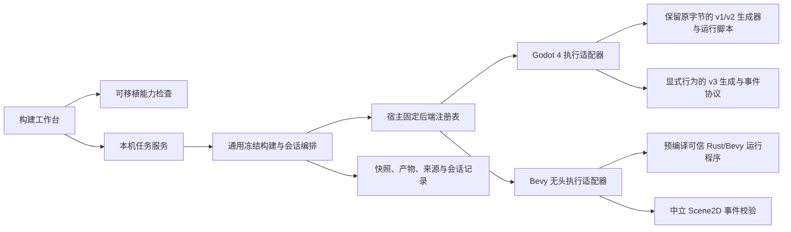

# 执行后端中间层

工具身份、运行验收用例、工程内保存、有序批次及成员报告现已随 [0.0.9 源码](RELEASE_0.0.9.md)交付；下列旧阶段名称与专题验收记录保留其原条件。

[成员报告](RUNTIME_CASE_REPORTS.md)接在通用调度器之后，只选择既有执行终态、定义与已接收的采样。后端不实现报告队列或导出接口；文件保存／pin 回读属于可信宿主，严格评价属于纯层，详情／下载属于 GUI。相同格式覆盖 Godot 与 Bevy，不改变引擎协议或适配器指纹。

0.0.8 源码把后端能力、宿主执行编排和具体引擎实现分开，Linux 上已有 Godot 4 与 [Bevy 无头后端](BEVY_BACKEND.md)两条受限实现。Bevy 消费无图 Scene2D plan 1／2，不接图片、作者 Rust 行为或图形运行；Godot 的[行为绑定](SCENE_BEHAVIORS.md)另为明确关联清单的场景增加 plan／runtime 3。作者格式和既有计划／协议保持。Nuislang、ns-nova、yalivia、离屏渲染、内嵌视口或 GPU 计算仍未接入。源码版本为 0.0.9，安装状态见 [当前状态](STATUS.md)。

0.0.9 的[有序验收组](RUNTIME_CASE_SUITES.md)由通用 Node 宿主顺序复用已有无头控制会话，每份重新验证冻结产物与可信工具。全部作者成员在任务分配前捕获，组准入和结果汇总留在纯模块；后端只收到原控制程序。断言失败继续，执行失败／取消停止余项；不新增引擎队列 API。

## 三层职责

| 层次 | 实现 | 负责内容 |
| --- | --- | --- |
| 可移植有限控制 | `engine/scene-control-program.mjs` | 检查全局／按实例方向布尔程序、冻结实例目标、时长及输入行／联合对象预算；按行准入有限步骤样本与生命周期，不模拟移动、不携引擎句柄 |
| 可移植运行观察 | `engine/scene-runtime-query.mjs` | 从已验证 plan 1／2／3 建立独立身份／来源视图，消费准入事件并按实例／定义筛选；不启动进程、不查询引擎反射 |
| 可移植能力契约 | `engine/backend-capabilities.mjs` | 校验纯数据描述符，分别检查执行操作、平台、计划版本和功能需求；不接触文件、进程、DOM 或具体引擎 |
| 可移植工具状态 | `engine/execution-tool-status.mjs` | 严格校验身份检查状态及版本／摘要；不携工具路径、进程输出或执行权限 |
| 宿主中间层 | `scripts/adapters/node-execution-backends.mjs`、`node-project-build.mjs`、`scripts/lib/project-build-service.mjs` | 捕获已保存输入，固定后端身份与可信实现，校验输出与冻结回放，管理任务、取消、进程结果及记录 |
| 具体执行适配器 | `scripts/backends/godot4-adapter.mjs`、`bevy-adapter.mjs` | 各引擎的工具识别、生成入口、阶段、命令行参数、环境、协议事件、诊断和缓存回收 |

注册表由本机程序以可信实现创建；它复制并冻结描述符、阶段列表和调用入口。HTTP 和工程文件不能注册代码、加载模块或传入可执行文件与输出路径。服务由宿主选择一个后端，网页没有引擎选择下拉框；源码 CLI 可以明确选择已登记的后端与本机工具。Bevy 沿用相同输入、输出与回放检查，不增加通用动态 Cargo 编译或编译后产物钩子。这不是已冻结的通用插件 ABI。

## 描述符与能力检查

描述符使用 `format: "viento-execution-backend"`、`schemaVersion: 1`，精确包含以下字段。作者格式版本、描述符版本和运行协议分别管理。

| 字段 | 约定 |
| --- | --- |
| `id`、`label`、`version` | 点分命名空间身份、展示名称、无前导零的 `x.y.z` 适配器版本；当前为 `org.viento.godot4`、`Godot 4`、`0.5.0` |
| `platforms` | 无重复的平台标识数组；当前 Godot 适配器仅声明 `linux` |
| `plans` | `{ kind: "scene2d", schemaVersion, runtimeProtocolVersion }` 数组，按 kind／schema 唯一；当前 plan 1／2／3 分别绑定 runtime 1／2／3；3 仅用于显式行为场景 |
| `capabilities` | 无重复的功能标识数组；当前为 `scene2d`、`input.arrows`、`state.movement`、`image`、`behavior.bindings`、`behavior.gdscript`、`runtime.control-replay`、`runtime.control-replay.instances` |
| `execution` | 下表七个键都必须存在并为布尔值 |
| `extensions` | `{ id, version }` 数组，ID 必须处于后端自身命名空间；仅描述能力扩展身份，不含代码或路径 |

| 执行操作 | Godot 4 | Bevy 无头 | 含义 |
| --- | --- | --- | --- |
| `build` | `true` | `true` | Godot 生成／导入／检查脚本；Bevy 生成数据并检查场景 |
| `headlessLogic` | `true` | `true` | 独立进程执行无头逻辑测试 |
| `windowPreview` | `true` | `false` | 独立正常窗口运行 |
| `windowCapture` | `true` | `false` | 窗口 smoke 运行生成截图；也必须声明窗口预览能力 |
| `offscreenRender` | `false` | `false` | 当前没有离屏渲染实现 |
| `embeddedViewport` | `false` | `false` | 当前没有嵌入编辑器的运行视口 |
| `gpuCompute` | `false` | `false` | 当前没有 GPU 计算接口 |

上方字段表列出 Godot 声明。Bevy 的 ID 为 `org.viento.bevy`、适配器／可信运行程序版本为 `0.3.0`，仅声明 Linux、scene2d plan／runtime 1／2，以及 `scene2d`、`input.arrows`、`state.movement`、`runtime.control-replay`、`runtime.control-replay.instances`；`extensions` 为空。带图片或行为的计划不能因同为 Scene2D 而绕过能力检查。

无头逻辑能力不推导出渲染能力；命名空间中的原生扩展信息也不表示已经能执行原生代码。当前 Godot 的 `extensions` 为空。生成器保留其历史后端元数据与摘要，描述符 `version` 不替换历史生成器版本。

`validateExecutionBackendDescriptor(input)` 返回与输入分离且递归冻结的描述符，未知字段、非数据成员、自定义原型、访问器、循环、稀疏数组和预算超限会被拒绝；访问器不会在校验过程中运行。错误为 `TypeError`，`errorCode` 为 `build_backend_invalid`。

`checkExecutionBackendSupport(descriptor, { operation, platform?, plan? })` 返回诊断数组，空数组表示这组声明支持该请求。缺操作或操作为 `false` 返回 `build_execution_unsupported`；平台不符为 `build_platform_unsupported`；计划格式、种类或版本不符为 `build_backend_plan_unsupported`；缺功能仍使用 `build_capability_missing`，保留场景 UUID、逻辑路径与原有空 JSON Pointer。无效 DTO 或未知操作拒绝为 `build_backend_invalid`。`canExecuteBackend(descriptor, operation, platform?)` 为 UI 提供失败时返回 `false` 的便利检查，不查找工具，也不启动运行。

## 宿主适配与冻结回放

适配器 contract version 1 提供描述符、构建／运行准备阶段，以及 `availability`、`identify`、`generate`、`fingerprint`、`executePhase`、`diagnostics`、`createEventReader`、`cleanupProject` 入口。可执行函数仅存在于可信宿主实现中。通用执行器消费这些入口，不包含 Godot 命令行参数、环境变量、缓存名或生成文件名。

生成结果通过 `files`、中立的 `resourceFiles`（资源 UUID → 相对文件路径）、`sourceMap`、历史 `backend` 元数据和 `artifact` 描述交付。宿主先校验并复制结果，再创建输出目录：拒绝绝对路径、路径逃逸、文件与资源冲突、同一路径同时作文件和目录、缺少入口及预算超限。构建输出始终位于作者工程和实际素材目录之外。具体引擎如何组织自己的生成项目，属于适配器职责。

新 `build.json` 和 `session.json` 增加独立的 `executionAdapter: { id, contractVersion, sha256 }`。Godot 适配器指纹覆盖十份文件：`godot4-adapter.mjs`、`backend-capabilities.mjs`、`node-execution-backends.mjs`、`godot4-behaviors.mjs`、`godot4/behavior-runtime.gd`、`scene-behaviors.mjs` 、`build-plan.mjs`、`scene-control-program.mjs`、`godot4/control-runtime.gd` 和 `godot4/control.tscn`；它与旧 `backend.sha256` 的生成器／运行脚本摘要分别核对。运行仍从冻结原文重建计划，核对后端、协议、工具版本与二进制摘要、生成文件清单和每份字节，才创建独立运行副本。源工程离线后可重放，工具或适配器变化要求重建。

显式兼容旧记录的已知 Godot 适配器允许没有 `executionAdapter` 字段的历史构建，仍执行旧生成器、工具和产物检查。新字段存在时必须精确匹配；其他后端不能因为字段缺失而自动获得兼容。原作者正文、UUID、登记、图片、Scene2D 格式和历史生成脚本不因此迁移。原无行为 plan／runtime 1／2 保持，行为清单明确选择新增 plan／runtime 3。

本机状态返回平台、完整描述符，以及 `job.backendId`／`latestBuild.backendId`。构建工作台分别判断构建、无头测试和窗口预览，并把描述符变化视为旧计划和产物批准失效；后端身份不符的任务不能授权新操作。界面保留中英日翻译、草稿保护、诊断导航及关闭后任务观察。工具路径仍来自宿主配置，HTTP 仅接受既有场景、任务和产物身份。

## 工具身份检查（未发布增量）

工作台新增 **检查工具身份**，源码 CLI 新增 `--command tool-check`。两者共用 `node-execution-tool-probe.mjs`，先确认宿主配置的候选文件，再调用可信适配器的既有 `identify`，最后复查候选。版本兼容规则仍由 Godot／Bevy 各自维护；没有为检查新增执行操作、适配器版本或运行协议。

公共数据是 `viento-execution-tool-status` schema 1：精确字段为 `format`、`schemaVersion`、`backendId`、`status`、`reason`、`identity`。四种状态为 `unchecked`、`checking`、`ready`、`unavailable`；只有 `ready` 携带 `{version, sha256, platform, arch}`，摘要为二进制完整字节的 64 位小写 hex。失败原因限 `tool_missing`、`platform_unsupported`、`tool_version`、`tool_timeout`、`tool_output_limit`、`tool_failed`、`tool_cancelled`、`tool_changed`。DTO 严格分离并冻结，拒绝额外字段、访问器和原型污染；不返回路径、原始输出或异常文本。

`GET /api/project-build` 只观察文件权限、解析路径和文件状态，不启动工具。身份检查须显式 `POST {"action":"tool-check"}`，不能附场景、后端、路径或其他字段，沿用本机连接和编辑鉴权。服务同时只允许一个检查或构建任务；检查不创建任务、不替换最近产物、计划批准或运行观察。未保存草稿不阻止检查。关闭宿主会取消检查并等待进程回收；网页关面板不会结束宿主检查。

总检查预算默认 12 秒，包含文件身份与版本检查；既有适配器版本进程仍有 10 秒／合计 1 MiB 输出限制，取消清理可能稍后完成。CLI 可指定 1–12000 毫秒的更短预算。缓存只属于当前服务内存，以私有候选摘要失效；文件、权限或链接目标变化后显示未检查。检查失败禁用构建／运行，检查计划及静态预览仍可使用。`ready` 只描述检查当时的事实；实际构建／运行继续重新识别工具并校验冻结二进制摘要，检查不能授予执行权限或绕过旧记录验证。工具发现、图形配置和安装仍待开发。

源码版本仍为 0.0.8；本轮结果见[工具检查验证](test-results/runtime-tool-probe/results.json)，没有更新安装版。

本轮还修复任务状态与作者目录的耦合：服务已成功读取目录且拥有成功冻结构建时，后续源工程不可读取不会中断工具／运行状态。保留上次目录并返回无路径的 `catalogDiagnostic: {code: "build_catalog_unavailable"}`，界面单独提示；重新读到源工程后清除提示。新计划／构建始终重新读取作者目录，不能借旧列表启动；已有冻结产物的运行、inspect、取消及工具检查继续可用。首次目录读取失败仍报错，不伪造有效工程。

## 运行验收用例（未发布增量）

[有限用例](RUNTIME_CASES.md)在通用宿主组合控制回放与可移植评判，沿用已有执行操作和适配器接口。纯层检查有限方向程序、plan 2 实例目标、步骤与显式位置容差／状态预期；宿主从严格 trace 取得样本并给出真实运行完成事实。会话追加独立 `verification`，不把断言失败写成引擎进程失败，取消／协议错误不补造通过证据。HTTP 输入只含纯数据且在任务分配前准入；Godot／Bevy 仍各自执行控制程序，无新引擎接口、计划、trace 或设备句柄。

## 运行对象观察

当前新增[运行对象](RUNTIME_OBJECTS.md)沿用 adapter contract version 1 与已有运行协议。通用执行器在工具与产物全部校验后建立观察，先发布分离的 runtime 视图，再通知原始事件；任务服务的完整视图独立于 128 条事件环，终态会话保留最后有效观察。来源仅取冻结声明，状态事件不更新坐标；取消或错误不补造 finished 样本。

HTTP inspect 只接受当前任务 UUID 及可选实例／定义 UUID，绕过新任务和工具可用性门禁，只读服务拥有的当前 run 任务。界面从 status.job.runtime 本地筛选，不向引擎发送查询或修改。该共同能力由 Godot／Bevy 的实际现有事件验证，无需加入 Entity、RPC、动态编译或渲染接口。

## 验证与下一步

当前另接入[有限控制回放](RUNTIME_CONTROL.md)：宿主冻结与记录纯方向程序；schema 2 提前按已验证 plan 2 核对实例 UUID，后端同时声明实例回放能力，未列实例由运行程序逐步释放。适配器在独立会话暂存驱动／程序，两引擎自行执行移动；可移植准入器按原顺序处理 runtime 与 trace 帧，样本进入同一对象观察。作者场景、旧计划、原构建库存及 adapter contract version 1 保持；`executePhase` 只增加可选 `controlProgram` 数据参数，不增加 stdin、RPC 或 Entity 接口。每次回放都继续核对工具、适配器、快照和产物摘要；没有程序的旧运行方式不增加控制字段。

此前中间层轮次的[验证记录](test-results/backend-middleware/results.json) 区分纯能力契约、Godot 包装适配器、通用宿主、真实 Godot、浏览器及打包资源。替代后端夹具仅用于测试通用执行器可注入另一种输出布局和阶段；它不是产品第二引擎，也不证明 Bevy、Nuis 或 GPU 已接入。已有冻结生成物与历史证据继续按原条件保留。

专项命令和平台要求见 [验证指南](TESTING.md#执行后端中间层)。GDScript 源码、参数、事件与来源的独立范围见[场景行为](SCENE_BEHAVIORS.md)；Bevy 实际工具链、同计划双引擎比较和受限能力见 [Bevy 指南](BEVY_BACKEND.md)。`engine/scene-runtime-events.mjs` 独立校验 Scene2D 运行身份、状态和生命周期；Bevy 不导入 Godot 生成器或事件读取器，旧 Godot 文件保持原字节。现有实例观察已由两个真实后端共同验证；有限控制只增加固定步骤采样，后续连续实时采样、资源或行为能力仍由真实需求推动，不提前授予 BRP、反射、作者 Rust 行为或资源通道。作者数据仍由原文、登记和素材维护，设备句柄与执行实现不进入工程迁移包。

运行验收的工程保存层见[用例文档](RUNTIME_CASES.md#工程内保存与迁移未发布增量)：只保存场景稳定身份与纯用例，文档读写／包迁移由作者宿主处理；Godot 和 Bevy 继续收到原控制程序，不读取项目路径、包装或登记元数据。
