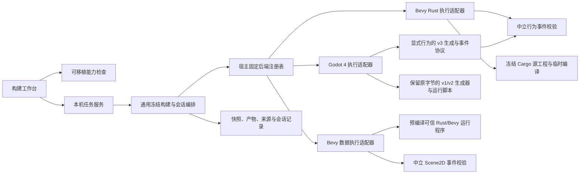

# 执行后端中间层

本页描述 **纯能力与计划契约 → 可信宿主编排 → 具体执行适配器** 的职责。当前源码版本为 **0.2.4**，Linux 宿主提供 Godot 4、Bevy 数据与 Bevy Rust 三个受限适配器。应用版本、安装与平台范围见[状态页](STATUS.md)，历次接入前言见[历史归档](history/backend-middleware-2026-10-25.md)。

| 阅读目的 | 入口 |
| --- | --- |
| 了解模块归属和信任边界 | [三层职责](#三层职责) · [架构](ARCHITECTURE.md) |
| 确认某后端能接收哪些计划 | [描述符与能力检查](#描述符与能力检查) · [二维后端映射](FUNCTION_MAPPING_2D.md#当前后端映射) |
| 核对冻结构建和重复运行 | [宿主适配与冻结回放](#宿主适配与冻结回放) · [工具身份检查](#工具身份检查) · [工程管理](BACKEND_PROJECTS.md) |
| 观察与验收 | [运行对象](#运行对象观察) · [运行验收用例](#运行验收用例) · [验证边界](#验证与下一步) |
| 接入具体领域 | [声音](#声音领域的具体适配) · [逐实例动画](#逐实例动画的后端准入) · [物理](SCENE_PHYSICS2D.md#构建交付与边界) |
| 使用现有构建入口 | [工作台](PROJECT_BUILD.md#编辑器工作台) · [Bevy 工具配置](BEVY_BACKEND.md) · [当前项目协议选择](PROJECT_BUILD.md#当前项目协议选择) |

当前 Godot 执行适配器为 **0.27.0**，Bevy 数据为 **0.3.0**，Bevy Rust 为 **0.2.0**。这些是适配器身份，不能与应用版本、作者格式或按内容选择的生成器版本混用。空间图偏移／尺寸编辑沿用原后端契约；角色停止／滑动响应另以 `physics.character-slide2d` 显式声明，只有实际滑动才要求该能力。原生 Nuislang／ns-nova／yalivia、离屏渲染、内嵌运行视口、GPU 计算与通用插件 ABI 尚未接入或冻结。

新运动构建另声明 `physics.character-events2d`：行为局部版本1端口只报告真实起跳／落地，作者脚本选择普通项目事件名。它是后端可选脚本能力，不通过文本扫描推断计划需求，也不改变项目运行协议；旧运动生成层0.24.0及作者schema 3保持。

静态单向平台以作者 schema 4 的 `oneWay: { margin: 1 }` 显式声明，只限静态矩形，margin 为 1–64。计划仅在字段实际存在时要求 `physics.one-way-platform2d`；Godot 0.26.0 包装设置原生形状的单向碰撞与容差，方向固定朝上。关闭后保留 schema 4，缺省继续普通碰撞；旧响应、运动和事件生成层保持，项目与观察协议不变。两个 Bevy 通道不支持该执行能力。

Godot0.27.0运动构建另提供可选 `physics.character-contacts2d`：每个运动角色行为独立观察本步实际移动碰撞集合的开始／结束，对方身份来自原生节点匹配。原有求解只执行一次，原文／wire／trace保持；普通作者脚本决定是否发布项目事件以及如何筛选载荷。没有运动角色时继续旧生成分支，语义与限制见[移动碰撞事件](SCENE_PHYSICS2D.md#用角色移动碰撞驱动项目事件)。

## 三层职责

```mermaid
flowchart LR
  UI[构建工作台] --> Admission[可移植能力检查]
  UI --> Service[本机任务服务]
  Service --> Executor[通用冻结构建与会话编排]
  Executor --> Registry[宿主固定后端注册表]
  Registry --> Godot[Godot 4 执行适配器]
  Registry --> Bevy[Bevy 数据执行适配器]
  Registry --> Rust[Bevy Rust 执行适配器]
  Rust --> Cargo[冻结 Cargo 源工程与临时编译]
  Rust --> BehaviorEvents[中立行为事件校验]
  Behaviors --> BehaviorEvents
  Godot --> Dispatch[保留原字节的 v1/v2 生成器与运行脚本]
  Godot --> Behaviors[显式行为的 v3 生成与事件协议]
  Bevy --> Host[预编译可信 Rust/Bevy 运行程序]
  Bevy --> Events[中立 Scene2D 事件校验]
  Executor --> Records[快照、产物、来源与会话记录]
```

| 层次 | 实现 | 负责内容 |
| --- | --- | --- |
| 可移植有限控制 | `engine/scene-control-program.mjs` | 检查全局／按实例方向布尔程序、冻结实例目标、时长及输入行／联合对象预算；按行准入有限步骤样本与生命周期，不模拟移动、不携引擎句柄 |
| 可移植运行观察 | `engine/scene-runtime-query.mjs` | 从已验证 plan 1／2／3 建立独立身份／来源视图，消费准入事件并按实例／定义筛选；不启动进程、不查询引擎反射 |
| 可移植能力契约 | `engine/backend-capabilities.mjs` | 校验纯数据描述符，分别检查执行操作、平台、计划版本和功能需求；不接触文件、进程、DOM 或具体引擎 |
| 可移植工具状态 | `engine/execution-tool-status.mjs` | 严格校验身份检查状态及版本／摘要；不携工具路径、进程输出或执行权限 |
| 宿主中间层 | `scripts/adapters/node-execution-backends.mjs`、`node-project-build.mjs`、`scripts/lib/project-build-service.mjs` | 捕获已保存输入，固定后端身份与可信实现，校验输出与冻结回放，管理任务、取消、进程结果及记录 |
| 具体执行适配器 | `scripts/backends/godot4-adapter.mjs`、`bevy-adapter.mjs`、`bevy-rust-adapter.mjs` | 各引擎的工具识别、生成入口、阶段、命令行参数、环境、协议事件、诊断和缓存回收 |

注册表由本机程序以可信实现创建；它复制并冻结描述符、阶段列表和调用入口。HTTP 和工程文件不能注册代码、加载模块或传入可执行文件与输出路径。服务由宿主选择一个后端，网页没有引擎选择下拉框；源码 CLI 可以明确选择已登记的后端与本机工具。Bevy Rust 也沿用相同输入、输出和冻结运行检查，Cargo 编译只存在于其固定适配器内部，不增加通用动态编译或可执行文件交付钩子。这不是已冻结的通用插件 ABI。

[工程持久管理](BACKEND_PROJECTS.md)是 Node 宿主与 GUI 的独立对接层：来源与库存检查、持久运行选择和创建者清理记录分开，不加入引擎能力描述符。[有序验收组](RUNTIME_CASE_SUITES.md)由宿主顺序运行已准入用例，断言失败可继续，执行失败或取消停止余项；[成员报告](RUNTIME_CASE_REPORTS.md)只读取已接收采样与终态。后端不实现额外的报告队列或文件下载接口。

## 描述符与能力检查

描述符使用 `format: "viento-execution-backend"`、`schemaVersion: 1`，精确包含以下字段。作者格式版本、描述符版本和运行协议分别管理。

| 字段 | 约定 |
| --- | --- |
| `id`、`label`、`version` | 点分命名空间身份、展示名称、无前导零的 `x.y.z` 适配器版本；当前 Godot 为 `org.viento.godot4`、`Godot 4`、`0.27.0` |
| `platforms` | 无重复的平台标识数组；当前 Godot 适配器仅声明 `linux` |
| `plans` | `{ kind, schemaVersion, runtimeProtocolVersion }` 数组，按 kind／schema 唯一；Scene2D plan 1／2／3 分别绑定 runtime 1／2／3，3 用于显式行为。当前 Godot 另声明 project plan 1／项目运行协议 11，实际生成分支按[项目内容选择](PROJECT_BUILD.md#当前项目协议选择)；每次访问嵌套对应子场景原协议。通用描述符接受 project runtime 1–11，由具体适配器显式声明 |
| `capabilities` | 无重复的功能标识数组；Godot 包括二维场景、输入、图片、GDScript 行为、有限控制回放、声音、项目事件／状态／切换、动画与二维物理。完整标识以[Godot 描述符](../scripts/backends/godot4-adapter.mjs)为准，各声明仍须与冻结计划同时核验 |
| `execution` | 下表七个键都必须存在并为布尔值 |
| `extensions` | `{ id, version }` 数组，ID 必须处于后端自身命名空间；仅描述能力扩展身份，不含代码或路径 |

| 执行操作 | Godot 4 | Bevy 数据 | Bevy Rust | 含义 |
| --- | --- | --- | --- | --- |
| `build` | `true` | `true` | `true` | Godot 导入／检查脚本；Bevy 数据检查场景；Bevy Rust 检查 Cargo 源工程 |
| `headlessLogic` | `true` | `true` | `true` | 独立进程执行无头逻辑测试 |
| `windowPreview` | `true` | `false` | `false` | 独立正常窗口运行 |
| `windowCapture` | `true` | `false` | `false` | 窗口 smoke 运行生成截图；也必须声明窗口预览能力 |
| `offscreenRender` | `false` | `false` | `false` | 当前没有离屏渲染实现 |
| `embeddedViewport` | `false` | `false` | `false` | 当前没有嵌入编辑器的运行视口 |
| `gpuCompute` | `false` | `false` | `false` | 当前没有 GPU 计算接口 |

上方字段表列出 Godot 声明。Bevy 的 ID 为 `org.viento.bevy`、适配器／可信运行程序版本为 `0.3.0`，仅声明 Linux、scene2d plan／runtime 1／2，以及 `scene2d`、`input.arrows`、`state.movement`、`runtime.control-replay`、`runtime.control-replay.instances`；`extensions` 为空。带图片或行为的计划不能因同为 Scene2D 而绕过能力检查。

Bevy Rust 的适配器版本为 `0.2.0`，仅支持无图 plan／runtime 3，声明 `scene2d`、`input.arrows`、`state.movement`、`behavior.bindings`、`behavior.rust`。固定步接口是 Rust 运行模板内的实例能力：`ready` 显式登记更新函数，固定时间步与自身位置命令由运行时管理；通用宿主仍只接收已有协议事件，不识别作者 Rust 函数。编译缓存属于可回收宿主临时目录；工程清单只含冻结源码。

无头逻辑能力不推导出渲染能力；命名空间中的原生扩展信息也不表示已经能执行原生代码。当前 Godot 的 `extensions` 为空。生成器保留其历史后端元数据与摘要，描述符 `version` 不替换历史生成器版本。

`validateExecutionBackendDescriptor(input)` 返回与输入分离且递归冻结的描述符，未知字段、非数据成员、自定义原型、访问器、循环、稀疏数组和预算超限会被拒绝；访问器不会在校验过程中运行。错误为 `TypeError`，`errorCode` 为 `build_backend_invalid`。

`checkExecutionBackendSupport(descriptor, { operation, platform?, plan? })` 返回诊断数组，空数组表示这组声明支持该请求。缺操作或操作为 `false` 返回 `build_execution_unsupported`；平台不符为 `build_platform_unsupported`；计划格式、种类或版本不符为 `build_backend_plan_unsupported`；缺功能仍使用 `build_capability_missing`，保留场景 UUID、逻辑路径与原有空 JSON Pointer。无效 DTO 或未知操作拒绝为 `build_backend_invalid`。`canExecuteBackend(descriptor, operation, platform?)` 为 UI 提供失败时返回 `false` 的便利检查，不查找工具，也不启动运行。

## 宿主适配与冻结回放

适配器 contract version 1 提供描述符、构建／运行准备阶段，以及 `availability`、`identify`、`generate`、`fingerprint`、`executePhase`、`diagnostics`、`createEventReader`、`cleanupProject` 入口。可执行函数仅存在于可信宿主实现中。通用执行器消费这些入口，不包含 Godot 命令行参数、环境变量、缓存名或生成文件名。

工程管理增量给构建后的 `cleanupProject(directory, context)` 另传可信的 `generatedFiles` 与 `resourceFiles` 相对路径列表；适配器可忽略此可选上下文。Godot 只清除这些已知输入对应的 UID／导入辅助文件，未知内容留给统一库存检查和保留规则。宿主不按后端名称猜测缓存文件。

生成结果通过 `files`、中立的 `resourceFiles`（资源 UUID → 相对文件路径）、`sourceMap`、历史 `backend` 元数据和 `artifact` 描述交付。宿主先校验并复制结果，再创建输出目录：拒绝绝对路径、路径逃逸、文件与资源冲突、同一路径同时作文件和目录、缺少入口及预算超限。构建输出始终位于作者工程和实际素材目录之外。具体引擎如何组织自己的生成项目，属于适配器职责。

`build.json` 和 `session.json` 记录独立的 `executionAdapter: { id, contractVersion, sha256 }`。指纹覆盖具体适配器声明的契约、生成器与运行实现，完整列表以各适配器的 `fingerprint()` 为准；它与 `backend.sha256` 的生成器／运行脚本摘要分别核对。运行从冻结原文重建计划，核对后端、协议、工具版本与二进制摘要、生成文件清单和每份字节，才创建独立运行副本。源工程离线后可运行，工具或适配器变化要求重建；首次接入的十二文件列表保存在[历史归档](history/backend-middleware-2026-10-25.md#中间层首次接入的指纹说明)。

显式兼容旧记录的已知 Godot 适配器允许没有 `executionAdapter` 字段的历史构建，仍执行旧生成器、工具和产物检查。新字段存在时必须精确匹配；其他后端不能因为字段缺失而自动获得兼容。原作者正文、UUID、登记、图片、Scene2D 格式和历史生成脚本不因此迁移。原无行为 plan／runtime 1／2 保持，行为清单明确选择新增 plan／runtime 3。

本机状态返回平台、完整描述符，以及 `job.backendId`／`latestBuild.backendId`。构建工作台分别判断构建、无头测试和窗口预览，并把描述符变化视为旧计划和产物批准失效；后端身份不符的任务不能授权新操作。界面保留中英日翻译、草稿保护、诊断导航及关闭后任务观察。工具路径仍来自宿主配置，HTTP 仅接受既有场景、任务和产物身份。

## 工具身份检查

工作台使用 **检查工具身份**，源码 CLI 使用 `--command tool-check`。两者共用 `node-execution-tool-probe.mjs`，先确认宿主配置的候选文件，再调用可信适配器的既有 `identify`，最后复查候选。版本兼容规则仍由 Godot／Bevy 各自维护；没有为检查新增执行操作、适配器版本或运行协议。

公共数据是 `viento-execution-tool-status` schema 1：精确字段为 `format`、`schemaVersion`、`backendId`、`status`、`reason`、`identity`。四种状态为 `unchecked`、`checking`、`ready`、`unavailable`；只有 `ready` 携带 `{version, sha256, platform, arch}`，摘要为二进制完整字节的 64 位小写 hex。失败原因限 `tool_missing`、`platform_unsupported`、`tool_version`、`tool_timeout`、`tool_output_limit`、`tool_failed`、`tool_cancelled`、`tool_changed`。DTO 严格分离并冻结，拒绝额外字段、访问器和原型污染；不返回路径、原始输出或异常文本。

`GET /api/project-build` 只观察文件权限、解析路径和文件状态，不启动工具。身份检查须显式 `POST {"action":"tool-check"}`，不能附场景、后端、路径或其他字段，沿用本机连接和编辑鉴权。服务同时只允许一个检查或构建任务；检查不创建任务、不替换最近产物、计划批准或运行观察。未保存草稿不阻止检查。关闭宿主会取消检查并等待进程回收；网页关面板不会结束宿主检查。

总检查预算默认 12 秒，包含文件身份与版本检查；既有适配器版本进程仍有 10 秒／合计 1 MiB 输出限制，取消清理可能稍后完成。CLI 可指定 1–12000 毫秒的更短预算。缓存只属于当前服务内存，以私有候选摘要失效；文件、权限或链接目标变化后显示未检查。检查失败禁用构建／运行，检查计划及静态预览仍可使用。`ready` 只描述检查当时的事实；实际构建／运行继续重新识别工具并校验冻结二进制摘要，检查不能授予执行权限或绕过旧记录验证。工具发现、图形配置和安装仍待开发。

工具身份检查首次接入时的验证见[工具检查记录](test-results/runtime-tool-probe/results.json)；该报告保留 0.0.8 开发时点，不代表当前安装或全量验收。

任务状态与作者目录读取分别维护：服务已成功读取目录且拥有成功冻结构建时，后续源工程不可读取不会中断工具／运行状态。保留上次目录并返回无路径的 `catalogDiagnostic: {code: "build_catalog_unavailable"}`，界面单独提示；重新读到源工程后清除提示。新计划／构建始终重新读取作者目录，不能借旧列表启动；已有冻结产物的运行、inspect、取消及工具检查继续可用。首次目录读取失败仍报错，不伪造有效工程。

## 运行验收用例

[有限用例](RUNTIME_CASES.md)在通用宿主组合控制回放与可移植评判，沿用已有执行操作和适配器接口。纯层检查有限方向程序、plan 2 实例目标、步骤与显式位置容差／状态预期；宿主从严格 trace 取得样本并给出真实运行完成事实。会话追加独立 `verification`，不把断言失败写成引擎进程失败，取消／协议错误不补造通过证据。HTTP 输入只含纯数据且在任务分配前准入；Godot／Bevy 仍各自执行控制程序，无新引擎接口、计划、trace 或设备句柄。

## 运行对象观察

[运行对象](RUNTIME_OBJECTS.md)沿用 adapter contract version 1 与已有运行协议。通用执行器在工具与产物全部校验后建立观察，先发布分离的 runtime 视图，再通知原始事件；任务服务的完整视图独立于 128 条事件环，终态会话保留最后有效观察。来源仅取冻结声明，状态事件不更新坐标；取消或错误不补造 finished 样本。

HTTP inspect 只接受当前任务 UUID 及可选实例／定义 UUID，绕过新任务和工具可用性门禁，只读服务拥有的当前 run 任务。界面从 status.job.runtime 本地筛选，不向引擎发送查询或修改。该共同能力由 Godot／Bevy 的实际现有事件验证，无需加入 Entity、RPC、动态编译或渲染接口。

## 验证与下一步

当前另接入[有限控制回放](RUNTIME_CONTROL.md)：宿主冻结与记录纯方向程序；schema 2 提前按已验证 plan 2 核对实例 UUID，后端同时声明实例回放能力，未列实例由运行程序逐步释放。适配器在独立会话暂存驱动／程序，两引擎自行执行移动；可移植准入器按原顺序处理 runtime 与 trace 帧，样本进入同一对象观察。作者场景、旧计划、原构建库存及 adapter contract version 1 保持；`executePhase` 只增加可选 `controlProgram` 数据参数，不增加 stdin、RPC 或 Entity 接口。每次回放都继续核对工具、适配器、快照和产物摘要；没有程序的旧运行方式不增加控制字段。

此前中间层轮次的[验证记录](test-results/backend-middleware/results.json) 区分纯能力契约、Godot 包装适配器、通用宿主、真实 Godot、浏览器及打包资源。替代后端夹具仅用于测试通用执行器可注入另一种输出布局和阶段；它不是产品第二引擎，也不证明 Bevy、Nuis 或 GPU 已接入。已有冻结生成物与历史证据继续按原条件保留。

专项命令和平台要求见 [验证指南](TESTING.md#执行后端中间层)。GDScript 源码、参数、事件与来源的独立范围见[场景行为](SCENE_BEHAVIORS.md)；Bevy 实际工具链、同计划双引擎比较和受限能力见 [Bevy 指南](BEVY_BACKEND.md)。`engine/scene-runtime-events.mjs` 独立校验 Scene2D 运行身份、状态和生命周期；Bevy 不导入 Godot 生成器或事件读取器，旧 Godot 文件保持原字节。现有实例观察已由两个真实后端共同验证；有限控制只增加固定步骤采样，连续实时采样、BRP、反射和更多运行资源仍需独立契约；作者 Rust 行为已由独立 Bevy Rust 适配器接入，不从旧数据通道推导。作者数据仍由原文、登记和素材维护，设备句柄与执行实现不进入工程迁移包。

运行验收的工程保存层见[用例文档](RUNTIME_CASES.md#工程内保存与迁移未发布增量)：只保存场景稳定身份与纯用例，文档读写／包迁移由作者宿主处理；Godot 和 Bevy 继续收到原控制程序，不读取项目路径、包装或登记元数据。

## 声音领域的具体适配

共享 Rust 定义音轨、播放／停止提示及显式时刻的声明状态；schema 1 允许 0–64 个提示，空提示不新增 ABI，也不替代项目声音命令账本。可移植计划层核对关联与来源，宿主冻结层读取真实资源并校验哈希及 PCM16 WAV 容器。音频文件限制单／双声道、8–96 kHz、每份不超过 32 MiB；文档播放器支持的其他音频格式不自动成为执行后端能力。

Godot 生成工程把音频映射至独立资源路径，普通图像及行为生成保持各自模块。运行器使用独立 `AudioStreamPlayer` 与每轨流副本处理音量、循环和 play／stop；有限 smoke 观察 0、0.25、0.5 秒，窗口运行由实际场景时间推进。`music`／`effect` 不映射为混音总线或空间节点。声音帧使用独立 `VIENTO_AUDIO` 协议 1，由 `scene-audio-events.mjs` 与已有演员／行为读取器组合；受冻结身份、顺序、预算与来源限制，不给 GUI 发引擎对象句柄。有限运行结束时刻另与演员固定步数交叉核对；提示保留 IEEE-754 精度，包括 0.5 秒两侧相邻 double 的触发差异。

工程库存和 ZIP 交付包含冻结的 WAV 原字节、声音清单及运行脚本。真实测试已核对异地工程文件／资源，并在 Godot 的隔离混音缓冲验证非零 PCM、零增益、停止与独立循环；这不验证实际扬声器。当前音频与有限控制回放组合明确拒绝；项目内行为触发已通过[独立声音控制](PROJECT_AUDIO_CONTROLS.md)接入；空间声音、总线、Bevy 音频及独立游戏发行仍需单独对接。见[声音指南](SCENE_AUDIO.md)和[专项验收](test-results/scene-audio/README.md)。

项目声音控制使用协议 4 的 `audio-command` 及起止命令计数，行为和音轨来源从当前冻结计划分别解析。原 `VIENTO_AUDIO` 协议 1 继续负责时间提示与声音生命周期；动态回执还需满足到期提示前缀、局部时钟及访问结束校验。Godot 独立声音队列在事件队列后排空，调用播放器后才发回执；核心没有播放器对象或磁盘读写。无动画项目生成 `assembly.json` schema 5，与动画或物理组合时按[项目内容选择](PROJECT_BUILD.md#当前项目协议选择)；作者组装与项目计划保持 1，旧单场景生成分支保持。

## 逐实例动画的后端准入

作者动画schema4显式保存 `playbackScope`，对应animation-plan 3。只有instance范围要求 `animation.instances2d`；能力检查同时复核冻结声明，移除标记不能绕过准入。场景plan及project:1父格式保持，旧动画计划1／2继续读取。单独scene2d生成遇到instance会报告 `build_animation_instances_require_project`，必须从项目组装构建；只读保存态预览不受这个生成限制。Bevy两个通道均未声明此运行能力。

当前协议、`assembly.json` 和生成器版本统一见[项目协议选择表](PROJECT_BUILD.md#当前项目协议选择)。当前 Godot 执行适配器为0.27.0；无物理项目的生成器按内容分别使用0.11.0／0.16.0／0.19.0／0.20.0。新物理构建在原schema 1包装0.21.0或schema 2响应包装0.22.0之上使用观察包装0.23.0，保留所选项目协议，独立声明 `physics.observe2d`。显式 schema 3 角色运动由独立0.24.0层增加运动参数与脚本，再套0.25.0作者事件包装；无运动字段的schema 3只转换给旧生成分支，不授予新能力。只有实际滑动角色要求 `physics.character-slide2d`，实际运动角色另要求 `physics.character-motion2d`；schema 4 的实际单向平台要求 `physics.one-way-platform2d` 并增加0.26.0包装。旧生成器源码与直接调用产物保持，新适配器生成的物理工程增加观察脚本和库存。

适配器描述符声明可接收协议11，实际生成分支仍按计划选择；文档4的scene范围本身不会启用协议11。清单12精确列出每个场景的范围、合法动画实例及所需运行文件，实例列表与冻结轨道相符。状态表作者v1–v5源文件不迁移，包装和target层仅进入生成工程；源与运行资源纳入生成器／适配器指纹、库存复核和ZIP交付。

协议11命令保留发起行为身份并追加独立target；完成记录以 `targetCommandSequence` 锚定目标最后命令，以 `commandSequence` 保存完成时全局截止。中立账本、完整运行读取与查询校验访问、目标归属、Rust传输和投递关系。其他实例的命令不撤销该目标完成通知；原全局队列和总量预算保持，旧协议仍按原精确字段读取。

Godot公开动画端口按原端口对象、登记访问、绑定与实际行为身份取回控制来源；修改字段或整体替换绑定声明不能重定向目标。该身份检查不限制任意GDScript的引擎／本机副作用，不是代码沙箱。GUI仍只显示冻结来源、目标和回执，不能持有引擎对象或注入任意目标命令。正式stop与预览静态恢复的区别见[动画范围](SCENE_ANIMATION.md#为正式运行选择播放范围)，实际验证见[本轮记录](test-results/animation-instance-runtime/README.md)。
