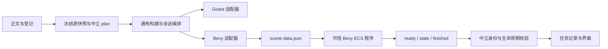

# Bevy 第二执行后端（0.0.8 源码）

Bevy 这条线先用真实 ECS 运行同一份无图 Scene2D 计划，检查现有中间层能否表达两个引擎的构建、工具身份、实例、输入、事件和冻结回放。源码为 **0.0.8**；这不是新安装包，也不是任意 Rust 脚本执行入口。默认后端仍是 Godot 4，操作与通用边界见[构建工作台](PROJECT_BUILD.md)和[执行中间层](BACKEND_MIDDLEWARE.md)。

## 当前支持范围

| 项目 | Bevy 当前实现 |
| --- | --- |
| 后端身份 | `org.viento.bevy`，适配器与可信运行程序版本 `0.3.0` |
| 工具链 | 固定 Bevy `0.19.1`；Rust 最低 `1.95`；仅 Linux 声明 |
| 输入计划 | 无图 Scene2D plan 1／2；作者 Scene2D v3 的组织分组仍按既有规则编译到 plan 2 |
| 功能 | `scene2d`、`input.arrows`、`state.movement`、`runtime.control-replay`、`runtime.control-replay.instances`；独立实例保持定义 UUID 与实例 UUID 配对 |
| 执行 | 构建数据工程、独立进程无头测试；窗口、截图、离屏、内嵌视口、GPU 均为 `false` |
| 未接入 | 图片／音视频、作者 Rust 行为、GDScript plan 3、BRP、反射、RPC、热更新、独立发行程序 |

Bevy 依赖关闭默认功能，仅启用 `std`。可信运行程序使用 `App`、`MinimalPlugins`、组件、查询和移动 system；没有加载窗口、渲染、素材或实体键盘输入插件。无头 smoke 使用受控方向输入和固定时间步，并不代表实体键盘或画面验收。插件能按需求组成不同应用，这是 [Bevy 官方插件模型](https://bevy.org/learn/quick-start/getting-started/plugins/)的基本接口；实际锁定版本与 API 见 [Bevy 0.19.1 App 文档](https://docs.rs/bevy/0.19.1/bevy/app/struct.App.html)。

## 准备可信运行程序

`crates/viento-bevy-runtime/` 是本应用维护的运行工具，与 `viento-studio-core` 编辑核心分开。每份工程只生成数据，不运行 Cargo、不编译工程中的 Rust 文本。先在仓库构建一次工具，再用绝对路径配置宿主。

```sh
# 首次获取锁文件中的依赖；Cargo 缓存与工程数据分开。
CARGO_TARGET_DIR=/tmp/viento-bevy-prototype-target \
  CARGO_PROFILE_DEV_DEBUG=0 CARGO_INCREMENTAL=0 \
  cargo build --manifest-path crates/viento-bevy-runtime/Cargo.toml --locked -j2

# 已缓存依赖后可以离线重建。
CARGO_TARGET_DIR=/tmp/viento-bevy-prototype-target \
  CARGO_PROFILE_DEV_DEBUG=0 CARGO_INCREMENTAL=0 \
  cargo build --manifest-path crates/viento-bevy-runtime/Cargo.toml --locked --offline -j2

export VIENTO_BEVY_BIN=/tmp/viento-bevy-prototype-target/debug/viento-bevy-runtime
"$VIENTO_BEVY_BIN" --version
```

版本输出应为 `viento-bevy-runtime 0.3.0 bevy 0.19.1`。适配器核对精确版本字符串和可执行文件 SHA-256；工具被替换后，旧构建必须重建。`/tmp` 是开发示例位置，会被系统清理；长期使用可自行把该程序放入本机工具目录，仍不放进作者工程。桌面资源准备会带上适配器模块，**没有把 Bevy 可执行文件放进安装包**。

## 使用同一场景

[无图双实例样例](../examples/bevy-headless/README.md)使用同一个 OC 定义：第一份实例允许方向移动，第二份实例使用 `controls: "none"`。固定右向输入持续 0.25 秒后，第一份实例从 `[200, 220]` 到 `[240, 220]`，第二份仍为 `[500, 220]`；释放后两者状态均为 `idle`。Godot 和 Bevy 分别运行同一份冻结计划，而不互相翻译引擎代码。

请先把样例复制到临时工程，输出目录必须是作者工程之外的新目录。以下 `/绝对路径/临时工程` 和 `/绝对路径/新构建目录` 需要替换为实际位置。

```sh
# 显式后端的计划检查会核对其能力；无需运行工具。
npm run project:build -- --command plan \
  --root /绝对路径/临时工程 --scene documents/scenes/demo.json \
  --backend org.viento.bevy

npm run project:build -- --command build \
  --root /绝对路径/临时工程 --scene documents/scenes/demo.json \
  --backend org.viento.bevy --tool "$VIENTO_BEVY_BIN" \
  --output /绝对路径/新构建目录

# 从冻结产物运行；无需重新打开作者工程。
npm run project:build -- --command run --build /绝对路径/新构建目录 \
  --backend org.viento.bevy --tool "$VIENTO_BEVY_BIN"
```

对照 Godot 时使用 `--backend org.viento.godot4 --tool "$VIENTO_GODOT_BIN"`，并为它选择另一个新输出目录。默认无头 smoke 有限结束；`--interactive` 则保持无头进程，当前没有运行时输入控制接口，需取消或超时停止。`--window`／`--capture` 对 Bevy 明确拒绝。

未显式选择后端、也未设置宿主后端变量的 `plan` 保留原中立只读行为；传入 `--backend` 后才进行对应能力检查。运行会从冻结记录选取适配器，但工具仍来自当前宿主配置；使用上方显式后端／工具命令可避免不同配置混用。`--godot` 仅保留为 Godot 专用旧别名，不能与 `--tool` 同传或用于 Bevy。

当前另有[有限控制回放](RUNTIME_CONTROL.md)：`run` 可选 `--control-program` JSON，以全局 schema 1 或按实例 schema 2 方向程序和固定时间步返回完整步骤样本。全局支持无行为 plan 1／2，按实例仅冻结 plan 2；每步未列实例释放，trace 仍包含全体演员。旧无程序 smoke 保留。适配器／可信程序升至 0.3.0，旧 0.1.0／0.2.0 工具和构建不能混用，需按当前锁文件重建并重新构建场景；旧验收报告仍描述其原版本。

## 编辑器入口

启动 Linux 本机编辑服务前设置：

```sh
export VIENTO_EXECUTION_BACKEND=org.viento.bevy
export VIENTO_BEVY_BIN=/绝对路径/viento-bevy-runtime
```

按既有方法打开工程，进入 **构建与运行 → 构建任务**，依次 **检查计划 → 构建场景 → 无头测试**。宿主每次固定一个后端，网页没有引擎选择下拉框；面板显示 Bevy 描述符，并禁用不支持的窗口入口。当前源码另有[运行对象](RUNTIME_OBJECTS.md)，可检索实例／定义、查看启动／结束位置样本和移动状态，并返回冻结声明；它使用现有事件，不向 Bevy 发起反射或 RPC。切回 Godot 时把宿主变量改为 `org.viento.godot4`，配置 `VIENTO_GODOT_BIN` 后重启服务，再重新检查和构建。

带图片的场景报告 `build_capability_missing`；GDScript 行为计划报告计划／能力或行为后端不兼容。后端不会静默忽略这些设计内容，也不会自动删图或去掉绑定。静态场景预览仍使用原几何模型，它可以显示 Bevy 尚不支持的设计内容，不能据此认定已可运行。

HTTP 继续限制场景、任务和产物身份，有限回放只在 `run` 增加纯数据 `controlProgram`；不能提交工具、后端模块、可执行文件或输出路径。未保存草稿、过期计划、描述符变化和产物后端身份不匹配沿用既有保护。

## 中间层与产物



`bevy-project.mjs` 只生成 `scene-data.json` 与来源映射。构建阶段 `scene-check` 调用工具检查该数据；运行阶段把已校验的冻结文件复制到独立会话目录，由工具执行。不把 Cargo 目标目录、设备句柄或 Bevy Entity 数字 ID 写入作者元数据。构建仍记录源快照、源映射、产物字节、真实工具以及执行适配器摘要；源工程离线后可回放。

`engine/scene-runtime-events.mjs` 是无 Node、DOM 或引擎依赖的事件准入规则：验证 plan／runtime 1／2、完整演员集合、实例／定义配对、有限坐标、`idle`／`moving` 与 ready／finished 顺序，限制帧与事件预算。原文导航只取冻结计划来源；进程输出不能指定任意作者文件。Bevy 不导入 Godot 的生成器或读取器；原 Godot 五份生成／运行文件保持原字节。

通用宿主仍拥有快照、路径、产物库存、工具身份、取消、超时和会话记录；具体适配器拥有引擎参数、生成布局与阶段；可信 Rust 运行程序拥有 ECS 对象和移动逻辑。第二实现先验证这一粒度，未来反射、运行资源或 Rust 行为确有共同需求时再单独立契约。工具及进程以当前用户权限运行，不是代码沙箱。

## 验证与下一步

Bevy 首轮记录位于[Bevy 验证目录](test-results/bevy-backend/results.json)，复现入口见[验证指南](TESTING.md#bevy-第二后端)。应分别核对实际 Rust／Bevy 工具、适配器、同计划双引擎运行、冻结源离线回放、缺能力与错误版本拒绝，以及取消／超时清理。已有 Godot、GDScript、场景预览与迁移回归继续保留。

Bevy 首轮接入的应用 1673 项全部通过、零跳过，新增中立事件／适配器／宿主 25 项已计入；可信 Rust 程序另有 14 项通过。实际同 plan 1／2 的 Godot／Bevy 完整事件一致，准备资源下的四次离线会话也一致。Chrome 五条流程验证 Bevy 的原工作台入口、三语窄屏、禁窗口、草稿与作者字节；移动仅执行两个纯模块的协议检查。分别见[可信工具](test-results/bevy-backend/runtime-proof.json)、[浏览器记录](test-results/bevy-backend/browser/browser.json)和[打包记录](test-results/bevy-backend/packaged-resources.json)，这些验证不包括 Bevy 图形、作者 Rust 行为、安装包或设备。

首次后端接入的事件对照使用受控整数坐标与固定时间步，不承诺任意物理模拟的浮点结果逐位相同。1531 份历史文件和 9 份冻结后端／WASM 字节保持；首次接入只清理该轮的 8 个临时目录，回收 2.241 GiB。首轮约 11.17 MB 的可信 Bevy 0.1.0 工具保留记录位于本机用户缓存证明中，路径及摘要见[工具记录](test-results/bevy-backend/host-tool.json)，不修改已安装程序或偏好，也不把编译目录写入工程。

运行对象首轮在独立的[运行对象轮次](test-results/runtime-object-inspection/results.json)接入实例／定义只读查询和工作台展示，沿用既有 plan／runtime，无需改变可信 Bevy 程序。当前又增加有限控制程序和固定步骤采样，详见[回放指南](RUNTIME_CONTROL.md)；后续比较连续实时采样、类型化事件、运行资源和明确 Rust 行为目录的共同需求。图片／窗口、BRP、反射、热更新、大规模性能与 Android 执行均需独立实现和真实验证，本轮不由 Bevy 依赖或描述符自动获得这些能力。
