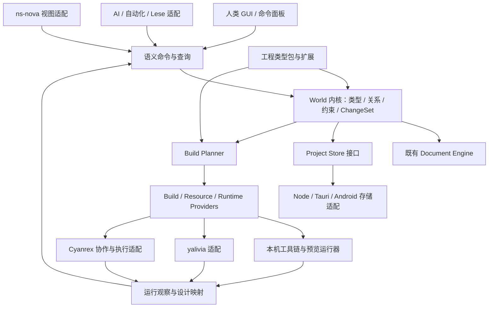

# Viento Studio 下一代架构书

状态：讨论与施工基线草案 v0.4 · 日期：2026-09-27

目标仓库：`Team-silvortex/viento-studio` · 新产品版本线起点：`0.0.1`

产品定位：设计优先、工程自动化、可由人类与 AI 共同操作的工程环境。

## 0. 范围、依据与关键决定

本书的既有实现基线是 `chiharu-kiryu/epic-of-viento-line` 的 `main` 快照：`bda0d3c4e5d8f90b4fff4914317809630c933583`，提交日期 2026-09-25，旧产品版本 b.4.6。它是迁移前的历史依据，不是新项目的目标名称或版本。初始核查包括架构文档、格式 Schema、可移植引擎、文档保存与项目定义代码、宿主实现和测试入口，属于静态架构核查；后续 0.0.1 对接的测试与备份另见迁移记录，不作为下一代提案已经实现的证明。源码存在、文档声明、真实部署验收是不同的证据层级。

需求依据是本次用户明确的新定位，以及所引用对话中“GUI 版 Emacs”“定义世界，定义对象，定义环境，绑定资源，按下 Build”的设计方向。用户进一步确认：迁移指将现有 GitHub 仓库的所有权从个人账户转到 `Team-silvortex` 组织，更名为 `viento-studio`，新版本号从 `0.0.1` 开始。对话中助手提出的其他名称和推论不作为已实现事实；目标模块名、接口名、目录、数据字段和里程碑仍是提案。

### 0.1 已确认的仓库与版本决策

```text
chiharu-kiryu/epic-of-viento-line
    → 转移现有仓库的所有权 + 更名
Team-silvortex/viento-studio
    → 新产品版本线：0.0.1
```

这是同一个仓库转移归属并调整项目定位。保留 Git 历史、分支、标签及随仓库转移的 Issues/PR 等记录，不采用新建空仓库后复制代码、Fork 或删除旧仓库的方式。`epic-of-viento-line` 退出后续产品和仓库命名；历史提交与来源记录中的旧名继续保留。GitHub 的仓库转移和更名机制支持延续这些记录及相应访问重定向。[GitHub 仓库转移说明](https://docs.github.com/en/repositories/creating-and-managing-repositories/transferring-a-repository) [GitHub 仓库更名说明](https://docs.github.com/en/repositories/creating-and-managing-repositories/renaming-a-repository)

`0.0.1` 是全新 Viento Studio 的软件发布起点；旧 b.4.6/0.4.6 历史与已有标签不改写。软件版本、作品格式版本、插件协议版本和本架构书修订号分别管理，软件版本重启不意味着把旧 workspace 数据解释成 v1。安装器与更新通道须显式处理新版本线，不能假定数值更小的 `0.0.1` 会自动成为旧安装的正常升级。

截至本书日期，GitHub 所有权转移与更名已完成：规范地址为 `Team-silvortex/viento-studio`，仓库 ID `1079541648` 未变，转移前后的 204 个提交、HEAD/tree、引用及文件清单核对一致。后续 Linux 侧已完成 `0.0.1` 名称、版本与安装计数器对接，并为最新官方实例建立独立快照、完整导出和恢复验收；逐项结果与本机交付物见 [0.0.1 交接记录](HANDOFF_0.0.1.md)。本地验收不代表已经发布 GitHub Release 或完成全部平台的设备验收。仓库归属迁移、代码架构演进和作品数据迁移分别验收，不把其中一项完成当作三项全部完成。后续施工先核对实际分支与版本，不重复转移仓库，也不删除旧地址指向的同一仓库。

### 0.2 架构决定

Lese、yalivia、ns-nova 和 Nuis 工具链在本轮未被当作独立仓库核查；以下集成点是待双方确认的适配契约，不宣称这些项目已经提供相应 API。

建议先确立五项架构决定：

1. **World 是设计和验证单元，Object 是操作单元，文件是持久化载体之一。** 文档编辑继续成为正式能力。
2. **GUI、命令面板、CLI、AI 使用同一语义命令层。** GUI 选择与布局可以是本地状态，领域变更必须经过统一校验和事务。
3. **设计版本、构建快照、运行状态分别管理。** 运行值不会悄悄覆盖设计值。
4. **工程类型包负责领域语义与构建规则。** 内核只承担身份、类型、关系、事务、约束、构建与观察契约。
5. **保留现有引擎和跨平台宿主，逐步引入新内核。** 第一个可用版本无需等待 Lese、yalivia 或 ns-nova 全部完成。

### 0.3 Linux 施工起点与交付边界

本书是下一代施工草案，不替代描述当前实现的 [系统架构](ARCHITECTURE.md) 与 [验证指南](TESTING.md)。最初架构文档提交仅纳入本书和入口链接。后续 [0.0.1 交接](HANDOFF_0.0.1.md)冻结前身契约并完成数据备份与恢复；没有启用下一代数据格式或删除原实例。

建议 Linux 侧按以下顺序启动：

1. 读取本书第 1、9、10 节，核对当前提交、工作区改动与实际版本。已有未提交工作先单独保留，不能为取得“干净基线”覆盖或清理它们。
2. 复核 [V0 交接记录](HANDOFF_0.0.1.md)的基线、0.0.1 安装兼容和官方实例恢复证据；更换机器或数据版本后重新执行相关验收。源码已迁入组织不等于任意后续作品快照也已迁完。
3. 从 V-M1 开始：提交 World/Object/ChangeSet/CommandDescriptor Schema 草案和属性权威来源 ADR，对旧工程只读投影；不先重写全部界面或启用 v4。
4. 再完成 V-M2 的一条窄纵切，使人类界面和命令客户端走同一语义动作。多记录持久修改须等待 V-M3 的事务恢复验收，不以临时双写代替。
5. 每个里程碑分别报告实际变更、测试证据、兼容性与尚未通过项。只有验收完成的能力才能在当前架构和发布说明中改称“已实现”。

施工范围以明确选定的阶段为限。本书不是立即运行所有迁移、执行特权操作、删除旧数据或发布版本的授权。配套协作边界见 [Cyanrex 下一代架构书](https://github.com/Team-silvortex/cyanrex-lab/blob/main/docs/zh-CN/next-architecture.md)。

## 1. 当前架构核查

### 1.1 已存在的模块边界

| 当前模块 | 已核实职责 | 下一代处置 |
|---|---|---|
| `web/` | 文档阅读、源码/区块/字段编辑、草稿、素材、导出、三语界面 | 保留为 Document 工作台，逐步接入语义命令层 |
| `engine/` | Markdown/文本/JSON/YAML 解析、布局、字段范围修改、文档身份与关系、存储工作流；不依赖 Node、HTTP、Tauri | 保留为可移植 Document Engine，作为领域内核的适配能力 |
| `scripts/adapters/` | Node 文档定位、快照与写入 | 继续履行文件存储契约 |
| `scripts/lib/`、`scripts/ops/` | 项目配置、素材登记、索引、导出和本机服务编排 | 分批整理为应用服务与宿主适配器 |
| `desktop/`、`src-tauri/src/` | 作品库、窗口与子进程生命周期、归档、原生存储 | 保留桌面宿主，增加 Build/Runtime Provider 桥 |
| `mobile/`、Android 宿主 | WebView 复用引擎、Rust 私有存储、草稿恢复、迁移传输 | 继续独立声明能力，不承诺桌面功能自动全量下放 |
| `schemas/` | workspace v2/v3、document v1、asset v1、类型与布局格式 | 冻结旧契约，新增下一代格式和升级规则 |

桌面经 Tauri 启动内置 Node 与本机服务；浏览器使用同一编辑器；Android 在 WebView 内适配请求，直接接 Rust 存储，不启动 Node/HTTP 后台。旧入口的兼容转发及核心依赖方向值得保留。[V1][v-architecture] [V2][v-engine]

### 1.2 当前数据模型

| 模型 | 当前事实 | 与目标模型的距离 |
|---|---|---|
| Workspace v3 | UUID、名称、创建时间；固定 `documents/templates/metadata` 数据根；逻辑素材存储 `main`；可配置 `documentTypes` | 是可移植作品容器，尚未描述可执行 World 与构建目标 |
| DocumentType | `id/label/directory/parserProfile/template/parserOptions/fieldGroups` | 控制文档创建、解释和展示；不是通用对象类型系统 |
| Document | 稳定 UUID、`sourcePath`、类型、解析配置、`relations`、`assetBindings` | 已有对象身份和关系的良好基础，但主要对象仍是文档 |
| Relation | `kind/targetId/slot`；`part-of` 可多归属；验证引用存在、重复与归属环 | 可升级为有端口、基数和领域约束的关系模型 |
| Asset | UUID、种类、标签、逻辑位置、大小/SHA-256、旧路径；可离线保留登记 | 可映射为 Resource 的文件资源子类 |
| Layout/Index | 从原文与登记派生，支持字段及章节；缓存可重建 | 适合作为语义模型的一种投影，不能成为第二份权威内容 |

现有正文是标题、属性、叙事等内容的权威来源；元数据不重复保存这些内容。`asset:<UUID>` 是稳定引用，本机绝对路径绑定留在 `.viento/local.json`。这一约束直接决定下一代不能再建一份独立、可随意写入的属性数据库与原文竞争。[V3][v-workspace] [V4][v-document-schema] [V5][v-asset-schema] [V6][v-document-model]

### 1.3 已有能力与明确缺口

**可以直接继承：** 通用文档类型与起始模板、跨格式编辑、保留未修改源片段、共享归属关系、稳定素材引用、版本冲突检查、跨平台存储适配、完整 `.viento.zip` 迁移、项目与应用分离、可重建索引。模板应用默认可只生成计划，并有迁移日志；模板目前是声明数据，不执行模板脚本。[V2][v-engine] [V7][v-project-definition]

**需要新增：** 通用 Object/Behavior/Environment 模型、原子多对象 ChangeSet、语义命令目录、类型化工程插件、统一 BuildPlan、构建产物溯源、RuntimeSession、Live Patch 和协作接口。当前索引重建与文档导出可成为 Build Provider 的素材，但不能直接当作已经实现了工程构建系统。

**不能夸大的宿主能力：** Android 当前已接入编辑、语言设置和完整迁移，媒体访问与插入、项目类型配置、文档分享导出仍有未接入项；同一引擎导出接口存在，不代表每个宿主已实现。[V1][v-architecture]

## 2. 愿景、体验与非目标

Viento Studio 让使用者以“世界、对象、环境、资源及行为”描述工程意图，并把工程实现交给显式、可验证的构建流程。Warcraft III World Editor 提供对象与规则驱动的设计参照；Emacs 提供可编程环境、命令组合和可塑工作面的参照。

默认交互顺序：**创建世界 → 定义对象与关系 → 定义环境和约束 → 绑定资源 → 查看构建计划 → Build → 观察运行结果。** 系统可根据已授予的策略自动完成重复步骤；阻断条件应定位到对象或字段。

建议主界面由 World Browser、领域视图、Inspector、Resource Browser、Behavior/Workflow、Build & Runtime、Changes & Review 组成。图、表格、文档、源码和空间视图都是同一设计的不同投影。工程类型包决定默认布局，不强迫 FEM、角色设定和软件部署采用同一种场景编辑器。

非目标：

- 不以复刻 VS Code 扩展生态或代码文件树作为第一阶段成功标准。
- 不在内核内置全部游戏、FEM、机器人、AI、软件系统知识。
- 不把所有工程问题强制降成三维场景，也不让 AI 决定未经声明的业务规则。
- 不在第一阶段实现通用分布式 CRDT、多租户云平台或全平台任意代码插件。
- 不把 Build 成功等同于科学正确、设备安全或业务验收通过；验收由模板声明并留存证据。

## 3. 核心抽象与不变量

| 抽象 | 定义 | 必须守住的边界 |
|---|---|---|
| Project/Workspace | 本地可移植容器，保存一个或多个 World、文档与资源 | 容器身份与远程 Cyanrex Workspace 显式映射 |
| World | 有规则、类型、环境和构建目标的设计集合 | 构建针对固定 revision，不读取不断变化的草稿 |
| Object | 有稳定 ID、类型版本、属性、关系和行为绑定的设计实体 | 名称、目录、展示坐标都不是身份 |
| ObjectType | 字段、默认值、验证规则、允许的关系/行为与视图描述 | 使用命名空间和 schemaVersion；未知类型可保留并只读 |
| Relation | 有类型的对象连接，可携带端口、方向、角色与参数 | 拓扑可有环；只有 `part-of` 等特定关系禁止环 |
| Behavior | 对象如何响应输入、状态或事件的声明 | 引用规则图或实现 Artifact；宿主通过 Provider 执行 |
| Constraint | 设计、绑定、构建或运行的约束 | 返回可定位诊断，标明 warning/error 与验证范围 |
| EnvironmentSpec | 目标平台、工具链、设备、网络、隔离及资源要求 | 与实际分配到的 EnvironmentInstance 分开 |
| Resource/Binding | 资源身份与版本，以及“对象哪个槽位使用哪个资源” | 文件、服务、设备、算力均可引用；凭据只存引用 |
| BuildTarget/BuildPlan | 构建意图与经解析的执行 DAG | 类型包负责 lowering；计划可预览、可解释、可缓存 |
| BuildRecord/Artifact | 一次构建的记录及不可变输出 | 输出指向输入快照、工具链、模板和资源版本 |
| RuntimeSession | 产物在具体环境中的运行实例 | 一个设计对象可对应零个、一个或多个运行实体 |
| Command/ChangeSet | 语义动作及一组有前置条件的变更 | 人、AI 和插件遵循相同验证、授权与冲突规则 |

World 图不必是树。界面中的父子树只是某种关系投影；构建 DAG 也不等于 World 拓扑。遇到领域中的反馈环，应由模板降低为调度或求解规则，不能为了满足 DAG 而删掉设计关系。

## 4. 模块分层与依赖



| 层 | 拥有的职责 | 不应拥有的职责 |
|---|---|---|
| Studio Shell / Views | 选择、面板、键位、可访问性、领域视图、草稿展示 | 直接绕过命令层写领域数据 |
| Semantic Application | 查询、命令目录、dry-run、批处理、撤销记录、操作结果 | 模板专属业务语义 |
| World Kernel | 标识、类型/关系验证、约束、设计版本、事务 | DOM、HTTP、Node 文件路径或特定 GPU API |
| Document Engine | 原文解析、保真修改与文档存储契约 | 通用调度或协作权限 |
| Build System | 解析依赖、生成计划、缓存、执行状态与 provenance | 直接假定某个编译器或运行时存在 |
| Runtime Bridge | 会话、对象映射、观察、补丁能力协商 | 把遥测自动提升为设计修改 |
| Extension Host | 包发现、兼容检查、声明注册及隔离执行 | 任意插件默认取得全部宿主能力 |
| Platform Adapters | 文件、窗口、网络、进程、归档、系统能力 | 决定 World 的领域含义 |
| Collaboration Adapter | 发布快照、提交 Task/Run、取回 Review | 在 Viento 内复制一整套 Cyanrex 调度数据库 |

逻辑边界在转移并更名后的同一仓库 `Team-silvortex/viento-studio` 内部建立，不要求立即拆 npm 包、Rust crate 或微服务。`engine/` 当前有清晰的可移植边界，优先保持；前端换框架不应成为语义内核迁移的前置条件。

## 5. 关键数据模型与存储

### 5.1 建议的最小记录

以下字段是目标契约示意，不是已发布 Schema。

| 记录 | 关键字段 |
|---|---|
| `World` | `id, projectId, name, schemaVersion, revision, typePackageRefs, environmentRefs, buildTargetRefs` |
| `Object` | `id, worldId, typeRef, typeVersion, revision, properties, behaviorBindings, documentRefs, provenance` |
| `Relation` | `id, worldId, typeRef, sourceObjectId, targetObjectId, sourcePort?, targetPort?, properties` |
| `PropertyBinding` | `objectId, propertyPath, authorityKind, authorityRef, sourceRevision` |
| `Resource` | `id, kind, versionRef, descriptor, contentDigest?, availability` |
| `ResourceBinding` | `id, objectId, slot, resourceId, selector, requiredCapabilities, resolvedVersion?` |
| `EnvironmentSpec` | `id, revision, target, toolchainConstraints, resourceRequirements, isolationRequirement, secretRefs` |
| `DesignSnapshot` | `id, worldId, worldRevision, sourceDigests, typePackageLock, resourceLock, digest` |
| `BuildPlan` | `id, snapshotId, targetId, providerVersions, steps, dependencyEdges, requiredPermissions, planDigest` |
| `BuildRecord` | `id, planId, state, stepResults, artifactRefs, diagnostics, executorRefs, startedAt?, finishedAt?` |
| `RuntimeSession` | `id, artifactRef, environmentInstanceRef, desiredRevision, observedRevision, status, runtimeEpoch` |
| `RuntimeObjectMap` | `sessionId, designObjectId, runtimeHandle, generation` |
| `ChangeSet` | `id, actorRef, baseRevision, commands, preconditions, affectedObjects, state, resultingRevision?` |
| `CommandDescriptor` | `id, version, inputSchema, outputSchema, targetTypes, preconditions, effects, requiredCapabilities, undoMode` |

`availability` 是观察值，不代表资源内容已校验；资源 ID、内容摘要和授权引用各自独立。复现构建时应锁定实际资源版本，不能只保存“latest”。

### 5.2 权威来源：避免双写

建议分两种持久化模式，显式声明到属性级：

- **Document-backed：** 旧文档仍是权威来源，Object 属性是解析投影。修改属性必须调用现有保真编辑器，写回原文后生成新投影；解析不确定的字段只读或要求用户选择映射。
- **Model-backed：** 新工程对象以类型化记录为权威来源，文档引用或展示对象字段。外部编辑生成文档不能反向覆盖模型，除非经过显式导入与冲突处理。

同一个属性不能同时由两种模式拥有。将旧文档“提升”为模型对象必须是可预览的迁移事务，保留原文快照和来源映射。正文中的叙事内容可以继续由 Document 拥有，不必为对象化而全部重写。

### 5.3 文件格式与事务

建议为需要新增可执行语义的工程定义 **workspace v4**，保留 `documents/`、`templates/`、`metadata/`、`assets/`，增加 `worlds/`、`objects/`、`environments/` 和工程包锁文件。命名仅是草案，最终由格式 ADR 决定。归档清单必须显式包含新目录，不能依赖旧导出器碰巧扫描它们。

迁移日志、恢复所需事务意图、格式拒绝标记和用户编写的视图配置不能混入可随时删除的 cache。构建缓存和派生索引可重建；被用户正式发布的产物与构建证明按保留策略独立保存。

第一阶段采用单 World 写入协调器、乐观版本检查、写入意图日志和崩溃恢复。多文件变更先持久化意图与新数据，再发布提交代次；读取只接受已提交代次。既有单文档事务可复用，但不应声称它已经提供多对象事务。外部文件编辑必须先导入为新 revision，再参与 Build。

### 5.4 人类与 AI 并发

GUI 与 Agent 都提交包含 `baseRevision` 的 ChangeSet。提交时重新验证前置条件和授权；过期版本返回对象/字段差异，绝不让“最后写入者”无提示覆盖。GUI 可保留尚未提交的草稿，AI 的变更在 Changes 视图中显示作者与影响。

撤销在版本仍匹配时执行逆命令；不满足前置条件时创建新的修正提案。对外部部署、设备动作和运行副作用，撤销只在 Provider 声明补偿能力时可用，不能把界面 Undo 伪装为物理回滚。

## 6. 运行与交互流程

### 6.1 从设计到可运行工程

1. 选择工程类型包，创建 World；包实例化默认对象、资源槽位、约束和 BuildTarget。
2. 人类或 AI 通过同一命令层创建、连接和修改对象；字段与关系的静态诊断即时出现。
3. 选择 EnvironmentSpec，绑定文件、数据、服务或计算资源；解析绑定并显示缺失能力。
4. 固定 DesignSnapshot，验证对象类型、关系、约束、资源可用性及工具链。
5. 类型包把语义模型降低为 BuildPlan；界面显示将生成什么、调用哪些工具、在哪运行。
6. 执行计划，保存 BuildRecord、输出 Artifact 和源对象映射；错误可以返回到对象字段。
7. 根据目标定义启动预览或提交部署请求，形成 RuntimeSession；观察结果显示在设计旁边。

BuildTarget 必须声明“只生成产物”“构建后本机预览”或“构建并部署”的效果。已有授权可以覆盖常规重复操作；新的外部资源、费用或部署目标应进入该工程的策略判断。工程自动化的前提是结果与边界可说明。

### 6.2 Cold Build

```text
Committed Design → Snapshot → Validate → Resolve & Lock
                 → Lower to BuildPlan → Execute DAG
                 → Verify Outputs → Package → Artifact
                 → optional Launch/Deploy → RuntimeSession
```

构建缓存键至少包含设计快照摘要、目标配置、输入资源版本、类型包与 Provider 版本、工具链标识。对读取时钟、网络状态或外部设备的步骤，Provider 必须标注不可复现或不可缓存，不能假定所有工程构建都是纯函数。

BuildPlan 可以由本机执行，也可把一个或多个步骤交给 Cyanrex Run。每个步骤只有一个执行所有者；Viento 管理设计依赖，Cyanrex 管理其接收的执行请求、租约和记录。调用方中断等待时，通过操作 ID 查询结果，不能直接重复投递有副作用的步骤。

### 6.3 Live Build

Live Build 的输入是“已提交的新设计与当前运行基线之间的差异”。它需要运行时明确声明支持哪些补丁，而不是对所有对象修改承诺热更新。

| 变更类别 | 默认策略 | 示例 |
|---|---|---|
| 仅视图/设计说明 | 更新 Studio 投影，无运行补丁 | 面板布局、设计注释 |
| 可动态更新的属性或资源 | 准备、验证、应用局部补丁 | 材质参数、已支持的资源重载 |
| 支持状态迁移的行为 | 运行时安全点、迁移函数、健康检查 | 状态机版本替换 |
| 不兼容的类型/环境/布局 | 提示局部重启或 Cold Build | ABI 改变、不支持的字段布局变更 |
| 不可补偿的外部动作 | 使用专门执行策略，不承诺回滚 | 设备运动、外部服务写操作 |

建议补丁协议：`describeCapabilities → preparePatch → validateBase → applyAtSafePoint → observeHealth → finalize`。准备阶段必须绑定 `sessionId/runtimeEpoch/baseRevision/patchDigest`；提交前再次比较基线，过期补丁不得执行。健康检查失败时，仅在 Provider 提供恢复点且副作用允许的情况下回滚，否则标记失败并要求重启或修复。

最低必要状态包括 `preparing/ready/applying/applied/rejected/failed/recovery_required`。设计提交成功和运行补丁成功是两个事实；运行面板同时展示 `desiredRevision` 与 `observedRevision`，避免模型已经更新、运行却仍是旧版时显示“一切已同步”。

### 6.4 运行观察与回写

选择一个对象时可同时查看 Design、Runtime、Dependency、Deployment、Verification。遥测带 `sessionId/designObjectId/runtimeHandle/generation/observedAt`，过期运行实例的数据不能写到当前对象视图。

例如在仿真中手动调节阻尼：默认只改变运行值。用户或 Agent 执行“提升为设计值”，才生成 ChangeSet；提交后再选择 Live Build 或 Cold Build。这个边界防止仿真噪声、探针结果或 AI 临时尝试污染工程定义。

## 7. 工程类型包、模板与扩展

### 7.1 分开四类扩展

| 扩展种类 | 内容 | 首期执行方式 |
|---|---|---|
| 工程类型包 | 对象/关系类型、约束、默认环境、构建目标、领域视图声明 | 版本化声明包，由内核解释 |
| 实例模板 | 初始 World/Object/ResourceBinding、示例数据和操作引导 | 复制或实例化，不自动修改既有工程 |
| Provider | 编译器、求解器、资源连接器、运行时与验证器 | 首期内置可信适配器；外部实现走显式进程/协议边界 |
| 工作台扩展 | Inspector、图形/表格/空间视图、命令组合与快捷键 | 通过只读查询和语义命令访问模型 |

新类型包建议声明 `packageId/version/schemaVersion/engineCompatibility/types/relations/constraints/views/buildTargets/providerRequirements/migrations`。使用例如 `org.example.game/Actor` 的命名空间，避免“character”“task”等跨包冲突。

当前 `documentTypes` 是文档模板机制，应保留为 Document 类型包输入；不要直接把旧 `template` 字段解释成可执行脚本。[V8][v-type-schema]

### 7.2 版本与权限

工程锁定包版本、摘要和 Provider 协议版本。安装新版本不自动迁移已有实例；迁移器给出计划、诊断、恢复点和最低读取版本。缺失插件时保留未知对象与原始载荷，以只读形式展示，不删除“不认识”的字段。

声明“需要网络/设备/执行工具”的扩展并不因此获得权限。扩展通过受限资源接口申请使用，宿主再依据工程策略授予。首期可执行 Provider 以可信内置实现为主；后续用独立进程或受限运行环境隔离，不能把整个 Node/Tauri 权限面暴露给任意包。

### 7.3 首批工程类型

1. **OC / Narrative：** 把现有角色、故事、地点、组织、设定与素材能力迁入新工作台，Build 输出可核验的文档站或分享包。它检验兼容性。
2. **二维场景与状态机演示：** 创建场景、Actor、触发器、状态机，绑定图像与音频，Build 生成独立 Web 预览；运行时支持少量明确声明的参数更新。它检验“设计 → 可运行产物”。
3. **Software Workflow：** 对象表达组件、输入输出、测试和运行步骤，经 Provider 执行。它检验内核是否脱离游戏专有概念。

FEM、机器人、AI、XR 作为后续类型包方向。它们应贡献自己的单位、数值精度、求解约束、设备规则与专业验证，不把这些规则塞进通用内核。

## 8. AI 与 Nuis 生态集成

| 集成对象 | Viento 提供 | 对方预期提供 | 首期降级/替代路径 |
|---|---|---|---|
| AI Agent | 类型目录、对象查询、合法动作、dry-run、ChangeSet、诊断、Build/Runtime 状态 | 计划、提案、执行策略与结果解释 | 使用本地语义 API，不依赖截图操作 |
| Lese | 稳定语义节点 ID、对象引用、控件角色、字段单位/类型、动作及当前可用原因 | 对语义界面的发现、理解和操作适配 | Studio 自带命令目录与语义树；Lese 后接 |
| yalivia | 产物清单、对象映射、环境要求、版本化补丁计划 | 会话、观察、安全点、状态迁移/补丁能力描述 | 内置预览运行器；不支持热更新时 Cold Build |
| ns-nova | 对象/关系投影、选择模型、视图描述、语义动作 | 高级图形或空间交互呈现 | 当前 Web/Tauri 二维工作台 |
| Cyanrex | 设计快照 Artifact、BuildPlan 的执行请求、可定位诊断 | Workspace 权限、Task/Run/Review、资源目录与执行证据 | 本机任务记录与执行器 |
| Nuis 工具链 | 目标与工具链需求、输入摘要、产物描述、诊断协议 | 编译/打包/环境/设备/身份等实际服务 | 通过可替换 Provider 接现有工具 |

AI 的有效权限是“操作者授权 ∩ Workspace 策略 ∩ 操作要求 ∩ 扩展能力”。Agent 不能因为读到了对象正文中的指令就取得额外工具权限。常规授权内操作可以自动化；策略要求审阅时生成具体 ChangeSet，而不是请求用户批准一个看不见的模糊计划。

Lese 层需要暴露“修改哪个对象的哪个字段、为什么不可执行”，不能只给 DOM 选择器或按钮名称。ns-nova 更换显示方式时必须保留相同对象 ID、焦点语义与命令效果。yalivia 接入必须通过能力协商，不能在适配器缺席时仍显示可用的 Live Build 按钮。

### 8.1 两个产品之间的最小契约

建议共享契约包，而非共享业务数据库。首批只定义版本化的 `PrincipalRef / WorkspaceRef / ArtifactRef / ActionDescriptor / ExecutionRequest / ExecutionReceipt / EventEnvelope`，采用 JSON Schema 及两端生成的类型。

Viento 的 World revision 以不可变 ArtifactRevision 发布到 Cyanrex；一个 BuildRecord 可以关联多个 Run，Run 输出再关联回源 Object。Cyanrex Review 指向准确的 ArtifactRevision 或 ChangeSet，不能用“某文件最新版”作为审阅依据。反向修改由 Viento 接受 ChangeSet 后产生新 revision，Cyanrex 不直接写入其本地工程文件。

跨产品引用包含实例/authority、对象类型、ID 和 revision，避免不同设备碰巧使用同一局部 ID。语义操作需要幂等键、协议版本与关联 ID；诊断和事件共享关联字段，但不强制两套领域事件完全同构。

## 9. 迁移与兼容策略

### 9.1 仓库所有权转移与更名

以下保留迁移施工顺序。V0 的安装兼容、官方实例备份与独立恢复已在 [0.0.1 交接](HANDOFF_0.0.1.md)完成，源码随后以 [0.0.2](RELEASE_0.0.2.md) 提交到组织仓库，基础与原生兼容 CI 均已通过；历史阶段描述不表示仍需重复迁移：

1. 核对源仓库管理权限、目标组织接收条件和目标名称可用性；不要预先创建占用 `Team-silvortex/viento-studio` 的空仓库。
2. 使用 GitHub 仓库所有权转移，将现有仓库交给 `Team-silvortex`；在转移流程中或随后更名为 `viento-studio`。
3. 核对仓库身份、提交、分支、标签、Issues/PR 和发布记录的延续情况，并检查组织下的访问权限与自动化设置。
4. 在转移后的仓库更新产品名称、包元数据、文档地址、远程地址和发布配置；历史证据中的旧地址与版本保留来源含义。
5. 将新产品版本统一为 `0.0.1`，对齐各包、宿主和发布元数据；旧标签保持原指向，新发布使用独立的新版本标签。
6. 验证 CI、安装与更新路径。仓库转移本身不改用户作品身份、格式或本机数据目录；必要的数据升级另走下节流程。

这一过程不需要保留一份独立“个人旧仓库”继续开发，也不通过删仓腾出旧名称。新旧地址的重定向不代替主动更新集成配置；Pages 地址和被其他仓库引用的 Actions 等需按 GitHub 的例外规则单独核对。[GitHub 仓库更名说明](https://docs.github.com/en/repositories/creating-and-managing-repositories/renaming-a-repository)

### 9.2 用户作品的旧概念映射

| 旧数据/能力 | 目标映射 | 迁移规则 |
|---|---|---|
| workspace v1/v2/v3 | Project，首个 World 的来源 | 保留原项目 UUID；World 用独立 ID 并记录来源 |
| Document UUID | Document-backed Object 的稳定 ID | 首期保留 ID；后续拆出多个工程对象时新建 ID 并保存映射 |
| `documentType` | 文档类型/领域类型的映射记录 | 用户确认映射，未知类型使用通用 Document |
| `parserProfile`、字段/布局规则 | Document Engine 和视图适配参数 | 保留旧解析行为，不能凭类型名重新解释旧字段 |
| `part-of` | 归属 Relation | 保留多归属、slot、无环约束；其他关系独立保留 |
| `assetBindings`、`asset:<UUID>` | 文件 Resource 与 ResourceBinding | 原 UUID、指纹、离线状态和旧路径保持 |
| `templates/` | Document 起始模板或类型包的模板资产 | 保留原文件；不自动赋予执行权限 |
| 索引与布局缓存 | Semantic Projection / View Cache | 可以重建，不升级为权威数据 |
| HTML/Markdown/ZIP 导出 | Document Export Build Provider | 对齐输出契约，保留旧导出入口 |
| `.viento/local.json` | Local Binding Profile | 留在本机，不上传到 Cyanrex 或进入迁移包 |

### 9.3 用户作品迁移次序与回退

以下处理的是用户的作品目录与数据格式，不是 GitHub 仓库所有权。这里的副本和 Fork 指作品数据身份，与仓库转移无关。

1. **兼容读取：** 新 Studio 先读取旧工程，建立内存语义投影；继续通过旧存储路径保存文档。
2. **计划与副本：** 启用 v4 前输出迁移计划、未知类型、离线资源及所需插件；在独立目标目录产生迁移副本。原始正文、素材、登记和历史归档保留。
3. **稳定身份：** 真正升级保留项目身份，但同步系统只能发布一个权威副本；若用户要同时发展两份，执行显式 Fork 并分配新项目身份、记录 lineage。
4. **格式保护：** 新清单与归档版本使旧程序明确拒绝写入。不能只加一个旧程序不认识的 `minReaderVersion` 字段，就认为旧导出器不会漏掉新数据。
5. **数据验证：** 比较原文/素材哈希、ID、关系、数量、未解析项；导出再导入后复查；迁移再次执行应幂等。
6. **切换与回退：** 切换到通过核验的新副本。新语义写入前可直接退回旧工程；写入后保留新工程分支与差异，不能宣称降级到 v3 仍无损保存 Behavior/Runtime 等新信息。

未知属性和插件数据必须原样保留。外置资源缺失应给出修复清单；不能把“目录存在”当作内容完整。迁移原子性覆盖模型与登记；索引失败可重建，不应把已提交设计回滚成旧缓存。

### 9.4 代码施工方式

代码演进在转移后的组织仓库内进行，沿用原有 Git 历史。先用适配层接入 `engine/index.mjs`、`document-store.mjs`、`project-definition.mjs` 与现有宿主接口，再让一条用户流程穿过新语义命令层。保留旧 HTTP/桥接响应与转发入口，逐个替换调用方。新产品版本线允许明确规划接口调整，但不能把所有权转移本身当作破坏数据兼容性的理由；迁移期避免同时重写 UI 框架、存储格式、插件系统与运行时。

### 9.5 官方实例数据保护：V0 的硬门槛

“Epic of Viento Line”仍是独立作品与官方示范，其应用名称退役不意味着作品身份或内容可以删除。仓库中的 [示范定义](examples/README.md)、旧 Git 历史及源码备份都不能代替 Linux 上最新作品数据；定义模板也不是完整作品。

在 Linux 侧实际切换版本或作品存储前，至少完成：

1. 盘点真实作品目录、所有外置素材绑定、模板、文档/素材登记、应用设置及恢复所需状态。记录缺失、离线和未登记文件；先保留原件，不凭文件名推断可以丢弃。
2. 在作品停止写入或具有一致性快照的条件下，生成完整迁移包及独立备份。外置素材必须实际收集并校验，不能只保存路径；本机绑定配置和应用设置另作受保护的恢复备份，不混入公共工程包。
3. 生成逐文件路径、字节数与 SHA-256 清单，并记录项目/文档/素材 ID、关系、绑定、数量和未解决项。任何历史统计只能作参考，验收以本次冻结快照为准。
4. 在独立目录恢复，比较清单及稳定身份，抽查正文、图片、音频、视频、共享归属与离线资源；实际完成打开、编辑副本、保存、重开和再次导出。不能只用“归档可解压”替代恢复验收。
5. 新版先保持现有应用标识 `io.viento.studio`、数据查找路径和作品 UUID 的兼容。确需调整时另写迁移计划，并明确设置、凭据引用与本地绑定的处置。
6. 只有恢复核验通过且使用者确认切换后，才讨论旧实例退役；本书及本次文档提交不执行删除。保留不可覆盖的原快照与回退路径，切换后的新写入也须有独立保留策略。

私有作品、原始备份、账户凭据、本机连接信息及敏感清单不提交到代码仓库。仓库只记录脱敏的验收结论、备份标识/摘要和待解决项；失败或资源缺失时明确阻断切换，不把“不在线”当成“不需要”。

## 10. 分阶段施工路线与首批里程碑

阶段按依赖和验收划分，未根据未知的人力配置承诺日历时间。先完成仓库转移、更名和 `0.0.1` 新版本线设置，再在同一仓库推进架构工作。版本号的设置不等于下表长期能力已经实现；每次发布须说明实际交付范围。Viento 可独立推进 V0–V3；对接 Cyanrex、Lese、yalivia 采用各自契约就绪后的集成门槛。

| 阶段 | 核心交付 | 完成标准 |
|---|---|---|
| V0：组织迁移与冻结基线 | 同仓库所有权转移、更名、`0.0.1` 版本线；旧格式夹具、宿主能力表和 ADR | 组织仓库保留历史；新名称/版本元数据一致；v1/v2/v3 样本明确数据兼容边界 |
| V1：语义内核 | World/Object 投影、类型注册、查询、命令与 ChangeSet | GUI 与自动化调用同一命令；创建、改属性、连接、绑定资源、验证均可无界面执行；冲突不覆盖 |
| V2：设计工作台 | World Browser、Inspector、资源与变更视图；OC 类型包 | 旧工程完成编辑、保存、重开、分享与完整迁移；全过程保持稳定 ID 和源内容 |
| V3：Cold Build | Snapshot、锁文件、BuildPlan、Provider、Artifact 与诊断映射 | 二维场景不手写业务代码即可构建、启动并观察；断网可构建锁定的本地示例；失败准确定位对象 |
| V4：协作与资源 | Cyanrex Artifact/Task/Run/Review 适配、Software Workflow 类型包 | 指定 revision 远程执行；重复提交不重复启动；评语定位到正确输入版本；资源不可用不静默换目标 |
| V5：Live Build | RuntimeSession、运行映射、有限补丁、yalivia 适配 | 声明支持的属性可热改；不支持的变更明确要求重建；过期补丁拒绝，失败能恢复或明确停止 |
| V6：生态扩展 | Lese 正式适配、ns-nova 视图、更多领域包 | 更换呈现或运行后端不改变语义命令和工程身份；通过插件兼容测试 |

**首批可拆分施工单：**

当前实现进度：V-M1 已加入实验性 Schema、属性权威来源 ADR，以及旧工程的只读 World / Object 投影和 GUI / CLI / HTTP 查询。V-M2 第一条纵切已接通 `property.set` 的预览、单文件保真写入、旧编辑器并发协调及真实版本冲突，见 [使用与验证记录](WORLD_PROJECTION.md)。V-M3 第一条纵切加入多个现有对象属性的批量提交、意图／提交记录、进程中断恢复及旧编辑器和导出读取屏障，见 [事务协议与验收范围](WORLD_TRANSACTIONS.md)。受控的 v1 / v2 / v3 格式样例与官方实例分别验收，不将合成样例称为三份真实生产工程。语义创建、关系和资源绑定动作、登记／资源事务及后续 Build 能力仍未实现。

| 编号 | 工作项 | 可审查验收物 |
|---|---|---|
| V-M0 | 复核已完成的组织转移与更名，完成 `0.0.1` 元数据、安装兼容及官方实例备份验收 | 仓库历史延续；名称/版本/发布配置核验；官方实例完整备份与独立恢复对账通过 |
| V-M1 | 写出 `World/Object/ChangeSet/CommandDescriptor` 第一版 Schema 与权威来源 ADR | 三个真实旧工程样例的只读投影及字段来源表；无数据改写 |
| V-M2 | 接通 `object.create/property.set/relation.add/resource.bind/world.validate` | GUI 和命令客户端执行同一操作得到同一 revision；包含一次真实版本冲突 |
| V-M3 | 实现可恢复的多记录 ChangeSet 提交 | 在意图落盘、数据落盘、提交发布三个位置中断后，恢复结果均为旧版或完整新版 |
| V-M4 | 首个二维场景工程类型包与本机 Build Provider | 一份含 Actor、触发器、图像、状态机的可移植示例，产出独立可运行预览 |
| V-M5 | 提交 v4 格式与归档升级 | 旧/新包往返矩阵、未知扩展保留、缺资源失败、旧程序拒绝写入的证据 |

建议先完成 V-M1/V-M2 的窄纵切，再扩展持久格式。V-M4 是产品方向验收：如果仍需用户先建立代码项目再补 GUI，设计优先链路尚未成立。

验证延续现有可移植引擎、文档保真与原生宿主回归；新增测试集中在跨层不变量：字段权威来源、对象身份、事务恢复、计划可复现性、Provider 超时/取消、补丁基线。Mock runtime 的通过只能证明协议，不能替代真实 yalivia 集成验收。[V9][v-testing]

## 11. 主要风险与决策门槛

| 风险 | 具体后果 | 处理与门槛 |
|---|---|---|
| 过早追求所有领域通用 | 内核变成巨型属性袋或过度抽象框架 | 用 OC、二维场景、软件工作流三种差异场景检验；至少两种独立需求出现后再提升为核心概念 |
| 文档和对象双份权威 | GUI、源码、AI 修改互相覆盖 | 属性级 authority；旧文档保真回写；提升模式必须迁移 |
| Build 隐含大量外部副作用 | 无法解释失败、复现或撤销 | BuildPlan 声明效果与目标；区分产物生成和部署 |
| 误把 World 图当树或 DAG | 丢失共享归属、反馈回路 | 关系类型各自定义约束；构建阶段专门 lowering |
| 热更新被承诺为万能 | 状态错配、陈旧补丁、生效情况不明 | 能力协商、epoch、基线比较、失败恢复；无法支持时重建 |
| 新格式破坏旧归档 | 新目录没有进入备份 | 独立版本与拒绝旧写入；迁移/归档往返作为发布门禁 |
| 同时重写全部宿主 | 移动端、桌面能力倒退 | 共用内核、宿主能力矩阵、逐流程替换 |
| 双方调度重叠 | Viento 与 Cyanrex 同时重试或取消同一步 | 一个步骤一个执行所有者；幂等键与准确 Run 引用 |
| 生态项目接口未定 | 主产品被迫等待 | 先本机 Provider 与契约测试，再接真实服务 |

进入实现前必须定案的 ADR：World 与 Project 的包含关系；属性权威模式；多对象提交协议；v4/归档兼容规则；首个工程包的最小运行语义；Build/Run 所有权；共享契约包的版本治理。它们影响首批数据和边界，应早于大规模界面改造。

## 12. 固定版本证据索引

本节的实现证据链接固定在此次核查提交，避免后续 `main` 变化使依据漂移。当前指南及配套架构书的导航链接可随主线更新，不用作已实现能力的证据。现有功能的核查不等于本次已执行其测试。

- [V1：模块、宿主链路和移动能力边界][v-architecture]
- [V2：可移植引擎及存储契约][v-engine]
- [V3：workspace v3 实际 Schema][v-workspace]；[权威来源与归档说明][v-layout]
- [V4：document v1 实际 Schema][v-document-schema]
- [V5：asset v1 实际 Schema][v-asset-schema]
- [V6：身份、归属验证与旧数据迁移实现][v-document-model]
- [V7：项目定义应用与迁移日志实现][v-project-definition]
- [V8：现有文档类型/模板 Schema][v-type-schema]
- [V9：已有验证入口与覆盖说明][v-testing]
- [文档保存的版本检查与宿主事务接口][v-document-store]

[v-architecture]: https://github.com/Team-silvortex/viento-studio/blob/bda0d3c4e5d8f90b4fff4914317809630c933583/docs/ARCHITECTURE.md
[v-engine]: https://github.com/Team-silvortex/viento-studio/blob/bda0d3c4e5d8f90b4fff4914317809630c933583/engine/README.md
[v-workspace]: https://github.com/Team-silvortex/viento-studio/blob/bda0d3c4e5d8f90b4fff4914317809630c933583/schemas/workspace-v3.schema.json
[v-layout]: https://github.com/Team-silvortex/viento-studio/blob/bda0d3c4e5d8f90b4fff4914317809630c933583/docs/WORKSPACE_LAYOUT.md
[v-document-schema]: https://github.com/Team-silvortex/viento-studio/blob/bda0d3c4e5d8f90b4fff4914317809630c933583/schemas/document-v1.schema.json
[v-asset-schema]: https://github.com/Team-silvortex/viento-studio/blob/bda0d3c4e5d8f90b4fff4914317809630c933583/schemas/asset-v1.schema.json
[v-document-model]: https://github.com/Team-silvortex/viento-studio/blob/bda0d3c4e5d8f90b4fff4914317809630c933583/engine/document-model.mjs
[v-project-definition]: https://github.com/Team-silvortex/viento-studio/blob/bda0d3c4e5d8f90b4fff4914317809630c933583/scripts/lib/project-definition.mjs
[v-type-schema]: https://github.com/Team-silvortex/viento-studio/blob/bda0d3c4e5d8f90b4fff4914317809630c933583/schemas/project-type-v1.schema.json
[v-testing]: https://github.com/Team-silvortex/viento-studio/blob/bda0d3c4e5d8f90b4fff4914317809630c933583/docs/TESTING.md
[v-document-store]: https://github.com/Team-silvortex/viento-studio/blob/bda0d3c4e5d8f90b4fff4914317809630c933583/engine/document-store.mjs
