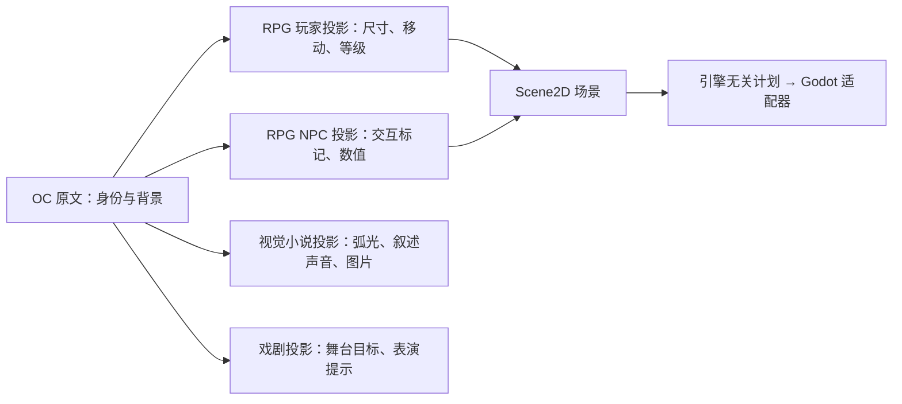

# OC 子模板与多份投影

本功能已纳入 [0.0.6 源码交付](RELEASE_0.0.6.md)。适用于提供 World 命令的桌面／本机编辑服务；Android 暂无投影编辑入口。它沿用 workspace v2 / v3 的正文、文档登记与素材目录，不迁移或复制已有 OC 背景。

## 一份 OC，多种用途

OC 原文负责身份、背景故事与设定。投影是另一份有独立 UUID 的 JSON 文档，引用原 OC，保存特定用途的字段。一个 OC 可以同时拥有 RPG 玩家、RPG NPC、视觉小说、文学或戏剧投影；修改某份投影的数值不会改写原 OC 或其他投影。



这里的“投影文档”是作者保存的配置；[World 投影](WORLD_PROJECTION.md) 则是内核根据工程生成的查询视图，两者不要混淆。投影的来源不限于某个内置 `character` 类型，空白工程的普通文档也可作为 OC。投影不能再以另一份投影为 OC 来源；复用子模板与来源身份是分开的。

## 创建与复用

1. 保存当前草稿，打开 **世界与对象**，选择已登记的 OC，点击 **创建投影**。
2. 选择子模板，填写名称、工程已有文档类型、JSON 路径和配置。需要图片时先通过编辑器素材入口导入；表单只选择已登记图片。
3. 先预览，再保存。预览不写作者文件；保存一次创建正文与登记，并自动登记来源 OC 和图片依赖。
4. OC 检查器列出它的各份投影。投影检查器可返回来源 OC、查看子模板及配置、打开原文；标题及非图片配置可通过已有属性表预览和修改，模板范围与枚举约束继续校验；图片和多字段修改可通过 **编辑投影配置** 一起保存。更新后的配置在下一次构建时生效。
5. 新建时也可选择工程内已有投影作为子模板，使用它的当前配置生成独立默认值。图片需重新选择，避免新投影隐式绑定旧素材。

内置层次为“角色 → 游戏角色 → RPG 角色 → 玩家／NPC”。视觉小说、文学、戏剧从角色基础分化。子模板展开继承的字段与默认值，保留祖先的标识和版本。字段类型支持数字、文字、布尔值、枚举和图片引用。

保存的模板快照包含展开后的完整字段规则、运行映射与 SHA-256 摘要。工程重开、完整迁移、资源包迁移不依赖安装目录中仍然存在同名模板；升级应用也不会自动修改已有投影。摘要用于完整性检查，不是签名。复用得到独立快照，不会动态追随旧投影后续变化。

表单有返回、Esc、草稿确认和关闭保护。修改输入或重新读取工程会使旧预览失效；预览后 World 修订若有变化，保存时会拒绝旧版本并保留表单，重新读取后再预览。保存不确定时先核对同一 UUID，避免重复创建。草稿只在当前页面内存中保存。

## 编辑已有投影

在 **世界与对象** 中选择投影，点击 **编辑投影配置**。表单使用该投影保存的模板快照，展示当前标题、文字、数值、枚举、开关和图片；不要求安装目录仍然存在来源模板。

1. 修改所需字段并 **预览修改**，核对内容后保存。标题和多项配置可以一次提交；图片从已有素材中选择，也可以选择不使用图片。
2. UUID、原 OC、文档类型、路径和模板锁保持不变。要生成另一个用途，返回原 OC 新建或复用子模板；这里的编辑不会把已有投影变成其他类型。
3. 保存同步更新正文和缺少的图片登记绑定。原文只替换有变化的标题／配置值，保留 BOM、CRLF、缩进、未修改的数值写法与模板；登记的既有关系、绑定和扩展内容保留。
4. 更换或清空配置图片不删除素材，也不移除已有绑定。它们可能仍被场景中的显式图片覆盖或其他用途使用。继承配置的场景会在重新检查计划、构建后采用新配置；显式配置继续使用场景自身的值。

预览不写数据；保存前同时核对 World、对象和正文修订。外部修改后拒绝旧预览并保留表单，重新读取后再预览。保存响应丢失时先核对已保存的字段；已有 UUID 的存在本身不能证明这次编辑已成功。关闭或取消未保存修改仍需草稿确认。

旧的单属性编辑入口保留。编辑表单暂不切换来源 OC、模板版本或路径，也不批量编辑多个投影；通用源编辑仍可维护正文，后续语义校验照常执行。

## 接入场景

在 **构建与运行 → 创建场景** 中选择 RPG 玩家／NPC 投影，勾选 **使用投影配置**。尺寸、颜色、移动速度、输入和图片由投影提供；位置属于场景。两份投影即使来自同一 OC，也会生成两个独立角色节点，运行事件使用各自的投影 UUID，并额外保留原 OC 的来源映射。

声明示例（UUID 为占位）：

```json
{
  "objectId": "aaaaaaaa-aaaa-4aaa-8aaa-aaaaaaaaaaaa",
  "position": [200, 220],
  "useProjectionDefaults": true
}
```

原有显式角色配置保持兼容。不勾选继承时使用场景中的值；创建／编辑场景表单与手写声明都可在继承基础上覆盖个别运行字段。继承时 `imageResourceId: null` 表示明确不使用图片。已有场景可在 **构建与运行 → 编辑场景** 中调整；配置诊断指向实际提供该字段的投影或场景；OC 来源和登记不一致会阻止构建。

目前只有映射到 `scene2d-actor` 的投影可执行，仍限于已有的图片、方向键和移动状态。等级、生命值、可交互等是设计数据，尚不自动实现战斗、AI 或交互逻辑；视觉小说、文学和戏剧投影目前用于设计组织，没有对应执行后端。

## 持久格式与命令

`projection.create` 与 `object.create` 共用请求形状：`mode`、`worldId`、`baseRevision`、`actorRef`、新 `objectId`、已有 `documentType`、`sourcePath` 和完整 JSON `content`。路径须为正文根内的 `.json`。GUI、HTTP 与 World CLI 调用同一规划器。正文格式为：

| 字段 | 内容 |
| --- | --- |
| `format` / `schemaVersion` | `viento-object-projection` / `1` |
| `title` | 投影的独立显示名 |
| `sourceObjectId` | 可读、已登记、非投影文档的 UUID |
| `template` | `packageId`、`version`、`digest`、完整 `snapshot` |
| `configuration` | 与快照所声明字段完全对应的值 |

字段上限、枚举、范围、运行映射和模板摘要均由可移植内核校验。World 对损坏的已识别投影报告错误，不静默当成普通角色。普通原文编辑仍保留原始内容，后续 World 查询、构建与选择式资源导出会检查其语义；手改来源或图片 UUID 时需同步登记，不能只改正文。

第 6 版受限事务只新增投影正文和文档登记两文件。登记的 `references` 关系使用 `projection-source` 槽位；图片由配置派生为资源绑定。预览、保存及恢复核对完整模板、派生登记和其余登记摘要；旧第 1–5 版事务规则保留。它不新增通用混合事务或用户撤销命令。

### 更新命令与恢复

`projection.update` 接受 `mode`、`worldId`、`baseRevision`、`actorRef`、已有 `objectId`、`objectRevision`、`sourceRevision` 和完整候选 JSON `content`。内核检查候选只能改变 `title` 与 `configuration`；格式、来源及模板锁必须与原声明一致。未知字段、超出模板范围、损坏模板或登记不一致会拒绝。

第 7 版受限事务固定处理既有投影正文与登记两文件。即使登记不变也保留它的版本保护；全部值不变时返回 `unchanged`，不产生新事务。恢复从前后字节验证受限字段替换和图片追加，守护其余登记摘要，不依赖当前安装的模板，也不改写原 OC。旧第 1–6 版规则保留，`changeset.apply` 仍只处理现有单属性命令。

## 导出与迁移

单独选择一份投影导出资源包时，闭包包括原 OC、该投影需要的资源及嵌入模板，不因共享 OC 自动携带其余投影。选择场景时包含它使用的所有投影，共享 OC 只携带一份。原 OC 自身已有的其他依赖仍按既有资源包规则跟随。投影更换图片后保留的绑定也属于依赖，所以选择式包可能同时包含旧图片。

完整 `.viento.zip` 继续保留全部正文、登记、模板和素材原始字节。损坏正文也应能完整备份，以便恢复；选择式包对已识别投影检查正文与登记的一致性，避免输出缺来源或图片的半份配置。完整迁移不要求接收设备已经支持投影编辑或执行。

实现位于 [纯模板契约](../engine/object-projection-template.mjs)、[投影解析与验证](../engine/object-projection.mjs)、[创建规划器](../engine/world-object-projection.mjs)、[编辑规划器](../engine/world-projection-update.mjs)、[投影表单](../web/modules/app-object-projection.js)。验证方法见 [测试指南](TESTING.md)，本轮实测见 [编辑验证记录](test-results/oc-projection-edit/results.json)，此前的 [创建验证记录](test-results/oc-projections/results.json) 保持原样。
