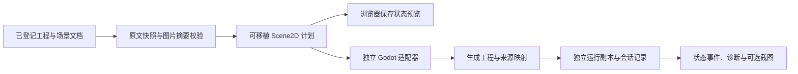

# 二维场景构建与运行（实验性）

本功能已纳入 [0.0.6 源码交付](RELEASE_0.0.6.md)，首个实测平台为 Linux，后端为独立 Godot 4 进程。当前支持场景、角色文档引用、图片、方向键移动，以及 `idle` / `moving` 两个运动状态。使用显式场景声明，不从 OC 故事或任意 Nuis 程序猜测游戏逻辑。

当前源码已提供编辑器的“构建与运行”面板，并保留源码 CLI。产物是 **需要 Godot 的生成工程**，不是已打包的独立可执行文件。原生 Nuis / ns-nova / yalivia、Bevy、任意状态机、音频行为、热更新、嵌入运行视口和 GPU 计算尚未接入。引擎图形运行使用正常窗口；无头运行只验收逻辑。工作台另有无需引擎的已保存场景布局预览。

## 编辑器工作台

在 Linux 本机编辑服务中，用宿主环境变量 `VIENTO_GODOT_BIN` 配置 Godot 4 的绝对路径，然后打开工程。工具配置不写入作品，也不从网页请求接受任意程序路径。未配置工具时仍可检查场景计划，构建／运行按钮会提示缺少工具。

1. 先保存编辑草稿，打开顶部 **构建与运行**，选择已登记的 Scene2D JSON 文档。当前文档是场景时优先选中它。
2. 点击 **检查计划**，核对场景、角色／资源数量及快照标识，再点击 **构建场景**。计划后作者文件变化会拒绝构建，要求重新检查。
3. 构建成功后手动选择 **无头测试** 或 **窗口预览**。运行使用最近成功产物的固定快照；后续编辑需重新构建。
4. 面板显示导入、脚本检查、引擎启动及运行状态；诊断可返回源文档，原始日志和事件可展开查看。未保存草稿会阻止新任务，跳转仍沿用编辑器的草稿确认。
5. **取消任务** 停止当前任务。返回编辑器或按 Esc 仅关闭面板，任务继续，顶部按钮显示进行中；重开可继续观察。关闭宿主服务或桌面工程时取消任务并等待引擎退出。

同一服务同时运行一个任务。窗口预览每阶段最多五分钟，无头测试每阶段最多 30 秒。服务实例只保留自己新建的最近三份构建目录；先前会话和 CLI 的缓存不自动清理。当前任务列表及可运行产物身份属于服务会话，重启服务后通过面板重新构建；磁盘证据仍保留。

面板支持中英日及窄屏布局。当前只在本机 Linux 编辑服务声明能力；浏览服务器和 Android 没有构建入口。新 HTTP 路由同时校验真实回环连接、Host／Origin，POST 沿用编辑写入鉴权；客户端只能提交场景、已登记构建和任务 ID，不能传工具路径、输出路径或任意命令。

## 场景预览选项卡

打开 **构建与运行**，选择场景，再切换 **场景预览**。无需配置或启动 Godot；默认的 **构建任务** 选项卡保留原有计划、构建、测试和日志流程。

- 画布按已保存声明显示背景、图片、角色中心位置、尺寸、颜色与前后顺序，使用解析后的投影继承和场景覆盖值。
- 可缩放、适配画布、平移及切换网格；点击画布或对象列表选中角色，在检查栏查看有效配置并打开来源文档。操作仅改变当前查看方式。
- **编辑场景** 打开已有表单，保存后重新读取预览；**刷新预览** 读取外部保存的最新内容。未保存的编辑器草稿不会参与预览，并有明确提示。
- 场景或图片无效时显示诊断并移除旧画面，避免把旧快照误认为本次结果。切换场景和关闭面板会取消旧请求、释放图片；切换选项卡不取消正在进行的构建任务。

这是保存状态的设计布局预览，不推进移动／状态机，也不支持拖拽修改作者场景。图片由浏览器解码，字体与 SVG 光栅化不承诺和 Godot 逐像素一致；运行行为仍通过 **构建任务 → 无头测试／窗口预览** 验证。

服务使用同一快照捕获和 Scene2D 规划器，核对正文、登记及图片摘要。`POST /api/scene-preview` 接受场景 ID，返回可移植计划及会话资源 URL；`GET` 只读取相应冻结图片，`DELETE` 释放快照。路由仅开放给 Linux 本机编辑服务，沿用本机连接与写入鉴权检查。最多保留两份快照且图片总字节不超过 128 MiB，十分钟过期，退出服务时清理；不写入作品或磁盘预览缓存。

## 创建场景

在 **构建与运行 → 创建场景** 中选择本工程已有的文档类型与 JSON 保存路径，填写标题、视口、背景，再选择一个或多个已登记对象作为角色。每个角色可设置位置、尺寸、颜色、速度、方向键／无输入，并选择已登记图片；没有图片时显示纯色矩形。

全新空白工程先在 **世界与对象 → 创建对象** 中创建一份角色文档，需要图片时打开角色文档，通过 **插入素材 → 从电脑导入** 完成入库，然后保存或结束文档草稿。角色不限定为 `character` 类型；空白包的 `document` 类型即可使用。场景也复用工程已有类型，不修改工作区清单、文学／戏剧的模板正文或已有角色。戏剧包里的“场景”文档类型本身不代表可执行场景。

1. 填写表单后先 **预览场景**，核对将保存的 JSON 和引用。
2. **保存场景** 会一次发布场景正文及身份登记，并自动写入场景到角色的引用关系和所选图片绑定。失败恢复时不会留下只有正文或只有登记的半成品。
3. 创建成功后返回构建面板，选择新场景，再检查计划、构建与运行；保存不会自动启动引擎。

修改任一输入会使预览失效。预览之后工程变化会拒绝保存并保留表单；重新读取对象后再预览。取消、Esc、离开页面及桌面关闭均检查场景草稿；草稿目前仅在当前页面内存中保存，不承诺崩溃后恢复。图片实际字节和可解码性继续在计划快照与真实引擎导入阶段核验。

已有场景可使用同一表单继续修改，见下方 [编辑已有场景](#编辑已有场景)。源文档／字段编辑器仍可使用；可在场景预览选项卡查看布局，拖拽修改场景尚未接入。

### 使用同一 OC 的不同投影

角色选择器可选择带 Scene2D 运行映射的 [OC 投影](OBJECT_PROJECTIONS.md)。勾选 **使用投影配置** 后，尺寸、颜色、速度、控制与图片取自投影，位置仍由场景维护；运行身份仍是各投影自己的 UUID，两份投影可同时使用同一 OC。视觉小说、文学、戏剧等没有运行映射的投影不会列入角色选择器。

勾选继承后，可分别启用尺寸、颜色、速度、控制或图片的场景覆盖；其余字段继续跟随投影。图片覆盖选择 **不使用图片**，会明确关闭继承图片。手写声明同样可设置 `useProjectionDefaults: true` 并覆盖个别运行字段；`imageResourceId: null` 明确去掉继承图片。旧场景不含此字段时保持原有显式配置行为。Build 额外记录原 OC 的 UUID、路径及修订；诊断按实际字段来源回到投影配置或场景。

## 编辑已有场景

在 **构建与运行** 中选择场景，点击 **编辑场景**。表单读取已保存的 JSON 并核对 World 中的正文修订，保留该场景的 UUID、类型和路径。

1. 修改名称、视口、背景、角色位置或运行配置；可以增加、移除或改选角色引用。移除场景中的角色不删除角色文档。当前一个对象在同一场景仍只能出现一次，至少保留一个角色。
2. 投影角色可逐项选择继承或场景覆盖。读取已有声明时保留局部覆盖、明确不使用图片及可选字段的省略；修改名称不会顺带把继承值固化到场景。
3. 点击 **预览修改**，核对真正将保存的原文，再 **保存修改**。保存只更新当前场景正文和必要的依赖登记，保持其他场景、OC、投影及素材原字节不变。
4. 返回构建后重新 **检查计划 → 构建场景**。保存会使当前面板的旧计划失效；刷新状态不会重新启用该旧计划。既有产物仍是它构建时的固定快照，需重新构建才能运行新配置。

原文更新保留未变化的 JSON 值写法、BOM、行尾和周围格式；角色增删或重排时复用已有角色的未变内容。预览无写入，完全无变化保存不创建事务。外部修改会拒绝旧预览并保留草稿；重新读取后再预览。保存响应不确定时核对实际保存内容，不能仅凭场景 UUID 已存在就宣布成功。

新增角色或显式图片会追加缺少的关系／绑定，既有关系、绑定和元数据扩展保留。移除角色或换图不会自动清理历史依赖，因此选择式资源包可能继续包含旧角色和旧图片；运行计划只使用当前声明中的角色和图片。完整迁移继续保留所有作者文件。

此入口编辑当前支持的 Scene2D 第 1 版声明，不切换类型或路径，不执行任意脚本。无法无损展示的未知字段或损坏声明会阻止表单编辑，可返回源文档检查。继承字段的最终有效性、依赖与后端能力仍由同一构建规划器校验。

## 场景命令

### 场景创建命令

GUI、HTTP 和 `scripts/world.mjs --request` 共用 `scene.create`。请求字段与 `object.create` 一致：`mode`、`worldId`、`baseRevision`、`actorRef`、新 `objectId`、工程已有 `documentType`、`sourcePath` 和 `content`；`content` 是完整 Scene2D 第 1 版 JSON 字符串。路径必须位于当前正文根，扩展名为 `.json`。预览和保存使用同一 UUID 与世界修订号。

服务端从声明派生依赖，不接受调用者提供的任意登记内容，也不先创建再逐条补关系。`world_scene_invalid` 返回沿用构建规划器的字段诊断；路径、身份或世界冲突沿用对象命令错误。返回结构与对象创建一致，包含预计对象、`changes`、提案与世界修订号；保存还带事务回执。

该命令使用受限的第 5 版事务意图，只新增一个正文与一个登记；旧第 1–4 版意图保留各自验证规则。恢复核对声明派生的登记、其余登记摘要和两个目标文件，不改写已有角色或图片。它不放宽 `changeset.apply` 的属性专用范围，作品格式仍是 v2 / v3。详见 [事务恢复](WORLD_TRANSACTIONS.md)。

### 场景更新命令

`scene.update` 接受 `mode`、`worldId`、`baseRevision`、`actorRef`、已有 `objectId`、`objectRevision`、`sourceRevision` 和完整候选 JSON `content`。它固定格式版本、UUID、文档类型与路径，只修改场景声明支持的字段。`changes[0].afterText` 返回保真变换后的实际正文，供预览与保存核对。

原场景须具有有效结构和登记；候选场景还须通过完整构建规划校验。第 8 版受限事务固定守护既有正文与登记两个文件，即使登记内容不变也核对其版本；全部值不变返回 `unchanged`。恢复重放同一受限原文变换和依赖追加规则，核对其余登记摘要，只恢复当前场景，不读取或覆盖其他角色的当前正文。旧第 1–7 版意图保持原规则；这不是任意混合命令事务。

## 运行样例

使用 Node.js 24，执行 `npm ci`。准备可执行的 Linux Godot 4 编辑器二进制，显式指定绝对路径；本轮实测为 `4.7.2.stable.official.ed1daf0bf`。工具可以置于 `$XDG_CACHE_HOME/io.viento.studio/toolchains/`（默认 `~/.cache/io.viento.studio/toolchains/`），不复制进每份作品。构建命令不会自动下载工具。

```sh
export VIENTO_GODOT_BIN=/绝对路径/Godot可执行文件

# 读取并校验源文、身份、依赖及图片实际字节；不写工程或生成输出
npm run project:build -- --command plan \
  --root examples/scene2d --scene documents/scenes/demo.json

# 真正调用 Godot 导入图片并检查生成脚本
npm run project:build -- --command build \
  --root examples/scene2d --scene documents/scenes/demo.json

# 用上一步返回的 buildDirectory 运行冻结产物
npm run project:build -- --command run --build /上一步的构建目录

# 打开正常窗口，运行同一固定步长测试，并保存 preview.png
npm run project:build -- --command run --build /上一步的构建目录 --window --capture

# 手动预览：方向键移动，Esc 关闭；最多 5 分钟，Ctrl+C 取消
npm run project:build -- --command run --build /上一步的构建目录 \
  --window --interactive --timeout-ms 300000
```

`--scene` 接受文档 UUID 或工程相对路径。`--godot /绝对路径` 可以覆盖环境变量。默认构建输出为 `$XDG_CACHE_HOME/io.viento.studio/builds/<UUID>/`，未设 XDG 时使用 `~/.cache`。`--output` 可指定一个**尚不存在**的目录；禁止输出到源工程或实际素材目录内，不覆盖已有构建。每阶段超时默认为 30 秒，上限一小时；取消和超时会终止本次进程组，回收运行副本并保留诊断记录。

默认 run 是无头 smoke：通过与交互运行相同的输入处理路径注入 `ui_right`，推进 0.25 秒后释放，检查位置和运动状态。它验证运行逻辑，不代替实体键盘输入验收。`--capture` 仅适用于窗口 smoke；手动预览使用 `--window --interactive`。

样例在 [examples/scene2d](../examples/scene2d/README.md)。样例、测试、工具缓存和日常作品相互独立。编辑样例前复制整个工程到自己的作品目录；不要把生成的 `project/` 当成作者工程编辑。

## 场景与引用

场景是普通已登记 JSON 文档，沿用 v3 工程目录和稳定文档 UUID，不增加一种新的作品持久版本。例如：

```json
{
  "format": "viento-scene2d",
  "schemaVersion": 1,
  "title": "Viento Scene2D",
  "viewport": [800, 480],
  "background": "#0d1829",
  "actors": [{
    "objectId": "aaaaaaaa-aaaa-4aaa-8aaa-aaaaaaaaaaaa",
    "position": [200, 220],
    "size": [80, 80],
    "color": "#ffffff",
    "speed": 160,
    "controls": "arrows",
    "imageResourceId": "cccccccc-cccc-4ccc-8ccc-cccccccccccc"
  }]
}
```

- `objectId` 引用另一个已登记且可读取的文档作为角色；名称和背景仍由角色自身文档维护。场景元数据须有到该对象的关系，便于选择式资源包保留依赖；可用已有 `relation.add` 登记。
- 未继承投影时，`imageResourceId` 可省略并显示纯色矩形；继承时省略表示使用投影图片，显式 `null` 才表示去掉继承图片。图片须为已登记、内容摘要匹配的 PNG、JPEG、WebP 或 SVG，并通过 `resource.bind` 绑定到角色或场景。图片是否实际可解码，还由真实 Godot 导入核验。
- 显式场景声明的位置、尺寸和速度属于场景文档；使用投影继承时运行配置属于投影，位置始终属于场景；角色 UUID 对应运行节点，运行状态不覆盖角色或场景正文。当前每个角色在一个场景中只出现一次，后续实例模型另行版本化。
- `controls` 只支持 `arrows` / `none`；速度单位为每秒像素，范围 0–2000。位置范围 ±100000，尺寸 1–2048，视口为 64–4096 的整数。一个场景 1–128 个角色，单张图片最多 32 MiB，所选图片合计最多 128 MiB。
- 未知字段、未实现行为、缺对象或未登记依赖会在构建前拒绝，并返回源文档 UUID、逻辑路径和 JSON 指针。字段规则与类型、输入、后端能力分开，不把 Godot 节点路径写入元数据。

## 数据与适配边界



`engine/build-plan.mjs` 是无 Node / Godot 依赖的规划器，负责明确支持的场景语义、UUID 关系和能力需求。`scripts/adapters/node-build-snapshot.mjs` 复用 World 读取屏障，复查正文与登记，核对并保留图片字节。`scripts/backends/godot4.mjs` 与其 `runtime.gd` 负责生成文件、工具识别、日志诊断和协议帧；`node-project-build.mjs` 管理输出、构建及会话，`build-process.mjs` 管理进程组和输出上限。

`scripts/lib/scene-preview-service.mjs` 管理独立的短期图片快照；`web/modules/app-scene-preview.js` 管理选项卡的读取与资源生命周期，`app-scene-preview-canvas.js` 绘制已解析值，不重做引擎规划。

`scripts/lib/project-build-service.mjs` 管理跨请求任务、进度、产物 ID 和退出清理；`web/modules/app-project-build.js` 通过同一服务观察状态，不直接启动引擎。运行标准输出按 UTF-8 流解码，协议帧核验场景／角色身份和生命周期顺序，再映射到来源文档。

此时只有一个后端实现，未冻结通用插件 ABI。后续副引擎可以消费受支持的计划；原生异构计算能力通过独立契约扩展，不受本场景子集限制。GUI 只提交语义请求并显示状态，不决定作者数据的存储形式。

## 记录与清理

| 构建目录内容 | 用途 |
| --- | --- |
| `snapshot.json` | 原文、解释它的工程定义与登记、构建计划；以 SHA-256 标识 |
| `project/` | 生成的 Godot 配置、场景、固定适配脚本和所选图片 |
| `source-map.json` | 角色 UUID、原文 revision、声明位置和运行节点映射 |
| `build.json` | 实际工具版本及二进制摘要、适配器版本及源码摘要、输出摘要、导入／检查日志和状态 |
| `sessions/<UUID>/session.json` | 关联 build / snapshot 的运行模式、状态事件、日志及诊断 |
| `sessions/<UUID>/preview.png` | 显式要求的窗口截图 |

运行时重新校验快照、计划、生成文件、适配器和工具摘要，再创建独立运行副本。源工程移走后仍可运行；修改生成文件、换引擎二进制或更改适配器需要重建。作者工程的实际本机素材路径不写入快照；仅由捕获时的本地绑定解析。

成功或正常失败结束后删除 Godot 缓存及会话工作副本，留下小型生成工程和证据。Godot 用户数据、设置与缓存也重定向到本次工作目录，结束后回收。整份构建目录与工具缓存都可独立删除，不影响作品。宿主被 SIGKILL 或断电后的进程／会话恢复尚未实现，不把 SIGINT / SIGTERM 取消验收解释为宿主崩溃恢复。

## 验证

```sh
VIENTO_GODOT_BIN=/绝对路径/Godot可执行文件 \
  node --test scripts/tests/project-build.test.mjs \
  scripts/tests/project-build-service.test.mjs scripts/tests/project-build-http.test.mjs \
  scripts/tests/build-runtime-protocol.test.mjs scripts/tests/project-build-ui.test.mjs
VIENTO_GODOT_BIN=/绝对路径/Godot可执行文件 npm run check -- --app-only

# Chrome + HTTP + 真实 Godot；窗口预览需可用的 Linux 图形会话
VIENTO_GODOT_BIN=/绝对路径/Godot可执行文件 \
  node scripts/tests/project-build-smoke.mjs /绝对路径/chromium
```

没有提供工具时，真实引擎测试会明确跳过；模拟子进程测试不代表 Godot 验收。首次 Linux 实测记录见 [构建验证](test-results/scene2d-build/results.json)，正常窗口截图见 [预览](test-results/scene2d-build/preview.png)。工作台增量验证见 [工作台记录](test-results/build-workbench/results.json)；新建场景到运行、完整迁移及恢复验证见 [场景创作记录](test-results/scene-authoring/results.json)。同一 OC 的多投影、继承配置、选择包与完整迁移见 [投影验证](test-results/oc-projections/results.json)。已有场景编辑、逐字段继承覆盖、旧计划失效和迁移见 [场景编辑验证](test-results/scene-edit/results.json)。无需运行引擎的静态画布、选项卡及缓存生命周期见 [场景预览验证](test-results/scene-preview/results.json)。其他平台、APK 和重新制作的安装包需分别接入与验收。

调用参数依据 [Godot 官方 CLI 文档](https://docs.godotengine.org/en/stable/tutorials/editor/command_line_tutorial.html)；独立可执行文件导出还需要对应的导出预设与模板，本轮没有下载全平台导出模板。
