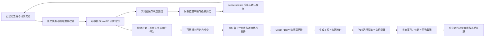

# 二维场景构建与运行（实验性）

构建链路与保存状态预览自 [0.0.6](RELEASE_0.0.6.md) 起提供；[0.0.7 源码交付](RELEASE_0.0.7.md) 进一步纳入布局草稿编辑、多选操作、共享 Rust 核心、独立场景实例、可嵌套组织分组，以及场景原文草稿预览和布局回写。首个实测平台为 Linux，运行后端为独立 Godot 4 进程。当前支持场景、角色文档引用、图片、方向键移动，以及 `idle` / `moving` 两个运动状态。0.0.8 源码纳入显式的[场景实例行为](SCENE_BEHAVIORS.md)：登记 GDScript 文本、为独立实例设置参数并接收映射信号。使用显式场景声明，不从 OC 故事或任意 Nuis 程序猜测游戏逻辑。源码与安装包的交付范围见 [当前状态](STATUS.md)。

当前源码已提供编辑器的“构建与运行”面板，并保留源码 CLI。Godot 产物是 **需要 Godot 的生成工程**；[Bevy 无头后端](BEVY_BACKEND.md)产物是需要可信运行程序的数据工程，均非独立发行程序。Bevy 只运行无图 Scene2D 的方向输入与移动逻辑，图片、作者 Rust 行为和窗口尚未接入。原生 Nuis / ns-nova / yalivia、任意状态机、音频行为、热更新、嵌入运行视口和 GPU 计算仍待开发。Godot 图形运行使用正常窗口；无头运行只验收逻辑。工作台另有无需引擎的保存态／原文草稿预览，以及两种明确区分的位置编辑方式：直接事务保存已保存场景，或把布局应用回当前文本草稿。

0.0.8 纳入[执行后端中间层](BACKEND_MIDDLEWARE.md)：工作台根据完整能力描述符分别开放构建、无头测试和窗口预览；描述符或后端身份变化会使旧计划／产物批准失效，需重新检查并构建。具体引擎参数、环境、阶段和缓存留在各适配器，通用宿主负责冻结输入、输出路径与回放校验。Godot 4 与 Bevy 无头后端由宿主固定选择，界面没有引擎选择下拉框。作者 Scene2D v1／v2／v3 格式不变；没有行为绑定时继续使用原 plan／runtime 1／2，Godot 明确关联行为清单的 v2／v3 场景才生成 plan／runtime 3。

## 文件内片段组合实验

0.0.8 源码还提供独立 `scene:compose` CLI：一份配方内的片段可以多次放置，显式保存各实例／组 UUID 与局部覆盖，Rust 展开为现有 Scene2D v3。默认只向 stdout 输出场景，`--emit bundle` 附带配方原始字节摘要和 JSON Pointer 来源；不写工程、不登记依赖、不启动引擎。场景预览选项卡已支持已登记配方的保存版和当前未保存原文，能够分别定位模板、覆盖、偏移和身份的真实来源。配方预览不授予 Scene2D 编辑权限；同一份配方处于当前源码编辑时，可通过[单实例覆盖](SCENE_COMPOSITION.md#编辑单个实例的局部覆盖)对话框检查修改、应用到原文草稿并普通保存。构建、运行及布局写入仍只处理普通 Scene2D，编辑独立生成场景不会回写配方。用法、样例和 `scene.create` 接入边界见[场景片段组合](SCENE_COMPOSITION.md)。

## 编辑器工作台

在 Linux 本机编辑服务中，用宿主环境变量 `VIENTO_GODOT_BIN` 配置 Godot 4 的绝对路径，然后打开工程。工具配置不写入作品，也不从网页请求接受任意程序路径。未配置工具时仍可检查场景计划，构建／运行按钮会提示缺少工具。

Godot 仍是默认后端。尝试第二引擎时，在启动服务前设置 `VIENTO_EXECUTION_BACKEND=org.viento.bevy` 与 `VIENTO_BEVY_BIN`，先构建可信运行程序并使用无图场景；完整命令见 [Bevy 指南](BEVY_BACKEND.md)。宿主每次固定一个后端，网页没有选择器。Bevy 只开放构建／无头测试，窗口入口禁用；工具与后端不写入作品。

1. 先保存编辑草稿，打开顶部 **构建与运行**，选择已登记的 Scene2D JSON 文档。当前文档是场景时优先选中它。
2. 点击 **检查计划**，核对场景、角色／资源数量及快照标识，再点击 **构建场景**。计划后作者文件变化会拒绝构建，要求重新检查。
3. 构建成功后手动选择 **无头测试** 或 **窗口预览**。运行使用最近成功产物的固定快照；后续编辑需重新构建。
4. 当前运行任务的 **运行对象** 区域显示实例／定义 UUID、移动状态和启动／结束位置样本，可本地检索并打开冻结声明；状态变化后位置未更新时会明确标注。实际操作和只读查询见[运行对象](RUNTIME_OBJECTS.md)。
5. 面板显示导入、脚本检查、引擎启动及运行状态；诊断可返回源文档，原始日志和事件可展开查看。未保存草稿会阻止新任务，跳转仍沿用编辑器的草稿确认。
6. **取消任务** 停止当前任务。返回编辑器或按 Esc 仅关闭面板，任务继续，顶部按钮显示进行中；重开可继续观察。关闭宿主服务或桌面工程时取消任务并等待引擎退出。

同一服务同时运行一个任务。窗口预览每阶段最多五分钟，无头测试每阶段最多 30 秒。服务实例只保留自己新建的最近三份构建目录；先前会话和 CLI 的缓存不自动清理。当前任务列表及可运行产物身份属于服务会话，重启服务后通过面板重新构建；磁盘证据仍保留。

面板支持中英日及窄屏布局。当前只在本机 Linux 编辑服务声明能力；浏览服务器和 Android 没有构建入口。新 HTTP 路由同时校验真实回环连接、Host／Origin，POST 沿用编辑写入鉴权；客户端只能提交场景、已登记构建和任务 ID；inspect 可附实例／定义 UUID，只读当前运行对象样本。不能传工具路径、输出路径或任意命令。

Godot 构建执行导入和脚本检查，Bevy 执行场景数据检查；阶段属于各适配器。使用源码 CLI 可通过 `--backend <已登记后端 ID> --tool <本机绝对路径>`明确选择。原 `--godot` 仅为 Godot 旧别名；默认中立 `plan` 保持只读，显式后端的 `plan` 另检查对应能力。

### 有限控制回放

支持的后端与无行为计划另有 **编辑控制回放 → 控制回放**。编辑四个方向布尔值、固定时长和有限步骤，在已批准冻结构建上执行；全局 schema 1 保留原语义，schema 2 可按冻结 plan 2 实例 UUID 分别输入，未列实例每步释放。**输入示例的目标 → 生成输入示例**提供全局或单实例起点；只有点击生成才替换 JSON。运行对象显示逐步样本及完成步数。只用于无头测试，不写入工程；普通 **无头测试** 保持原 smoke。JSON 错误、对象与步骤联合超限、草稿、过期批准或行为计划不能启动回放。

CLI 的 `run` 可选 `--control-program /绝对路径/程序.json`，不能与窗口、截图或交互长运行同用。1–64 步、每步至多 0.25 秒、总时长至多 8 秒、最后全释放且对象数 × 步数至多 1024；schema 2 另限每步 128 行、全程序 1024 行输入，未知实例提前拒绝。CLI 文件 schema 1 至多 16 KiB、schema 2 至多 256 KiB；完整格式、接口和引擎版本见[有限控制回放](RUNTIME_CONTROL.md)。HTTP 仅在 `run` 新增纯数据 `controlProgram`，不接磁盘路径或执行命令；已有 inspect 可读取控制采样摘要。

## 场景预览选项卡

打开 **构建与运行**，选择场景，再切换 **场景预览**。无需配置或启动 Godot；默认的 **构建任务** 选项卡保留原有计划、构建、测试和日志流程。

- 画布按已保存声明显示背景、图片、角色中心位置、尺寸、颜色与前后顺序，使用解析后的投影继承和场景覆盖值。
- 可缩放、适配画布、平移及切换网格；点击画布或对象列表选中角色，在检查栏查看有效配置，点击 **查看字段来源** 打开原文编辑器并选中对应值。继承值定位到投影配置，局部覆盖定位到场景声明；宽度和高度可分别定位。原文变化或合成字段只有近似范围时会显示说明，不盲选旧位置；已有未保存草稿和光标保留。查看操作不写文件。
- **编辑场景布局** 打开独立的位置草稿画布，见下方操作；**编辑场景** 打开已有完整表单。保存后重新读取预览；**预览已保存场景** 读取外部保存的最新内容。默认读取保存版本；当前场景的未保存原文可通过 **预览当前草稿** 单独查看，见下节。
- 保存版本无效时显示诊断并移除旧画面。草稿预览失败保留同一场景上一次有效画面，并明确标出画面与诊断各自的来源。切换场景会清理旧结果；关闭面板取消请求，草稿模式仅保留一份已解码画面供返回编辑器后继续查看。切换选项卡不取消正在进行的构建任务。

布局移动、吸附、对齐和位置批次校验由共享 Rust/WASM 核心执行；源码草稿的严格结构检查和精确坐标补丁也由同一核心执行，界面仍负责手势和绘制。核心无法加载时会提示，已保存场景仍可预览；仅支持旧布局操作的核心不能执行源码草稿回写。

这是静态设计画布。预览选项卡可显示保存状态或当前原文草稿，布局编辑器另有位置草稿；这些视图都不推进移动／状态机。图片由浏览器解码，字体与 SVG 光栅化不承诺和 Godot 逐像素一致；运行行为仍通过 **构建任务 → 无头测试／窗口预览** 验证。静态预览不校验或执行行为清单，保存态行为绑定错误也可能得到有效几何预览；这不表示行为可以构建或运行。

服务使用同一快照捕获和 Scene2D 规划器，核对正文、登记及图片摘要。`POST /api/scene-preview` 接受场景 ID，返回可移植计划及会话资源 URL；`GET` 只读取相应冻结图片，`DELETE` 释放快照。路由仅开放给 Linux 本机编辑服务，沿用本机连接与写入鉴权检查。最多保留两份快照且图片总字节不超过 128 MiB，十分钟过期，退出服务时清理；不写入作品或磁盘预览缓存。

### 预览当前场景原文草稿

1. 在主编辑器打开一个已登记的场景 JSON，修改原文后进入 **构建与运行 → 场景预览**，选择同一场景，点击 **预览当前草稿**。
2. 有效草稿会更新静态画布、分组大纲和字段来源。返回编辑器继续修改后，重开同一场景会继续草稿模式并重新解析；JSON 未写完或字段无效时保留上一次有效画面，诊断来自本次草稿。草稿只在当前页面会话内保留，刷新页面不会恢复预览缓存。
3. 点击草稿字段或组名来源可回到当前原文并选中相应值。正文摘要须与这次预览相同；过期、近似或缺失范围保留现有内容和光标。投影继承字段仍定位到已保存的投影来源，沿用跨文档草稿保护。
4. 当前仍处于同一场景的**源码模式**且草稿与预览一致时，点击 **调整草稿布局** 可将位置修改应用回文本草稿，操作见下节。**预览已保存场景** 回到磁盘保存版本；草稿结果不会授予场景表单或事务保存权限。构建任务始终只使用保存版本，预览成功不代表已保存或已经通过事务检查。

本切片只覆盖当前场景原文，支持 Scene2D v1／v2／v3，草稿上限 **128 KiB UTF-8**。投影、图片、场景到定义的关系及资源绑定取已保存状态；新引用缺少登记时会给诊断，不自动补登记。外部修改了该场景的保存基线时，拒绝此次预览并保留输入，需在编辑器处理保存冲突。新建未登记文档、多文件草稿和跨视图统一撤销尚未接入；配方展开与单实例覆盖另走独立流程，当前只允许把同一场景的布局坐标补丁应用回源码草稿。

接口增加 `{ sceneId, draft: { sourcePath, baseSourceRevision, content } }`，保留原 `{ sceneId }` 请求。路径须精确匹配所选已登记场景，基线为正文的 `sha256:` 摘要。响应附 `draft: { baseSourceRevision, sourceRevision }`，来源范围绑定原样草稿，不返回 `sceneEditing` 或可执行 `snapshot`；图片仍走同一冻结与摘要校验。内容超限／参数不合法返回 400，总 JSON 请求超过既有 1 MiB 限制返回 413，基线变化返回 409。所有草稿预览均不写正文、元数据或构建缓存。

### 调整当前文本草稿的布局

1. 在主编辑器的**源码模式**修改已登记的 Scene2D JSON，打开场景预览并点击 **预览当前草稿**。仅当这次有效结果仍对应当前原文时，**调整草稿布局** 可用；错误草稿保留的旧画面不能作为编辑基线。
2. 在布局画布中拖动、按方向键微调、输入坐标，或选择逻辑组的后代实例后整体移动／对齐。几何和最近 100 批次撤销／重做复用既有 Rust 核心；修改暂存在这个布局会话中。
3. 点击 **预览布局修改**，检查 **将应用到文本草稿的完整内容**，再点击 **应用到文本草稿**。后续坐标修改会使审阅失效。应用只替换变化的坐标数值，保留分组、身份、继承字段、BOM、CRLF 和其他未改原文。
4. 应用成功关闭布局窗口并重新预览；尚有文本修改时，返回主编辑器后点击普通 **保存** 才会写入文件。若布局恰好使原文回到保存基线，编辑器恢复无修改状态并显示保存态预览。应用不重置原保存版本，外部修改仍由主编辑器的正常保存冲突检查处理。

取消只丢弃本次尚未应用的位置调整，不修改已有文本草稿。打开或应用期间若当前原文、路径、编辑会话或编辑器所持的保存基线发生变化，会保留输入并拒绝旧结果；重新预览当前草稿后再调整。字段／分段模式、其他文档、新建未登记场景及过期画面均不能接收补丁。修改后正文仍须在 **128 KiB UTF-8** 内；没有跨源码、表单和画布统一的撤销栈，关闭后不恢复布局历史。

应用坐标补丁不读磁盘。如果文件在编辑器之外发生了变化，本地草稿仍可接收布局；随后的草稿预览会提示保存基线冲突，主编辑器的普通 **保存** 使用原版本条件并保留冲突草稿，不覆盖外部文件。

这条路径不调用 World 命令，不写元数据、素材、OC 或投影，也不创建构建任务。保存版的直接事务布局编辑仍使用下方流程；两者共用几何能力，但来源基线、审阅结果与应用方式相互隔离。

### 编辑场景布局

在已加载的**保存态场景预览**中点击 **编辑场景布局**。入口需要本机编辑权限、`scene.update` 能力，以及与当前预览一致的场景原文和修订；先处理编辑器中的其他草稿，等待正在进行的构建任务结束。

1. 点击角色可选择对象；按住 Shift、Ctrl 或 Command（⌘）点击可切换该对象是否选中，也可使用列表复选框。普通点击画布中已选对象会保留整组选中，点击未选对象会改为单选；普通点击列表名称始终改为单选。使用 **全选对象／清除选择**，或在画布获得焦点时按 Ctrl／Command + A 全选；单击空白处清除选择。
2. 在 **移动对象** 模式拖动已选角色可整体移动选中对象。画布获得焦点后，方向键使整组微调 1 像素，Shift + 方向键微调 10 像素。所有对象采用相同位移，保持相对间距；任一对象到达 ±100000 坐标边界时，限制整组共同位移。缩放不会改变坐标单位，未吸附时保留原有小数部分。
3. 单选角色时，可填写 **位置 X／Y**，坐标表示角色中心且允许小数。这两个输入只在单选时显示，多选通过整体拖动或对齐调整位置，保留原有单对象坐标含义。**吸附到 32 像素网格** 以实际抓住的角色中心为锚点，整组跟随相同位移，不会将每个对象分别吸附而改变间距；坐标范围优先于网格吸附。网格显示可以单独开关，方向键微调和手填坐标不受吸附开关影响。
4. 选中至少两个对象后，可使用 **左侧对齐／水平居中／右侧对齐** 或 **顶部对齐／垂直居中／底部对齐**。对齐以当前选择的整体外接矩形为参照，采用投影继承和场景覆盖解析后的有效尺寸：侧边对齐计算各对象边缘，居中对齐使用整体边界中心。对齐只改变对应坐标轴的位置；超出坐标范围时拒绝整次操作。
5. 拖动空白处、按住空格拖动或使用鼠标中键可平移视图，也可切换 **平移视图** 模式；拖动空白处平移时保留选择。缩放、适配画布、平移和对象选择只改变查看方式。拖动中按 Esc 会取消本次临时移动。
6. **撤销布局修改／重做布局修改** 管理当前内存草稿的最近 100 步修改，也支持 Ctrl／Command + Z、Shift + Ctrl／Command + Z 或 Ctrl／Command + Y。一次整组拖动、方向键微调或对齐计为一步，所有相关对象一起撤销或重做；位置修改先保留在内存草稿中。
7. 点击 **预览布局修改**，检查 **将保存的场景**，确认后点击 **保存布局**。任何后续位置修改都会使这次检查失效，需要再次预览。保存成功后刷新场景预览，使旧构建计划失效；运行新位置需重新检查计划并构建。

布局草稿只修改现有角色的 `position`。尺寸、图片、投影继承、显式覆盖、`imageResourceId: null`、可选字段省略和其他声明保持原有含义；增删角色或修改其他配置使用 **编辑场景**。选择集只属于当前页面视图，选择操作本身不会产生未保存修改，也不进入作品、迁移包或构建输入。保存沿用 `scene.update` 的修订检查、保真原文变换和可恢复事务，保留 Scene2D v1／v2／v3 的原声明版本和全部分组，无须修改 workspace 格式；v2／v3 的多选、位置与撤销按独立实例区分；预览检查及画布操作均不写作者文件。

如果场景或工程在打开草稿后变化，预览或保存会拒绝旧基线，并保留当前草稿供核对。**重新读取已保存场景** 在确认丢弃草稿后返回预览并刷新；重新进入布局编辑时使用最新基线。保存请求的结果不确定时会暂停再次提交，使用 **核对保存结果** 只读获取 World 和原文，核对场景身份、路径及修订，再对比完整声明的语义内容；相符才确认保存，不相符则保留草稿并要求核对、重新读取。保存已经完成而预览刷新失败时，界面单独提示刷新问题，避免重复保存。

返回预览、取消或关闭布局对话框时会检查未保存修改；离开页面和桌面关闭流程也纳入布局草稿及保存忙碌状态。布局草稿和撤销历史目前只保留在当前页面内存中，不承诺崩溃后恢复。

## 创建场景

在 **构建与运行 → 创建场景** 中选择本工程已有的文档类型与 JSON 保存路径，填写标题、视口、背景，再选择一个或多个已登记对象作为角色。新场景默认采用 Scene2D v2：每个实例可设置位置、尺寸、颜色、速度、方向键／无输入，并选择已登记图片；没有图片时显示纯色矩形。同一对象可重复选择，或点击 **复制场景实例** 保留当前配置并分配新身份。复制时位置相同，可随后修改位置；**上移实例／下移实例** 改变列表及重叠绘制顺序，保留实例身份。

全新空白工程先在 **世界与对象 → 创建对象** 中创建一份角色文档，需要图片时打开角色文档，通过 **插入素材 → 从电脑导入** 完成入库，然后保存或结束文档草稿。角色不限定为 `character` 类型；空白包的 `document` 类型即可使用。场景也复用工程已有类型，不修改工作区清单、文学／戏剧的模板正文或已有角色。戏剧包里的“场景”文档类型本身不代表可执行场景。

1. 填写表单后先 **预览场景**，核对将保存的 JSON 和引用。
2. **保存场景** 会一次发布场景正文及身份登记，并自动写入场景到角色的引用关系和所选图片绑定。失败恢复时不会留下只有正文或只有登记的半成品。
3. 创建成功后返回构建面板，选择新场景，再检查计划、构建与运行；保存不会自动启动引擎。

修改任一输入会使预览失效。预览之后工程变化会拒绝保存并保留表单；重新读取对象后再预览。取消、Esc、离开页面及桌面关闭均检查场景草稿；草稿目前仅在当前页面内存中保存，不承诺崩溃后恢复。图片实际字节和可解码性继续在计划快照与真实引擎导入阶段核验。

已有场景可使用同一表单继续修改，见下方 [编辑已有场景](#编辑已有场景)。源文档／字段编辑器仍可使用；只调整角色位置时，可使用 [场景布局编辑器](#编辑场景布局)。

### 使用同一 OC 的不同投影

角色选择器可选择带 Scene2D 运行映射的 [OC 投影](OBJECT_PROJECTIONS.md)。勾选 **使用投影配置** 后，尺寸、颜色、速度、控制与图片取自投影，位置仍由场景维护。v2 每个实例有独立 `instanceId`，`objectId` 引用所选投影；同一投影可创建多个实例，不必复制投影文档。旧 v1 仍以投影 UUID 区分角色，两份投影也可同时使用同一 OC。视觉小说、文学、戏剧等没有运行映射的投影不会列入角色选择器。

勾选继承后，可分别启用尺寸、颜色、速度、控制或图片的场景覆盖；其余字段继续跟随投影。图片覆盖选择 **不使用图片**，会明确关闭继承图片。手写声明同样可设置 `useProjectionDefaults: true` 并覆盖个别运行字段；`imageResourceId: null` 明确去掉继承图片。旧场景不含此字段时保持原有显式配置行为。Build 额外记录原 OC 的 UUID、路径及修订；诊断按实际字段来源回到投影配置或场景。

## 编辑已有场景

在 **构建与运行** 中选择场景，点击 **编辑场景**。表单读取已保存的 JSON 并核对 World 中的正文修订，保留该场景的 UUID、类型和路径。

1. 修改名称、视口、背景、角色位置或运行配置；可以增加、移除或改选角色引用。移除场景中的实例不删除定义文档。v2 允许共享同一定义的多个实例，可以复制和重排；始终至少保留一个，最多 128 个。旧 v1 仍保持对象唯一，点击 **启用场景实例** 后才进入 v2 草稿，已有实例以旧对象 UUID 初始化身份；完成预览并保存才升级文件。
2. 投影角色可逐项选择继承或场景覆盖。读取已有声明时保留局部覆盖、明确不使用图片及可选字段的省略；修改名称不会顺带把继承值固化到场景。
3. 点击 **预览修改**，核对真正将保存的原文，再 **保存修改**。保存只更新当前场景正文和必要的依赖登记，保持其他场景、OC、投影及素材原字节不变。
4. 返回构建后重新 **检查计划 → 构建场景**。保存会使当前面板的旧计划失效；刷新状态不会重新启用该旧计划。既有产物仍是它构建时的固定快照，需重新构建才能运行新配置。

原文更新保留未变化的 JSON 值写法、BOM、行尾和周围格式；v1 按对象 UUID、v2 按实例 UUID 复用增删或重排后的未变内容。预览无写入，完全无变化保存不创建事务。外部修改会拒绝旧预览并保留草稿；重新读取后再预览。保存响应不确定时核对实际保存内容，不能仅凭场景 UUID 已存在就宣布成功。

新增角色或显式图片会追加缺少的关系／绑定，既有关系、绑定和元数据扩展保留。移除角色或换图不会自动清理历史依赖，因此选择式资源包可能继续包含旧角色和旧图片；运行计划只使用当前声明中的角色和图片。完整迁移继续保留所有作者文件。

此入口编辑 Scene2D v1／v2／v3 声明，支持显式启用实例和分组；当前不提供格式降级，不切换文档类型或路径，也不执行任意脚本。无法无损展示的未知字段或损坏声明会阻止表单编辑，可返回源文档检查。继承字段的最终有效性、依赖与后端能力仍由同一构建规划器校验。

## 场景分组与大纲

在 **编辑场景** 中点击 **启用场景分组**，草稿升级为 Scene2D 作者格式 v3。旧 v1 先点击 **启用场景实例**；新建场景仍默认 v2，启用分组后才使用 v3。升级、修改分组与分配成员均需预览并保存，取消草稿不会转换磁盘文件。

- 添加分组、填写名称并选择父分组，再用每个实例的分组选择器分配成员。分组拥有稳定 UUID，可嵌套；修改名称、父组或实例配置不会重建身份。只有没有实例和子组的空组可以从表单删除，先移出成员再删除。
- 预览与布局中的大纲按层次展示分组和实例，支持折叠、搜索名称或身份。搜索保留匹配项的祖先路径；匹配组名会显示其后代。查询和折叠仅影响视图，不写入场景。
- 在布局中选择分组，会按原实例顺序选中其全部后代；随后使用已有整组移动、对齐和撤销。普通预览仍一次检查一个实例，组名的来源按钮可定位到场景原文。

分组是**编辑组织**：实例位置仍是场景绝对坐标，`actors` 数组仍决定重叠绘制顺序。改变父组不会移动实例，折叠分组不会隐藏画布对象。当前没有组变换、组可见性或事件流程；文件内片段组合由独立配方描述，不改变组织分组的这些语义。

v3 声明要求 `groups` 数组，允许 0–128 个组，最多 16 层。每个组包含 `groupId`、`name` 和可选的 `parentGroupId`；实例用可选 `groupId` 归组。根级关系省略字段，不使用 `null`。组 ID 不可重复或与实例 ID 冲突；名称允许重复，长度 1–160 且不可全空白或包含控制字符。缺失父组、环或悬空成员会以原文路径报错。例如：

```json
{
  "format": "viento-scene2d",
  "schemaVersion": 3,
  "title": "城镇入口",
  "viewport": [800, 480],
  "background": "#0d1829",
  "groups": [
    {"groupId": "55555555-5555-4555-8555-555555555555", "name": "城镇"},
    {"groupId": "66666666-6666-4666-8666-666666666666", "name": "居民", "parentGroupId": "55555555-5555-4555-8555-555555555555"}
  ],
  "actors": [{
    "instanceId": "11111111-1111-4111-8111-111111111111",
    "objectId": "aaaaaaaa-aaaa-4aaa-8aaa-aaaaaaaaaaaa",
    "groupId": "66666666-6666-4666-8666-666666666666",
    "position": [200, 220],
    "size": [80, 80],
    "color": "#ffffff",
    "speed": 0,
    "controls": "none"
  }]
}
```

场景仍只登记定义和素材依赖，分组与实例均不另建 World 对象。分组保存在作者 JSON 中，随资源包迁移；无损保存按组 UUID 匹配原文片段，布局保存只替换实例位置。运行端不解释组织分组：没有行为绑定的作者 v3 编译成现有 plan v2，预览结构通过独立 `sceneStructure` 附加信息传递，旧 v1／v2 生成器保持原字节。分组编辑仍改变原文修订与快照摘要，需重新检查构建。

## 场景命令

### 场景创建命令

GUI、HTTP 和 `scripts/world.mjs --request` 共用 `scene.create`。请求字段与 `object.create` 一致：`mode`、`worldId`、`baseRevision`、`actorRef`、新 `objectId`、工程已有 `documentType`、`sourcePath` 和 `content`；`content` 是完整 Scene2D v1／v2／v3 JSON 字符串。路径必须位于当前正文根，扩展名为 `.json`。预览和保存使用同一 UUID 与世界修订号。

服务端从声明派生依赖，不接受调用者提供的任意登记内容，也不先创建再逐条补关系。`world_scene_invalid` 返回沿用构建规划器的字段诊断；路径、身份或世界冲突沿用对象命令错误。返回结构与对象创建一致，包含预计对象、`changes`、提案与世界修订号；保存还带事务回执。

该命令使用受限的第 5 版事务意图，只新增一个正文与一个登记；旧第 1–4 版意图保留各自验证规则。恢复核对声明派生的登记、其余登记摘要和两个目标文件，不改写已有角色或图片。它不放宽 `changeset.apply` 的属性专用范围，作品格式仍是 v2 / v3。详见 [事务恢复](WORLD_TRANSACTIONS.md)。

### 场景更新命令

`scene.update` 接受 `mode`、`worldId`、`baseRevision`、`actorRef`、已有 `objectId`、`objectRevision`、`sourceRevision` 和完整候选 JSON `content`。它固定场景文档 UUID、类型与路径，只修改声明支持的字段；接受同版本编辑或向更高作者格式版本显式升级，拒绝降级。`changes[0].afterText` 返回保真变换后的实际正文，供预览与保存核对。

原场景须具有有效结构和登记；候选场景还须通过完整构建规划校验。第 8 版受限事务固定守护既有正文与登记两个文件，即使登记内容不变也核对其版本；全部值不变返回 `unchanged`。恢复重放同一受限原文变换和依赖追加规则，核对其余登记摘要，只恢复当前场景，不读取或覆盖其他角色的当前正文。旧第 1–7 版意图保持原规则；v1 历史恢复继续兼容旧重复键读取，v2／v3 恢复严格拒绝重复键及解析索引超限。实例扩展复用既有两文件边界，不是任意混合命令事务。

## 运行样例

使用 Node.js 24，执行 `npm ci`。准备可执行的 Linux Godot 4 编辑器二进制，显式指定绝对路径；本轮实测为 `4.7.2.stable.official.ed1daf0bf`。工具可以置于 `$XDG_CACHE_HOME/io.viento.studio/toolchains/`（默认 `~/.cache/io.viento.studio/toolchains/`），不复制进每份作品。构建命令不会自动下载工具。

```sh
export VIENTO_GODOT_BIN=/绝对路径/Godot可执行文件

# 读取并校验源文、身份、依赖及图片实际字节；不写工程或生成输出
npm run project:build -- --command plan \
  --root examples/scene2d --scene documents/scenes/demo.json

# 真正调用 Godot 导入图片并检查生成脚本
npm run project:build -- --command build \
  --root examples/scene2d --scene documents/scenes/demo.json

# 用上一步返回的 buildDirectory 运行冻结产物
npm run project:build -- --command run --build /上一步的构建目录

# 打开正常窗口，运行同一固定步长测试，并保存 preview.png
npm run project:build -- --command run --build /上一步的构建目录 --window --capture

# 手动预览：方向键移动，Esc 关闭；最多 5 分钟，Ctrl+C 取消
npm run project:build -- --command run --build /上一步的构建目录 \
  --window --interactive --timeout-ms 300000
```

`--scene` 接受文档 UUID 或工程相对路径。`--godot /绝对路径` 可以覆盖环境变量。默认构建输出为 `$XDG_CACHE_HOME/io.viento.studio/builds/<UUID>/`，未设 XDG 时使用 `~/.cache`。`--output` 可指定一个**尚不存在**的目录；禁止输出到源工程或实际素材目录内，不覆盖已有构建。每阶段超时默认为 30 秒，上限一小时；取消和超时会终止本次进程组，回收运行副本并保留诊断记录。

默认 run 是无头 smoke：通过与交互运行相同的输入处理路径注入 `ui_right`，推进 0.25 秒后释放，检查位置和运动状态。它验证运行逻辑，不代替实体键盘输入验收。`--capture` 仅适用于窗口 smoke；手动预览使用 `--window --interactive`。

样例在 [examples/scene2d](../examples/scene2d/README.md)。样例、测试、工具缓存和日常作品相互独立。编辑样例前复制整个工程到自己的作品目录；不要把生成的 `project/` 当成作者工程编辑。

## 场景与引用

场景是普通已登记 JSON 文档，沿用工程目录和稳定文档 UUID，不增加一种新的 workspace 持久版本。新场景采用独立版本的 Scene2D v2，例如：

```json
{
  "format": "viento-scene2d",
  "schemaVersion": 2,
  "title": "Viento Scene2D",
  "viewport": [800, 480],
  "background": "#0d1829",
  "actors": [{
    "instanceId": "11111111-1111-4111-8111-111111111111",
    "objectId": "aaaaaaaa-aaaa-4aaa-8aaa-aaaaaaaaaaaa",
    "position": [200, 220],
    "size": [80, 80],
    "color": "#ffffff",
    "speed": 160,
    "controls": "arrows",
    "imageResourceId": "cccccccc-cccc-4ccc-8ccc-cccccccccccc"
  }, {
    "instanceId": "22222222-2222-4222-8222-222222222222",
    "objectId": "aaaaaaaa-aaaa-4aaa-8aaa-aaaaaaaaaaaa",
    "position": [400, 220],
    "size": [80, 80],
    "color": "#99aaff",
    "speed": 160,
    "controls": "none",
    "imageResourceId": "cccccccc-cccc-4ccc-8ccc-cccccccccccc"
  }]
}
```

- v2 的 `instanceId` 是场景内唯一的小写 UUID；实例复制产生新 UUID，重排、移动、覆盖修改不改变它。v1 不接受该字段，仍要求同一定义只出现一次。
- `objectId` 引用另一个已登记且可读取的文档作为角色定义；名称和背景仍由角色自身文档维护。场景元数据须有到该对象的关系，便于选择式资源包保留依赖；可用已有 `relation.add` 登记。
- 未继承投影时，`imageResourceId` 可省略并显示纯色矩形；继承时省略表示使用投影图片，显式 `null` 才表示去掉继承图片。图片须为已登记、内容摘要匹配的 PNG、JPEG、WebP 或 SVG，并通过 `resource.bind` 绑定到角色或场景。图片是否实际可解码，还由真实 Godot 导入核验。
- 显式场景声明的位置、尺寸和速度属于场景文档；使用投影继承时运行配置属于投影，位置始终属于场景；v2 的实例 UUID 对应运行节点，运行事件同时带定义 UUID，运行状态不覆盖定义或场景正文。同一定义的多个实例可有不同位置、图片、控制方式及局部覆盖。
- `controls` 只支持 `arrows` / `none`；速度单位为每秒像素，范围 0–2000。位置范围 ±100000，尺寸 1–2048，视口为 64–4096 的整数。一个场景 1–128 个角色／实例；v3 另提供组织分组，坐标及绘制仍按平面列表执行，未增加空间变换、复用片段或剧本事件。单张图片最多 32 MiB，所选图片合计最多 128 MiB。
- 未知字段、未实现行为、缺对象或未登记依赖会在构建前拒绝，并返回源文档 UUID、逻辑路径和 JSON 指针。字段规则与类型、输入、后端能力分开，不把 Godot 节点路径写入元数据。

## 数据与适配边界



`engine/scene-model.mjs` 是无 Node / Godot 依赖的语义解析器，负责支持的场景字段、定义／实例身份、投影继承及依赖；`build-plan.mjs` 默认发射对应 v1／v2 几何计划，明确关联行为时由 `scene-behaviors.mjs` 验证注册清单、实例和源码并发射 plan 3，`backend-capabilities.mjs` 分别校验操作、平台、计划版本和能力需求。`scripts/adapters/node-build-snapshot.mjs` 复用 World 读取屏障，复查正文与登记，核对并保留图片字节。`node-execution-backends.mjs` 固定可信适配器，通用 `node-project-build.mjs` 校验中立的文件／资源输出并管理构建及会话；`godot4-adapter.mjs` 承接 Godot 参数、环境、阶段和缓存，再通过 `godot4-dispatch.mjs` 按计划版本调用原 `godot4.mjs`／`runtime.gd` 或实例版 `godot4-instances.mjs`／`runtime-v2.gd`。plan 3 使用独立 `godot4-behaviors.mjs` 和 `behavior-runtime.gd`，历史 v1／v2 生成器、脚本和摘要不变；`build-process.mjs` 继续管理进程组和输出上限。

`scripts/lib/scene-preview-service.mjs` 管理独立的短期图片快照；`web/modules/app-scene-preview.js` 管理选项卡的读取与资源生命周期。捕获结果在冻结快照外提供该场景原文及 World／对象／正文修订，作为布局编辑基线；来源附加信息记录有效字段的文件、正文修订与 UTF-16 范围。`scene-model.mjs` 负责语义解析，`build-plan.mjs` 发射对应版本计划，v1 DTO 及原生成器保持不变；来源范围不进入冻结计划，不改变旧快照与生成产物。v2 来源按实例索引，继承字段仍定位到共用定义。`app-scene-preview-canvas.js` 绘制已解析值，移动手势只提交位置变化，不重做引擎规划或修改传入模型。

`engine/scene-layout.mjs` 将已验证的作者声明适配为 Rust/WASM 的几何与位置草稿操作，由 Rust 管理有界批次历史、位移、吸附与六向对齐。v2／v3 将实例 UUID 作为几何协议中名为 `objectId` 的不透明选择键，作者的定义引用不变；几何和历史操作不解释完整场景语义。批次先校验全部坐标，再一起更新草稿；从原始声明生成 `scene.update` 请求，避免把投影解析结果反向固化为场景覆盖。`web/modules/app-scene-layout.js` 管理内存选择集、画布、坐标输入、检查／保存及未知响应核对；实际写入仍由已有 World 命令和事务执行器完成。

源码草稿另经 `scene-source-layout.mjs` 调用 Rust 无状态 `sceneSource.inspect`／`sceneSource.patch`：检查严格 JSON、v1／v2／v3 身份／坐标与组关系，按原数值 token 生成补丁。JS 保留预览匹配、摘要和编辑会话复核，主编辑器只接收内存候选，普通保存仍走原冲突检查。源码前后均限 128 KiB，组与实例上限不变，后端完整模型、来源导航和事务解析仍在 JS；本轮没有增加片段格式或修改构建／运行协议。验证见 [Rust 源码补丁记录](test-results/rust-scene-source/results.json)。

`scripts/lib/project-build-service.mjs` 管理跨请求任务、进度、产物 ID 和退出清理；`web/modules/app-project-build.js` 通过同一服务观察状态，不直接启动引擎。当前新增 `engine/scene-runtime-query.mjs` 从已验证冻结计划取身份及来源，独立保存完整对象观察；工作台本地检索，服务 inspect 只读当前 run 任务。状态变化不更新坐标，取消／失败保留最后有效样本，详见[运行对象](RUNTIME_OBJECTS.md)。运行标准输出按 UTF-8 流解码，v1 协议帧沿用角色身份；v2 校验实例 UUID 与定义 UUID 的配对及生命周期顺序，再由冻结计划映射到声明或继承字段，不能仅凭共享 `objectId` 选择一个实例。

场景声明独立支持 v1／v2／v3；没有行为绑定的计划与运行协议、所有静态预览载荷仍为 v1／v2，v3 的编辑组织通过独立结构附加信息传递。明确行为场景的构建计划与运行协议另用 v3，加入注册清单、源码修订与绑定身份；冻结快照容器、构建和会话记录沿用现有版本。新代码继续读取旧 v1 声明与冻结构建，不批量迁移作者工程。旧客户端可能仍通过普通文本入口改写新格式，不能把格式版本号当作所有旧入口的只读保护。

当前 Linux 源码已有 Godot 4 与 Bevy 两条受限后端实现，各按实际能力声明。中间层已有纯数据描述符与可信宿主适配契约，尚未冻结通用插件 ABI；测试替代后端仍不算额外产品接入。后续副引擎可以消费明确支持的计划；原生异构计算能力通过独立契约扩展，不受本场景子集限制。GUI 只提交语义请求并显示状态，不决定作者数据的存储形式。

## 记录与清理

| 构建目录内容 | 用途 |
| --- | --- |
| `snapshot.json` | 原文、解释它的工程定义与登记、构建计划；以 SHA-256 标识 |
| `project/` | Godot 的配置、场景、固定适配脚本及图片，行为场景另含清单和 `.gd` 副本；或 Bevy 的 `scene-data.json` 数据工程 |
| `source-map.json` | v1 角色 UUID；v2 的实例／定义 UUID 配对，以及原文 revision、声明位置和运行节点映射；行为场景追加绑定与脚本来源 |
| `build.json` | 实际工具版本及二进制摘要、历史生成器 `backend` 版本及源码摘要、新执行适配器 `executionAdapter` 指纹、输出摘要、导入／检查日志和状态 |
| `sessions/<UUID>/session.json` | 关联 build / snapshot／后端与执行适配器的运行模式、状态事件、日志、诊断及独立的 `runtime` 对象观察 |
| `sessions/<UUID>/preview.png` | 显式要求的窗口截图 |

运行时重新校验快照、计划、生成文件、适配器和工具摘要，再创建独立运行副本。源工程移走后仍可运行；修改生成文件、换引擎二进制或更改适配器需要重建。作者工程的实际本机素材路径不写入快照；仅由捕获时的本地绑定解析。

新执行适配器指纹与旧生成器摘要分开。已知 Godot 适配器显式允许缺少新字段的历史记录，仍核对工具、协议及全部产物；新字段存在时必须匹配，其他后端不能自动继承此兼容。完整契约与边界见[中间层说明](BACKEND_MIDDLEWARE.md#宿主适配与冻结回放)。

成功或正常失败结束后删除 Godot 缓存及会话工作副本，留下小型生成工程和证据。Godot 用户数据、设置与缓存也重定向到本次工作目录，结束后回收。整份构建目录与工具缓存都可独立删除，不影响作品。宿主被 SIGKILL 或断电后的进程／会话恢复尚未实现，不把 SIGINT / SIGTERM 取消验收解释为宿主崩溃恢复。

## 验证

```sh
VIENTO_GODOT_BIN=/绝对路径/Godot可执行文件 \
  node --test scripts/tests/project-build.test.mjs \
  scripts/tests/project-build-service.test.mjs scripts/tests/project-build-http.test.mjs \
  scripts/tests/build-runtime-protocol.test.mjs scripts/tests/project-build-ui.test.mjs
VIENTO_GODOT_BIN=/绝对路径/Godot可执行文件 npm run check -- --app-only

# Chrome + HTTP + 真实 Godot；窗口预览需可用的 Linux 图形会话
VIENTO_GODOT_BIN=/绝对路径/Godot可执行文件 \
  node scripts/tests/project-build-smoke.mjs /绝对路径/chromium
```

没有提供工具时，真实引擎测试会明确跳过；模拟子进程测试不代表 Godot 验收。首次 Linux 实测记录见 [构建验证](test-results/scene2d-build/results.json)，正常窗口截图见 [预览](test-results/scene2d-build/preview.png)。工作台增量验证见 [工作台记录](test-results/build-workbench/results.json)；新建场景到运行、完整迁移及恢复验证见 [场景创作记录](test-results/scene-authoring/results.json)。同一 OC 的多投影、继承配置、选择包与完整迁移见 [投影验证](test-results/oc-projections/results.json)。已有场景编辑、逐字段继承覆盖、旧计划失效和迁移见 [场景编辑验证](test-results/scene-edit/results.json)。无需运行引擎的静态画布、选项卡及缓存生命周期见 [场景预览验证](test-results/scene-preview/results.json)。其他平台、APK 和重新制作的安装包需分别接入与验收。

调用参数依据 [Godot 官方 CLI 文档](https://docs.godotengine.org/en/stable/tutorials/editor/command_line_tutorial.html)；独立可执行文件导出还需要对应的导出预设与模板，本轮没有下载全平台导出模板。

## 场景实例行为（0.0.8 源码）

用普通已登记 JSON 清单声明实例、源码、标量参数和信号映射，场景通过 `behavior` 关系明确选择清单，脚本保存为普通已登记 `.txt` 文档。操作与完整格式见[场景行为绑定](SCENE_BEHAVIORS.md)，可运行样例见[双实例行为](../examples/scene-behaviors/README.md)。不需要升级 workspace 或改写 Scene2D actor 字段；World v1 的 `behaviorBindings` 仍为空。

工作台计划显示绑定和源码数量；运行显示独立实例的行为事件与参数，保留原始日志。参数类型由真实 Godot 导出属性检查，错误定位到清单字段；脚本编译错误定位到注册 TXT 原文。任一文档仍有编辑草稿时，构建／运行沿用已有保护，不运行未保存文本。脚本在用户权限下执行；尚无任意方法 RPC 或热更新。Bevy 无头后端不消费这份 GDScript 绑定计划，其作者 Rust 行为尚未接入。

静态预览只处理几何与图片，不验证或执行绑定。行为参数／源码及全部依赖进入构建冻结快照，选择式资源包严格检查闭包；完整备份仍保留未完成原文。

<a id="行为绑定选型预研尚未接入"></a>

## 行为绑定选型（历史预研）

当前优先 GDScript 和 Rust，C# 因额外工具链开销暂缓；下表保留选型依据。近期目标是让结构化场景文本引用现成引擎中的行为：实例、参数、动作与事件有明确来源，代码由后端执行。Nuislang 仍是长期原生方向，当前开发无需等待其工具链。以下保留 2026-10-03 的选型和独立实验范围；该探针当时尚未接入产品。当前受限的参数／信号绑定已通过上节独立实现，探针本身仍不是产品接口或其验证证据。

| 路线 | 绑定基础 | 对 Viento 的接入判断 |
| --- | --- | --- |
| Godot + GDScript | 脚本可枚举导出属性、默认值、方法和信号；对象可设置参数、缓存 Callable 并连接信号 | 现有 Godot 后端可继续扩展；最适合先验证薄绑定层与作者诊断 |
| Godot + C# | `[Export]`、信号和 Godot Object 接口可供同一绑定层使用；可与 GDScript 组合 | 适合类型明确的行为实现；增加 .NET 版 Godot、SDK 和编译步骤，当前暂缓 |
| Bevy + Rust | 反射／函数注册、组件与观察器；BRP 可读 schema、修改组件、订阅运行变化和触发事件 | 外部 IDE 的运行态接口很有价值；需新后端以及作者行为目录、文本加载与身份映射，列为第二验证对象 |

Godot 的依据是 [Script 元数据接口](https://docs.godotengine.org/en/stable/classes/class_script.html)、[跨语言组合](https://docs.godotengine.org/en/stable/tutorials/scripting/cross_language_scripting.html) 和 [C# 工具要求](https://docs.godotengine.org/en/stable/tutorials/scripting/c_sharp/c_sharp_basics.html)。C# 与 GDScript 通过属性、方法、信号组合，不能相互继承；适配器仍须处理签名、名称及 Variant 类型转换。导出属性元数据可辅助生成字段编辑器，但不能直接代替 Viento 的作者契约。

截至 2026-10-03，查阅的 Bevy 稳定版为 [0.19.1](https://github.com/bevyengine/bevy/releases/tag/v0.19.1)。[BRP](https://docs.rs/bevy/0.19.1/bevy/remote/index.html) 已提供外部工具通信，[FunctionRegistry](https://docs.rs/bevy/latest/bevy/reflect/func/index.html#function-registration) 可按名称调用已编译并登记的函数；这些接口不解释任意 Rust 文本，也不自动回写作者文件。[BSN](https://docs.rs/bevy/latest/bevy/scene/index.html) 支持组合、层级、引用和字段覆盖，但该版本的 `.bsn` 文件格式及官方加载器尚未发布。Rust 行为也并非每次修改都必须重启：[官方 hotpatching 示例](https://github.com/bevyengine/bevy/blob/v0.19.1/examples/ecs/hotpatching_systems.rs) 展示 system／observer 函数体替换；组件结构变化、状态恢复等仍需逐项测试并保留重建路径。这些是文档核查，未在本项目编译 Bevy。

本机使用标准版 Godot `4.7.2.stable.official.ed1daf0bf` 完成独立探针：[结果与运行输出](test-results/behavior-binding/results.json)。同一个 GDScript 的两个实例获得不同参数，预先绑定的方法产生不同结果，信号带回各自实例标识；修改其中一个实例不影响另一个，断开连接后不再收到该实例的事件。共 8 组断言通过，另以故意失败的对照确认探针返回非零退出码。样例中的行为路径和实例名称只用于实验，不是新的持久场景格式。

复现入口将样例复制到临时目录，重定向 Godot 用户数据／配置／缓存并在结束后清理；原始记录不覆盖，新结果另存：

```bash
VIENTO_GODOT_BIN=/绝对路径/Godot可执行文件 \
  node docs/test-results/behavior-binding/run.mjs > /tmp/viento-binding-results.json
```

本机已有 .NET SDK，但本轮使用的 Godot 不含 C#；C# 运行与跨语言互调、Bevy 实际执行、大量对象性能、脚本热重载，以及 Viento UI／构建／迁移集成都未由此探针验证。当前受限接入的独立结果见[行为指南](SCENE_BEHAVIORS.md)，不能用旧探针替代其构建、诊断或迁移证据。后续范围按 [路线图](ROADMAP.md#文本驱动场景的实施顺序) 推进，编译产物保持可重建。
