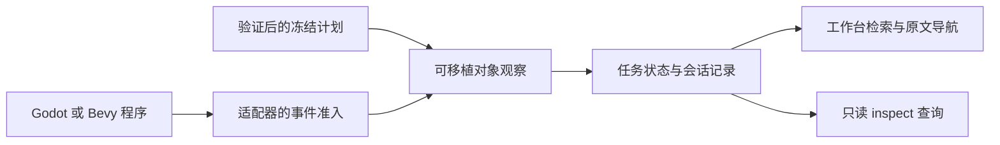

# 运行对象与只读观察（0.0.8 源码）

0.0.8 源码在 **构建与运行 → 构建任务** 中增加 **运行对象** 面板。它读取 Godot／Bevy 已报告的实例身份、位置样本和移动状态，支持检索及返回冻结声明来源。运行程序、作者格式和 plan／runtime 1／2／3 协议均保持原规则；这是现有事件的只读观察，不提供引擎实时反射、方法 RPC 或运行修改。

当前另有[有限控制回放](RUNTIME_CONTROL.md)：无行为 plan 1／2 可通过独立控制 trace 逐步报告完整位置与状态。全局输入保留 schema 1；冻结 plan 2 的 schema 2 可为不同实例独立指定方向，未列实例每步释放。输入稀疏时 trace 仍采样全体演员，观察 DTO 与运行协议保持原样。普通观察继续消费原运行事件；无控制程序的 DTO 不增加字段。该增量升级两个适配器及可信 Bevy 工具，不改变作者格式或旧 Godot v1／v2 文件，也不提供实时反射。

## 在工作台查看

1. 保存作者草稿，选择已登记 Scene2D，依次 **检查计划 → 构建场景 → 无头测试**；Godot 也可使用原窗口入口，Bevy 仍仅支持无头逻辑。
2. 同一场景、后端和构建的当前运行任务有有效观察数据时，**运行对象** 显示名称、定义 UUID、独立实例 UUID、状态、位置样本及采样阶段。旧协议 1 只显示定义身份；协议 2／3 保持实例与定义配对。
3. 输入名称、实例 UUID 或定义 UUID 的部分文本筛选；筛选在本地执行，不请求运行程序。轮询和切换语言保留输入、焦点和光标；新任务或归属改变时清理旧筛选和对象。
4. 点击 **打开实例声明**（协议 1 为 **打开对象声明**）返回作者原文。导航使用冻结计划的来源与修订守护，原文已变化时沿用已有定位提示；编辑器有未保存草稿、正在创建或忙于其他操作时禁用该跳转，保留正文及光标。

名称来自作者设计，不随中英日界面翻译；过长或多行名称按展示预算规范化，不修改正文。对象视图归属于当前运行任务、所选场景、后端描述符、构建 ID 和源快照；切换到不匹配的场景、任务或产物不会展示旧对象。关闭后重新打开面板仍通过当前服务状态观察任务；服务重启后需要重新构建和运行。任务完成、失败或取消后可继续读取最后有效观察，工具暂时不可用不使已有样本消失。

## 位置是样本

| 观察阶段 | 位置与状态 | 含义 |
| --- | --- | --- |
| `waiting` | `position`、`state`、`positionSample` 均为 `null`，`positionCurrent: false` | 冻结构建已经验证；已知对象身份和来源，尚未收到运行位置 |
| `ready` | 启动帧提供全体对象坐标与状态，`positionSample: "ready"` | 启动时的运行值；不从作者坐标猜测尚未报告的运行结果 |
| `ready` 中的 `state` 更新 | 只改变对应对象状态；保留原坐标并设置 `positionCurrent: false` | 状态已变化，位置未更新；界面明确标注，不能把旧坐标当作新位置 |
| `ready` 中的控制步骤 | 完整样本更新全体对象，`positionSample: "control"`，`positionStep` 为零基步骤，`positionCurrent: true` | 可选有限回放的步骤结果；随后状态事件仍可使该位置过期 |
| `finished` | 结束帧提供全体对象坐标与状态，`positionSample: "finished"`，`positionCurrent: true` | 该次运行的最后报告值 |

`positionCurrent` 只表示该位置样本之后没有收到使它失效的状态事件，不承诺当前时刻的引擎坐标。窗口运行也没有逐帧位置采样接口。诊断和自定义 `behavior` 事件不改动对象视图；`sequence` 只在有效 ready／state／finished 或可选控制样本发生时递增。取消、超时或失败不会补造结束帧，`phase` 仍为最后有效生命周期阶段，任务的 `status` 单独表示执行结果。

完整对象视图最多 128 个对象，独立于工作台最多 128 条原始事件记录。即使早期 ready 帧被日志环淘汰，身份、来源和当前观察仍可查询。观察不会写回作者正文、元数据或原构建；运行结束的 `session.json` 保存 `runtime`，临时运行工程仍按原规则清理。

## 数据与中间层边界

`engine/scene-runtime-query.mjs` 提供两个无 Node、DOM 或具体引擎依赖的入口：

```js
const observer = createSceneRuntimeObservation(verifiedFrozenPlan);
observer.push(admittedFrame); // ready/state/finished 改变观察时返回 true
const fullView = observer.snapshot();
const selection = querySceneRuntimeObservation(fullView, { objectId, instanceId });
```

有限回放可在工厂传 `{ controlProgram }`，通过 `observer.pushSample(admittedTraceFrame)` 更新。观察额外携带 `control: { stepCount, completedSteps, fixedDelta }`；全样本按连续零基步骤准入，ready 阶段的位置携 `positionStep`，finished 清除此字段并核对全部步骤已完成。协议 3 不支持控制程序；检索和冻结来源继续使用原规则。

观察器先分离冻结计划中的身份、名称与来源，再消费具体适配器已准入的帧；它自身也检查身份、集合、数值和生命周期。来源首选实例声明，其次位置字段来源，再回退到定义文档，绝不取自进程输出。协议 1 以 `objectId` 唯一，协议 2／3 以 `instanceId` 唯一并核对定义配对；不暴露 Godot 节点路径、Bevy Entity 数字 ID、资源句柄或方法名。



通用宿主在源快照、工具、适配器及产物全部验证后才建立观察；适配器的生成布局、命令和引擎对象继续独立。运行观察先于原始事件通知发布，避免消费者收到 ready 后取消任务而丢失对应样本。普通运行对象观察无需改变作者数据、生成脚本、运行协议或 adapter contract version 1；可选有限控制的独立驱动与 trace 另见其指南。

## 本机只读查询

`POST /api/project-build` 继续沿用回环连接、Host／Origin 和编辑鉴权；新增请求：

```json
{
  "action": "inspect",
  "jobId": "本服务当前运行任务的UUID",
  "instanceId": "可选实例UUID",
  "objectId": "可选定义UUID"
}
```

上例是字段说明，调用时 UUID 需替换为实际小写 UUID；不需要的可选字段应删除。只允许 `action`、`jobId`、`instanceId`、`objectId`，不能传 `engineEntity`、工具、后端、路径或任意查询表达式。无过滤返回全体对象；仅定义过滤返回该定义的全部实例；同时给实例与定义时按 AND 匹配；没有匹配对象时正常返回 `actors: []`。

HTTP 成功响应沿用 `ok: true` 外层字段，其余内容为分离的观察 DTO：`format: "viento-runtime-observation"`、`schemaVersion: 1`、`protocolVersion`、`sceneObjectId`、`phase`、`sequence`、`actors`，并附 `jobId`、`buildId`、`snapshotId`、`backendId`、`status`。每个 actor 包含 `objectId`、协议 2／3 的 `instanceId`、`name`、`position`、`state`、`positionSample`、`positionCurrent` 和可信 `source`。`source` 含作者 `objectId`、`sourcePath`、JSON Pointer，可按既有来源附修订、范围及贡献信息。

| 拒绝条件 | 错误码与 HTTP 状态 |
| --- | --- |
| 未知字段、缺少任务 UUID、非法或非 UUID 过滤身份 | `build_request_invalid`，400 |
| 不是本服务当前运行任务、已被后续任务替换、其他服务任务或计划／构建任务 | `runtime_query_job_missing`，404 |
| 当前运行任务尚未通过冻结构建验证，观察未建立 | `runtime_query_unavailable`，409 |
| 宿主服务正在关闭 | `build_service_closed`，503 |

inspect 不启动新任务、不占取消槽，不重新检查引擎工具，也不读取当前作者工程。有效活动任务和终态任务均可查询；无法跨服务重启采用磁盘会话作为当前运行任务。普通 `plan`／`build`／`cancel` 白名单不扩大；有限回放只在 `run` 增加纯数据 `controlProgram`。inspect 的输入字段保持，控制观察的响应可附上述 `control` 摘要及 actor 步骤字段。

## 验证范围

复现命令和平台条件见[运行对象验证](TESTING.md#运行对象观察)。运行对象首轮证据集中在[验证结果](test-results/runtime-object-inspection/results.json)：纯规则、宿主和界面分别验证；实际 Godot／Bevy 同计划 1／2、Godot 行为协议 3、离线冻结回放、取消、错误与事件环覆盖相互区分。浏览器及准备资源另记录真实条件，源码接入不代表安装包或 Android 设备已验收。

首轮应用回归 1707／1707、零跳过；新纯观察 15、宿主 8、界面 11 项已包含在全量。真实 Chrome 7 条流程和准备资源下四次双引擎离线运行分别验收对象视图、查询与来源守护，移动仅复用三个纯模块。环境、原字节保护和临时目录清理见上述结果，不扩展为新安装或设备验收。

普通观察继续消费已有移动协议，有限控制只按固定步骤采样。连续实时位置采样、组件反射、引擎 RPC、运行编辑、作者 Rust 行为、BRP、资源通道、GPU 与跨会话历史查询仍需单独契约和实际后端验证。
