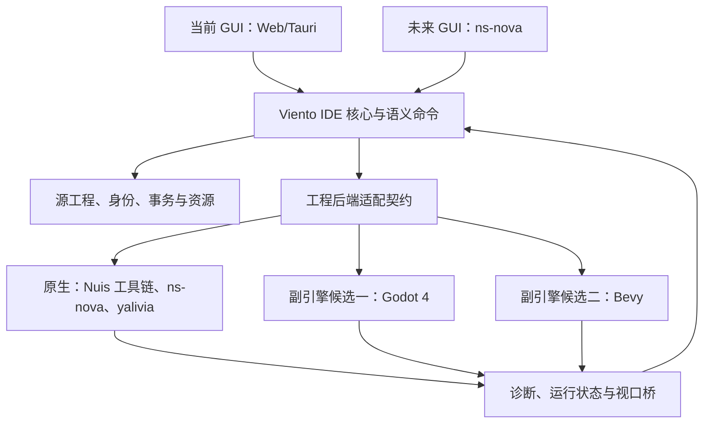

# ADR 0008：Nuis 原生 IDE、GUI 宿主与副引擎

日期：2026-10-03。状态：原生方向、GUI 迁移、1–2 个副引擎及快速实验迭代原则已确认；Godot 4 首个 Linux 场景子集已通过构建、逻辑与窗口实测，原生及 Bevy 尚未接入。

## 决策与范围

Viento 的原生目标是 **Nuislang 工具链、ns-nova 与 yalivia runtime**，并定位为 **ns-nova 的官方 GUI 编辑器与 IDE**。按用户确认的定位，ns-nova 是原生异构计算引擎，承担 GPU 计算、场景、渲染和交互能力；yalivia 承接运行生命周期。具体产物与调用协议随双方已验证的契约对接。Viento 的 GUI 未来也迁到 ns-nova，当前 Web/Tauri 实现承接过渡期编辑工作。

产品范围允许长期支持 **1–2 个副引擎**。首个副引擎同时承接原生体系研发早期的可执行样例；原生就绪后仍可作为独立工程目标使用。当前建议优先验证 Godot 4 的构建／运行链路，再用 Bevy 验证模块化执行与外部检查接口。此顺序是工程判断，不是已通过性能、嵌入或维护成本比较的“最佳引擎”结论。

这里把用户所说的“无头引擎”落实为 **引擎核心不绑定编辑器、可由宿主驱动，并可按能力提供渲染**。这与命令行选项关闭窗口和渲染是不同的能力。GUI 使用哪个引擎、项目运行在哪个引擎是两项独立配置；用 ns-nova 绘制 Viento，不要求所编辑项目也只能运行于 ns-nova。

原生目标当前不可用时显示具体缺少的能力。所选项目后端与 GUI 宿主均须可识别，构建记录写明实际工具链；副引擎的结果不能标成 yalivia 验收。

以上是目标分工。现有实现仅接通下述受限 Godot 独立进程链路，原生调用、GUI 重写及其他副引擎仍待实现。迁移 GUI 时保留语义命令、草稿、事务与工程格式契约；具体实现语言和宿主传输可逐步替换。

## 实验性演进与异构计算

Viento 及其依赖按高速迭代、长期实验项目推进。实验性依赖和接口变化是可接受的开发条件，不因暂未稳定而排除 Bevy、LibGodot 或 Nuis 原生接口，也不提前冻结完整插件 ABI。通过小范围集成原型验证边界，每次只提炼已被真实调用需要的契约。

- **独立演进。** GUI、语义与存储、构建运行、计算／渲染适配分别承担职责。领域界面可以直接调用已声明的原生 GPU 扩展，其后端依赖留在扩展和适配层；通用文档与事务模块不导入具体引擎或图形 API。
- **显式版本。** 快照和构建记录固定实际工具链／适配器版本及摘要，连接时核对协议与能力。可以主动升级或重写内部实现；接口变动由适配器与契约测试吸收，不等同于限制依赖更新。
- **原生能力充分开放。** 以 Nuis 异构执行能力设计计算与渲染扩展：例如批量对象处理、可见性／选取、纹理处理、程序化预览与仿真。副引擎按自身能力实现相应操作；原生扩展可以超出共有功能，不为兼容副引擎而隐藏 GPU 能力。
- **控制与资源传输分开。** 命令、诊断和任务状态使用可序列化协议；纹理、缓冲区及大量计算结果通过专门资源通道交换。支持时保留 GPU 驻留和共享资源，减少反复 CPU 回读。资源通道须描述所有权、使用期限、设备／会话身份及同步要求；不预设任意两个引擎或设备可以零复制互通。
- **运行态与作品分开。** 工程保存资源身份、算法或着色器来源及参数；设备句柄、队列、栅栏、显存驻留和临时结果属于运行会话。运行时结果需要显式保存为资源或通过语义命令提交，才能成为作者数据。
- **按实际工作量选择设备。** 渲染与并行密集任务优先评估 GPU；CPU 继续承担适合它的解析、文件与事务工作。是否加速要测量提交、同步、传输及内存成本；只对有已验证实现的能力提供 CPU 回退，其余明确报告暂不支持。

异构调度与设备执行通过 Nuis／ns-nova／yalivia 的实际能力接入；Viento 提交任务、资源依赖并展示状态与结果，不另建一套竞争的底层调度器。这里描述接口目标，不能把本机 `frame_runtime.ns` 的队列、帧图与同步数据示例当作完整 GPU 执行或跨引擎共享已通过的证据。

成熟度随实测逐步提高，不以短期发布稳定版为前置目标。实验性接口可以调整；工程正文、素材和身份继续保护，涉及持久格式的变更提供可审查迁移与恢复途径。

## 副引擎选择依据

截至 2026-10-03 的官方资料核查：

| 候选 | 可利用的接口 | 需要本项目解决的问题 | 当前建议 |
| --- | --- | --- | --- |
| Godot 4 | 命令行导入、构建、运行；4.6 起有实验性 LibGodot，可作为静态／共享库用于桌面应用 | 场景与字段映射、调试桥、窗口／视口接入；库嵌入的重初始化、移动端与跨渲染器共享须逐项验证 | 优先作为第一个副引擎验证构建与运行；先独立进程，库嵌入单独设验证门槛 |
| Bevy | 按插件组合渲染／窗口／UI；可由宿主调用 `App::update`；BRP 支持外部工具查询／修改 ECS 状态 | 设计对象到 ECS 的映射、资源和构建配套、运行桥；接口升级与渲染器互操作仍有维护成本 | 第二副引擎候选，用于验证宿主驱动与外部编辑能力 |

Godot 的官方 FAQ 将 LibGodot 标为实验性，列出 Windows、macOS、Linux 支持；官方优先事项仍列有移动平台支持和库重初始化。因此不能从“可编译成库”推导已能在 ns-nova 内稳定嵌入多视口。[Godot FAQ](https://docs.godotengine.org/en/stable/about/faq.html#is-it-possible-to-use-godot-as-a-library) · [Godot 库支持计划](https://godotengine.org/priorities/)

Bevy 的模块化插件和宿主调度接口有官方文档，BRP 的 JSON-RPC 可供外部工具操作已支持的 ECS 状态；它不直接提供 Viento 的稳定 UUID、草稿事务或 ns-nova 视口。[插件](https://bevy.org/learn/quick-start/getting-started/plugins/) · [App](https://docs.rs/bevy_app/latest/bevy_app/struct.App.html) · [BRP](https://docs.rs/bevy_remote/latest/bevy_remote/) Bevy 官方入门说明仍提醒接口升级可能包含破坏性变更，评估时须计入版本锁定与升级维护。[稳定性说明](https://bevy.org/learn/quick-start/introduction/#stability-warning)

选择先验证 Godot 是为了利用现有构建与资源流程；保留 Bevy 候选是为了验证另一种可由宿主组合的执行模型。依赖成熟度是维护因素，不作为本实验项目的排除条件。两者都不作为重写 Viento GUI 的目标。若视口原型表明另一候选的整体成本更低，可调整接入顺序，不把资料比较当成实测排名。

## 语义与生成物边界

- 工程类型决定对象、行为和约束；游戏／文学／戏剧起始模板仍是作者内容，不自行获得可执行权限。首批游戏构建另定义少量场景、Actor、触发事件和状态机能力。
- 在 Viento 侧描述这批设计语义与构建输入；这不是 NIR／YIR，也不另造通用语言或编译器。原生适配如何生成 Nuis 源码或提交工具链产物，须以对应工具链的实际契约为准。原生能力独立扩展，不以副引擎的共有功能限制 ns-nova／yalivia。
- 统一工程打开、资源查询、合法编辑命令、构建、运行和诊断接口；后端按能力扩展类型、源码语言与工作台。支持副引擎不承诺任意游戏、脚本、材质和物理行为可以自动互转。
- Viento 生成模式只转换明确列出的声明式能力子集；副引擎不承诺执行任意 Nuis 程序、消费任意 YIR，或模拟 yalivia 的全部生命周期能力。遇到超出范围的原生行为绑定，构建前给出对象／字段诊断。
- Godot 节点、信号、脚本及资源路径由适配器生成和映射，不进入通用对象身份与关系契约。原始工程维持对象／资源 UUID；运行句柄、节点路径和生成文件保存在该次构建的映射中。
- 生成的 Godot 工程、脚本、导入缓存与打包产物写入独立的构建输出目录。它们可从固定输入重建，不作为作者源数据回写；直接修改生成工程不承诺双向同步。
- 后续直接打开副引擎原生工程时，其源码和引擎项目文件是作者数据；适配器须声明由谁维护哪些文件，不能按“生成输出”清理它们。此模式与 Viento 生成模式分别验收，不要求 IDE 用户先把全部引擎源码转换为通用文档。
- 工具链二进制和可重新下载的模板放在应用管理的本地工具缓存中，按版本与摘要识别；本机路径留在本地配置。避免每个工程复制一份，也不默认混入作品迁移包。安装或清理不得影响用户单独管理的引擎与作品。

## 无头执行与可视预览

Godot 官方文档提供 `--headless`、命令行导入和导出入口，可用于后台构建及逻辑测试；导出需要对应的预设和导出模板。[命令行文档](https://docs.godotengine.org/en/stable/tutorials/editor/command_line_tutorial.html)

`--headless` 会关闭渲染和窗口管理，RenderingServer 的多数调用返回占位值；这不能当作离屏图像渲染能力。图形预览首期使用单独的正常运行窗口，IDE 内嵌视口和离屏帧传输留到后续专门验证。[RenderingServer 文档](https://docs.godotengine.org/en/stable/classes/class_renderingserver.html) 无头服务器可使用导出模板二进制，构建则使用具备编辑器功能的二进制。[服务器导出说明](https://docs.godotengine.org/en/stable/tutorials/export/exporting_for_dedicated_servers.html)

因此能力声明须分别覆盖“构建”“无窗口逻辑运行”“离屏渲染”“窗口预览”和“嵌入视口”，不能用单一的 `headless` 标记推导图形、音频输出或热更新能力。

视口桥单独处理渲染表面、尺寸／DPI、输入与焦点、选中对象映射和生命周期。共享 GPU 纹理、离屏帧传输、子窗口嵌入是不同方案，须验证图形 API、同步、资源所有权和平台支持。首期独立进程便于隔离崩溃；是否采用同进程嵌入由真实原型决定，不以有 FFI 或 Rust 库接口直接推导跨语言、跨渲染器兼容。

## 首个可交付链路

1. **固定输入与能力检查。** 从已提交设计建立快照，核对资源实际字节与摘要，记录类型包、适配器、工具链版本和目标平台。现有 World 投影的 `present-unverified` 不能直接充当资源验证结果。
2. **构建计划与诊断。** 生成可审查的计划，列明输入、输出和缺失能力；计划阶段不改源工程。失败定位回对象、字段或资源，不只返回工具的文本日志。
3. **首个副引擎执行。** 生成一个最小二维场景，支持 Actor、简单输入事件、状态切换、图像绑定；先验证独立 Godot 进程，接收启动／停止／失败结果。进程通信封装在适配器内，固定协议版本；不先绑定编译器内部结构。
4. **运行记录。** 产物与会话关联固定快照、实际后端、日志及对象映射。支持超时、取消和失败收尾，运行变化不自动覆盖设计值。冷构建与重启先行，热更新另按真实能力接入。
5. **副引擎比较与原生接入。** 用受限样例比较 Godot 与 Bevy 的视口显示、输入、对象选中／属性修改、诊断定位、停止重开、资源重载、崩溃恢复和磁盘占用，再确定副引擎支持级别。相同的场景与预期事件／状态用于 Nuis 原生目标验收；明确时钟、事件顺序和数值容差，不要求物理结果或画面逐像素相同。原生目标通过后成为默认路径，副引擎目标可继续使用，旧工程不自动改选后端。
6. **GUI 迁移。** ns-nova GUI 消费同一语义接口，验证中英日文本与输入法、键盘／焦点、可访问性、草稿恢复及所有已接入工程后端；GUI 切换与游戏运行后端切换分别验收。

GPU 能力按独立纵切接入：先选择一项真实工作量，串起资源上传、计算／渲染、预览消费和取消／释放；记录设备、执行结果、GPU 时间、传输量与峰值内存。能共享资源时再验证跨后端路径，缺少原生执行器时保留明确未实现状态。该实验与文档、保存和迁移链路分别验证。

验收须使用真实 Godot 进程，覆盖成功、缺工具／资源、错误定位、取消／超时和源工程未被修改。协议模拟测试不代表原生运行已经可用。首期验证平台为 Linux；其他桌面系统与 Android 不继承本机执行能力声明。

## 依据与当前状态

- 用户于 2026-10-03 明确：原生是 ns-nova、yalivia runtime 的 Nuislang 体系；Viento 是 ns-nova 官方 GUI 编辑器，自身 GUI 也由 ns-nova 重写，并希望保留 1–2 个副引擎。早期副引擎承担替补，长期仍服务 IDE 的多工程定位。
- 用户进一步确认：项目与依赖都允许高速实验迭代，重点是尽量解耦；ns-nova 按原生异构计算引擎定位，Viento 可以充分使用 GPU 能力，成熟是长期目标。
- 本轮只读查看本机 `nuislang-probe` 资料：`README.md` 标注 `beta-0.3.*`，`stdlib/ns-nova/README.md` 与 `stdlib/ns-nova/scene/README.md` 描述场景／渲染方向，`subprojects/yalivia/README.md` 仍标注项目骨架和待定生命周期／RPC 接口。另一本机 `nuislang-codex` 副本的总览较早，标注 `beta-0.0.1`。这些是本机资料快照，不宣称代表上游最新提交或已完成集成验证。
- 首条构建纵切已实现于开发源码：明确的 Scene2D 文档与 UUID 引用、冻结正文及图片字节、独立 Godot 4 生成适配器、构建／运行记录、源对象诊断、超时和取消。真实 Godot 4.7.2 在 Linux 完成图片导入、输入处理与运动状态验收，以及 Radeon 680M 正常窗口预览。代码与复现入口见 [二维场景构建](../PROJECT_BUILD.md)。
- 当前产物为需 Godot 执行的生成工程，支持 CLI 与 Linux 本机编辑器面板；后者包含任务进度、取消、诊断回到原文及宿主正常退出时回收引擎。独立发行程序导出、任意事件／状态机、Live Build、视口桥和宿主崩溃恢复尚未接入。未编译 Nuis 工具链、实测 LibGodot／Bevy 或实现 GUI 重写，也不将窗口渲染当作原生 GPU 计算验收。

关联：[下一代架构](../NEXT_ARCHITECTURE.zh-CN.md)、[资源绑定边界](0007-recoverable-resource-binding.md)、[工程模板契约](../PROJECT_WORKFLOW.md#工程起始模板包)。
